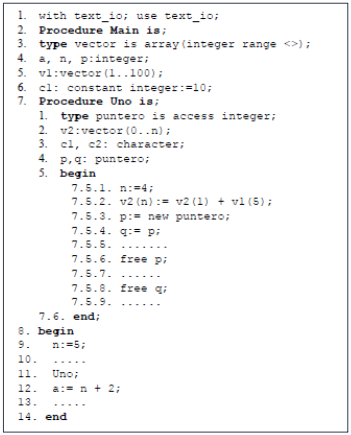
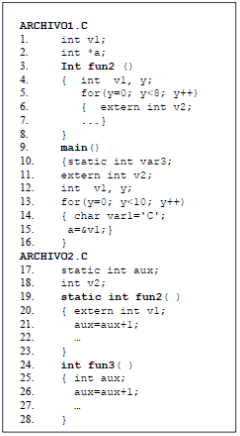

# Semántica

## Ejercicios

1. Describa informalmente la semántica de algún constructor de un lenguaje de programación que conozca (por ejemplo, el while de java).
1. Investigue e informe qué otras entidades pueden ser denotadas por identificadores.
1. ¿Por qué c = b = a = 4 tiene el mismo efecto que la asignación a = b = c = 4?
1. ¿Por qué a = b + 2 = c = 4 es incorrecta?
1. Explique las diferencias que hay entre las sentencias de asignación en Pascal y las expresiones de asignación en ANSI C.
1. Describa la semántica:
    1. int a = 10;
    1. int mat [2][3] = {{1,2,3}, {4,5,6}};
    1. sentencias: if, while, for
1. Investigue e informe cuál es la diferencia semántica entre el prototipo de una función y la definición de esa misma función.
1. Defina un LP para un campo de aplicaciones particular, con la característica de que este LP esté formado por un grupo de comandos que son LRs. Describa su sintaxis en BNF, su semántica en lenguaje natural y presente varios ejemplos para su uso.
1. Dados los siguientes métodos en Java, Python y C, determine cuáles son las diferencias semánticas entre ellos en cuanto al uso de variables, tipos, inicialización de variables, etc. Verifique si retornan los mismos resultados.

    

1. Identificar abstracciones y aplicaciones: ((λx. ((λy. (xy)) x)) (λz.w))
1. Simplificar la siguientes expresiones:
    1. ((λx. (xy)) (λz.z))
    1. ((λx. ((λy. (xy)) x)) (λz.w))
1. Demostrar que la máquina suma, procesando a las máquinas tres y dos, obtiene la máquina cinco.
1. Demostrar que la máquina producto, procesando a las máquinas tres y dos, obtiene la máquina seis.
1. ¿En qué momento se definen los tipos de una variable en un lenguaje tipo-algol con inferencia de tipos?
1. ¿El tipo de binding de alcance de un lenguaje determina con seguridad el tipo de binding de tipo de ese lenguaje?
1. Considerar si la siguiente afirmación es verdadera o falsa: El hecho que la única invocación a una función se encuentre en el bloque de la cláusula “then” de una instrucción condicional de un programa hace que el lenguaje tenga binding dinámico de alcance.
1. Si se tuviese conocimiento de todos los valores que se definen en tiempo de ejecución en de programa (valor de las funciones de aleatorización, entradas del usuario, condiciones del sistema operativo, etc.) ¿se podría compilar un programa con alcance dinámico?
1. Defina el concepto de ligadura y su importancia respecto de la semántica de un programa. ¿Qué diferencias hay entre ligadura estática y dinámica? Cite ejemplos (proponer casos sencillos)
1. Tome una de las variables de la línea 3 del siguiente código e indique y defina cuales son sus atributos. Compare los atributos de la variable del punto a) con los atributos de la variable de la línea 4. Que dato contiene esta variable?, que otra variable hay en este código?

    ```plain
    01. Procedure Practica();
    02. var
    03. a,i:integer
    04. p:puntero
    05. Begin
    06. a:=0;
    07. new(p);
    08. p:= ^i
    09. for i:=1 to 9 do
    10. a:=a+i;
    11. end;
    12. ...
    13. p:= ^a;
    14. ...
    15. dispose(p);
    16. end;
    ```

1. Indique cuales son las diferentes formas de inicializar una variable en el momento de la declaración de la misma.
1. Analice en los lenguajes: Java, C, Phyton y Ruby las diferentes formas de inicialización de variables que poseen. Realice un cuadro comparativo de esta característica.
1. Explique los siguientes conceptos asociados al atributo l-valor de una. De al menos un ejemplo de cada uno. Investigue sobre qué tipos de variables respecto de su l-valor hay en los lenguajes C y Ada.
    1. Variable estática.
    1. Variable automática o semiestática.
    1. Variable dinámica.
    1. Variable semidinámica.
1. ¿A qué se denomina variable local y a que se denomina variable global?
1. ¿Una variable local puede ser estática respecto de su l-valor? En caso afirmativo dé un ejemplo.
1. Una variable global ¿siempre es estática? Justifique la respuesta.
1. Indique qué diferencia hay entre una variable estática respecto de su l-valor y una constante.
1. Sea el siguiente ejercicio escrito en Pascal:

    ```plain
    1- Program Uno;
    2- type tpuntero= ^integer;
    3- var mipuntero: tpuntero;
    4- var i:integer;
    5- var h:integer;
    6- Begin
    7-    i:=3;
    8-    mipuntero:=nil;
    9-    new(mipuntero);
    10-   mipuntero^:=i;
    11-   h:= mipuntero^+1;
    12-   dispose(mipuntero);
    13-   write(h);
    14-   i:= h - mipuntero;
    15- End.
    ```

    1. Indique el rango de instrucciones que representa el tiempo de vida de las variables i, h y mipuntero.
    1. Indique el rango de instrucciones que representa el alcance de las variables i, h y mipuntero.
    1. Indique si el programa anterior presenta un error al intentar escribir el valor de h. Justifique
    1. Indique si el programa anterior presenta un error al intentar asignar a i la resta de h con mipuntero. Justifique
    1. Determine si existe otra entidad que necesite ligar los atributos de alcance y tiempo de vida para justificar las respuestas anteriores. En ese caso indique cuál es la entidad y especifique su tiempo de vida y alcance.
    1. Especifique el tipo de variable de acuerdo a la ligadura con el l-valor de las variables que encontró en el ejercicio.
1. Elija un lenguaje y escriba un ejemplo:
    1. En el cual el tiempo de vida de un identificador sea mayor que su alcance.
    1. En el cual el tiempo de vida de un identificador sea menor que su alcance.
    1. En el cual el tiempo de vida de un identificador sea igual que su alcance.
1. Sea el siguiente programa en ADA, completar el cuadro siguiente indicando para cada variable de que tipo es en cuanto al momento de ligadura de su l-valor, su r-valor al momento de alocación en memoria y para todos los identificadores cuál es su alcance y cual es su el tiempo de vida. Indicar para cada variable su r-valor al momento de alocación en memoria:

    

    | Identificador | l-valor | r-valor | Alcance | Tiempo de Vida |
    | -- | -- | -- | -- | -- |
    | a (linea 4) | automática | basura | 4-14 | 1-14 |
    | | | | | |
    | | | | | |
    | | | | | |

1. El nombre de una variable puede condicionar (justifique la respuesta):
    1. Su tiempo de vida.
    1. Su alcance.
    1. Su r-valor.
    1. Su tipo.
1. Sean los siguientes archivos en C, los cuales se compilan juntos. Indicar para cada variable de que tipo es en cuanto al momento de ligadura de su l-valor. Indicar para cada identificador cuál es su alcance y cual es su el tiempo de vida. Indicar para cada variable su r-valor al momento de alocación en memoria.

    

    | Identificador | l-valor | r-valor | Alcance | Tiempo de Vida |
    | -- | -- | -- | -- | -- |
    | | | | | |
    | | | | | |
    | | | | | |
    | | | | | |
