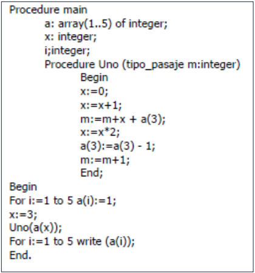

# Control de Flujos

* La manera cómo se incorpora en el LP determina el orden de ejecución de un programa
* Los mecanismos del LP utilizados para especificar el orden de ejecución, pueden ordenarse en categorías:

  | Categoría | | Ejemplos |
  | -- | -- | -- |
  | **Secuencia**    | Orden de las sentencias para su ejecución | asignaciones, if, ... |
  | **Selección**    | Alternativa entre dos o más sentencias controlada por una condición booleana | if-then-else, switch-case |
  | **Iteración**    | Causa que una o más sentencias se ejecuten cero o más veces | PERFORM-TIMES, for, foreach, while, do-while |
  | **Unidad**       | Abstracción procedural | f() { ... } |
  | **Recursión**    | Funciones con posibilidad de llamarse a sí mismas | f() { caso-base; f(); } |
  | **Concurrencia** | | |
  | **Excepciones**  | Eventos inusuales (ejemplo: división por cero, apertura de archivo inexistente) que deberían controlarse/manejarse para que el SW sea confiable y tolerante a fallas | try-catch-finally, try-except-else-finally |
  | **Eventos**      | El control de ejecución se basa en acciones producidas por el usuario o por el entorno | on event when condition do action |

## Expresión

* Consiste de un objeto simple (constante o variable) o un operador o una función aplicada a una colección de operandos o argumentos (cada uno de los cuales define una expresión)
* Consta de:
  * Operadores (unarios, binarios o ternarios)
  * Operandos
  * Paréntesis
  * Llamadas a función
* La mayoría de los lenguajes imperativos adoptan una notación infija para los operadores, pero hay otras opciones:
  * Prefija: op a b | op (a, b) | (op a b)
  * Infija: a op b
  * Posfija: a b op
* Aspectos de diseño:
  * Reglas de precedencia y asociatividad de operadores: orden en el cual operadores con diferente precedencia son evaluados. Pueden modificarse con el uso de paréntesis.
  * Orden de evaluación de los operandos
  * Sobrecarga de un operador
  * Errores en las expresiones

## Asignación

* En el **paradigma declarativo**, el cómputo consiste en **evaluar expresiones**
* En el **paradigma operacional**, el cómputo consiste en una **serie ordenada de cambios** (de los valores de las variables en memoria)
* La sintaxis general tiene la siguiente forma:
  * \<variable destino> \<operador de asignación> <expresión>
* Se puede definir la operación de asignación como:
  1. Computar el valor del lado izquierdo (l-value, denotan locaciones)
  2. Computar el valor de la expresión del lado derecho (r-value, denotan valores)
  3. Asignar el valor computado del lado derecho al computado como objeto de dato del lado derecho
  4. Retornar el valor computado como valor del lado derecho como resultado de la asignación
* La asignación puede en algunas circunstancias darse en forma implícita. Generalmente esto sucede en:
  * La inicialización en las declaraciones
  * El pasaje de parámetros

## Evaluación de Operandos

|||
| -- | -- |
| **Variables**  | cargar el valor desde memoria |
| **Constantes** | algunas veces son cargadas desde la memoria, otras veces la constante puede ser parte de las instrucciones del lenguaje máquina |
| **Expresiones parentizadas** | se evalúan las expresiones de acuerdo al modo de evaluación elegido |

## Evaluación de Expresiones

| Tipo de Evaluación || Ejemplo |
| -- | -- | -- |
| **Estricta o Ansiosa**     | los argumentos de una función o los operandos de la expresión son siempre completamente evaluados antes de la aplicación de la función u operador. Tradicionalmente usada por los LP | sumar(2+1); al parámetro le llega 3 |
| **No Estricta o Perezosa** | los argumentos de una función o los operandos de la expresión no son evaluados a menos que sean utilizados en el cuerpo de la función o sean necesarios para determinar el valor de la expresión | sumar(2+1); al parámetro le llega 2+1 |

## Tipos de Control de Flujo

| Tipos | | |
| -- | -- | -- |
| **No estructurado** | Se provee a través de saltos condicionales e incondicionales | if E1 C1: **goto** L1 |
| **Estructurado**    | Correspondencia entre el orden del texto del programa y el orden de la ejecución, permitiendo legibilidad, verificación, mantenimiento | ejecución **top-down**, con opciones de sentencias **break** y **continue** |

## Subprogramas

* Los LP operativos brindan mecanismos para dividir el programa en unidades cada una de las cuales tiene cierta coherencia y lógica. Su incorporación fomenta:
  * Eficiencia: permiten factorizar el código.
  * Legibilidad: metodología de diseño top-down.
  * Verificación: una unidad puede pensarse como una mapeo entre dominios de valores.
* Los LP permiten que un programa esté compuesto por subprogramas (secuencia de sentencias de un programa).
* En general se las llama rutinas, procedimientos, métodos, funciones (un valor), llaves o delimitadores, closures o funciones lambda.
* Ejemplo:

  ```c
  int f1() {
    return 3 + 2;

  }
  int main() {
    int y = f1(); 
  }
  ```

  ```pascal
  Program Programa;
  procedure B;
  var x: integer;
  begin
  ...
  end;
  begin
    B();
  end.
  ```

  ```java
  public class Cliente {
    private int codigo;
    public Cliente() {
      codigo = 0;
    }
  }
  ```

### Aspectos de diseño a tener en cuenta por el LP

* Generales:
  * Entidades
  * Ligaduras
  * Reglas de alcance
  * Sistemas de tipos
  * Soporte para definir subprogramas

* Específicos:
  * Estructura estática
  * Recursividad
  * Control
  * Métodos de pasaje de parámetros
  * Correspondencia entre parámetros formales y actuales
  * Sobrecarga y polimorfismo
  * Tipos de los parámetros: datos y unidades
  * Ambiente de referenciamiento de los subprogramas que recibe como parámetro (chequeo estático o dinámico de subprogramas)

### Atributos del subprograma

| Atributo | |
| -- | -- |
| **Nombre**  | identificador que se introduce en su declaración para invocar a la rutina |
| **Alcance** | segmento de código dentro del cual el subprograma puede invocarse (si incluye al mismo subprograma acepta recursividad). Rango de instrucciones donde se conoce su nombre |
| **Ambiente de referenciamiento** | puede ser: **local** (entidades declaradas dentro de la rutina) o **no local** (referencias a entidades declaradas en otros subprogramas cuyo alcance es visible en la rutina). Toda variable no locales que pueda ser referenciada por cualquier subprograma en el programa se llaman variables globales |
| **Lista de parámetros** | permiten la comunicación del subprograma con el resto del programa. Si se admiten parámetros de diferentes tipos el subprograma es polimórfico |
| **Encabezado/Declaración** | formado por el nombre del subprograma, la lista de parámetros y el tipo del resultado |
| **Cuerpo**     | formado por las declaraciones locales y la sección ejecutable |
| **Definición** | declaración + cuerpo |

  ```c
  int suma(int n) {                // ENCABEZADO = DECLARACIÓN
    int s = 0;                     // CUERPO
    for(int i = 1; i <= n; ++i)    // CUERPO
      s += i;                      // CUERPO 
    return s;                      // CUERPO 
  }
  ```

### Parámetros

* Hay dos maneras de hacerle llegar los datos sobre los cuales computar a una unidad, a través del:
  * acceso a variables no locales visibles para la unidad
  * pasaje de parámetros
* Los datos pasados como parámetros son accedidos a través de nombres que son locales a la unidad
* El pasaje de parámetros es más flexible, ya que define computación parametrizada
* El uso de variables no locales puede conducir a programas menos confiable

  | Tipo de parámetro | | Ejemplo |
  | -- | -- | -- |
  | **Formal**                 | Se declaran/definen en el encabezado de la unidad; aclarando en general su tipo | def sumar(a, b): |
  | **Actual/Real/Argumentos** | Son variables, constantes, expresiones que se utilizan en la invocación de la unidad | sumar(2, 3) |

### Binding entre parámetros formales y reales

| Asociación sintáctica | | Ejemplos |
| -- | -- | -- |
| **Posicional** | asociación por la posición de los parámetros en la definición (formales) y la invocación (reales). Se ligan uno a uno | PROCEDURE P(x:INTEGER; y:FLOAT; z:INTEGER); <br> BEGIN <br> END; <br> P(a, b, c); |
| **Faltantes o implícitos** | sólo pueden estar al final de los parámetros de la función. No es posible que un parámetro del medio pueda faltar | def ff(str1, a=1, str2='No'): <br> pass <br> ff('Hola') <br> ff('Hola', 2) <br> ff('Hola', 2, 'que tal') |
| **Explícito** | el llamador debe conocer los nombres de los parámetros formales. Útil cuando existen muchos parámetros faltantes y se quieren pasar pocos | def ff(str1, a=1, str2='No'): <br> pass <br> ff('Hola', a=3) <br> ff('Hola', str2='¿cómo andas?') |
| **Anónimo** | cantidad variable de parámetros. El invocado no conoce la cantidad ni el tipo de los parámetros | void ff(int a, ...); <br> ... <br> ff(x, y, 3); |

| Asociación semántica | | Ejemplo |
| -- | -- | -- |
| **Referencia** | Se crea un "alias" entre cada parámetro real y su correspondiente parámetro formal. Referencian la misma celda de memoria. Las modificaciones sobre el parámetro formal se reflejan en el parámetro real | void ff(int& i) { i = 3; } <br> int a = 4; <br> ff(a); |
| **Copia o valor** | Se copian los valores  de los parámetros reales en los parámetros formales. Los parámetros reales y formales se desacoplan | void ff(int i) { i = 3; } <br> int a = 4; <br> ff(a); |

### Subprogramas genéricos

* Los subprogramas factorean un segmento de código, que se ejecutará en diferentes puntos mediante una invocación customizada a través de los parámetros.
* Si difieren en algún detalle que no pueden resolver los parámetros debe repetirse la codificación.
  * Una rutina para ordenar arreglos de enteros.
  * Otra rutina para ordenar arreglos de strings.
* Se puede parametrizar el tipo (C++, Ada, Java).
* Una rutina genérica es un molde.
* Cada instanciación genera una rutina específica ligando el parámetro genérico al parámetro real durante la compilación.

### Pasaje de funciones como parámetros

```py
def x(a):
  print a

def y(z, t):
  z(t)

y(x, 1)
```

```haskell
func1 :: (a -> b) -> a -> b
func1 f x = f x

duplicar :: Int -> Int
duplicar x = x * 2

resultado :: Int
resultado = func1 duplicar 5
```

### Sobrecarga

* Un nombre con mas de una entidades.
* Hay suficiente información para permitir establecer la ligadura unívocamente.

```java
class A {

  void m() {}
  void m(int i) {}
  void m(boolean b) {}
}
```

### Closures

* Aportan características funcionales al LP.
* Permite igualar las funciones con las variables.
* Proporcionan mayor flexibilidad a las funciones.
* Permiten que un objeto retorne un método sin necesidad de dar acceso a sus propios atributos.
* Permite implementar funciones generadoras de funciones.
* LP que tienen closures: ML, Lisp, Perl, Ruby, Python, JavaScript, PHP, C++14, Java+8, Rust, GO, entre otros.
* Función evaluada o ejecutada en un ámbito diferente al cual fue definida.
* Puede hacer uso de variables no presentes en su ámbito de evaluación.
* El LP debe proveer un mecanismo para que la función acceda a las variables del ámbito correspondiente.
* Ejemplo Python (b() es un closure)

```py
def a():
  x = 2
  def b():
    y = 3
    print x+y
  return b

z = a
z()
```

* Ejemplo javascript

```js
function fn() {
  var x = 3;
  var lambdaFun = () => x + 1;
  x++;
  console.log(lambdaFun()); // Imprime 5
}
```

## Ejercicios

1. Considere el siguiente programa en el lenguaje Python:

    ```py
    x = 1
    def a():
      x = 2
      b()
    def b():
      print x
    b()
    ```

    1. ¿Qué imprime este programa y qué característica implica que el lenguaje tiene ámbito estático?
    1. ¿Qué imprimiría si el lenguaje tuviese ámbito dinámico?

1. Considere el siguiente programa en el lenguaje Python:

    ```py
    y = 1
    def a():
      x = 2
      def b():
        print x
        print y
      b()
      return b
    a()
    z = a
    y = 3
    x = 4
    z()
    ```

    1. ¿Qué imprime el programa? ¿Por qué?
    1. ¿Por qué las dos veces que se ejecuta la instrucción “print x” imprime el mismo valor?

1. Explique brevemente los siguientes conceptos:

   * Parámetro.
   * Parámetro real.
   * Parámetro formal.
   * Ligadura posicional.
   * Ligadura por palabra clave o nombre.

1. Complete el siguiente cuadro según lo correspondiente a cada lenguaje:

   | Tipo de pasaje de parámetros | Lenguaje |
   | -- | --     |
   |    | ADA    |
   |    | C      |
   |    | Ruby   |
   |    | Java   |
   |    | Python |

1. Ada es más seguro que Pascal, respecto al pasaje de parámetros en las funciones. Explique por qué.
1. Explique cómo maneja Ada los tipos de parámetros in/out de acuerdo al tipo de dato.
1. Indique con un ejemplo el comportamiento del parámetro formal por nombre (en el parámetro formal) para los siguientes casos de parámetros reales:
    1. Un valor entero.
    1. Una constante.
    1. Un elemento de un arreglo.
    1. Una expresión.
    1. ¿Qué sucede en cada caso?
1. Sea el siguiente programa escrito en Pascal-like:
    1. Plantee diferencias, relacionada con la forma de implementación de cada uno y los resultados sobre este ejemplo considerando los siguientes tipos de pasajes parámetros nombre, referencia y valor resultado.
    1. ¿Qué sucede si en Uno se agrega la siguiente declaración: x: integer? Indique el resultado para cada uno de los tipos de pasajes de parámetros (nombre, referencia y valor resultado)

    

1. Sea el siguiente un programa escrito en Pascal:
    1. Explique cómo simularía en Pascal el pasaje por valor resultado y hágalo sobre este ejemplo. Nota: No se pueden agregar más variables, ni cambiar el nombre de las que están.
    1. Transcriba este ejemplo en Ada de manera tal que el resultado de la ejecución sea diferente si el pasaje de parámetros es por referencia y luego por valor – resultado.

    
