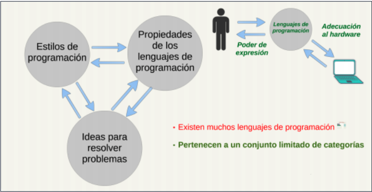
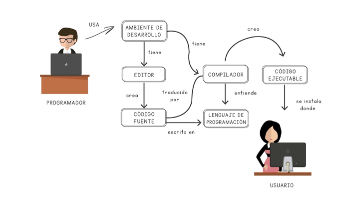
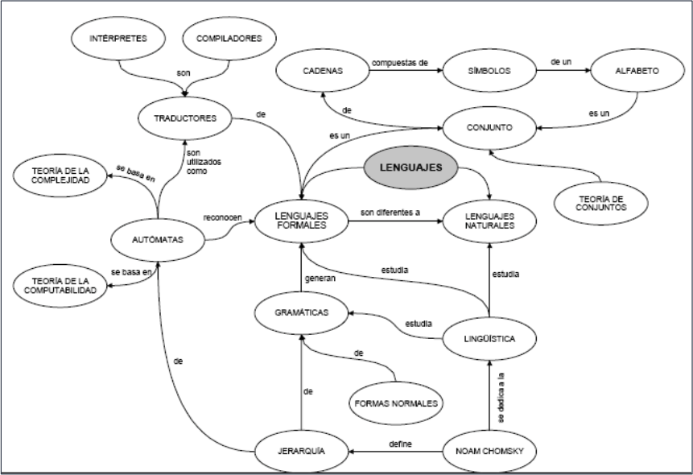
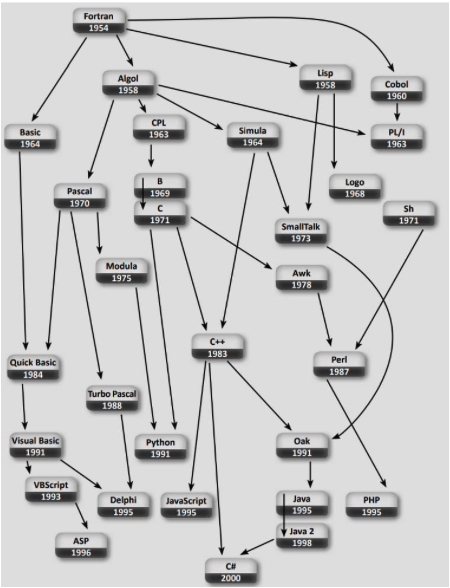
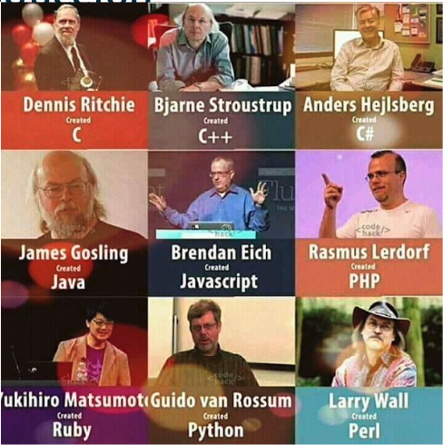
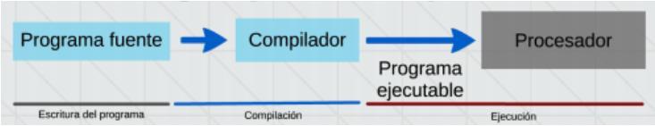
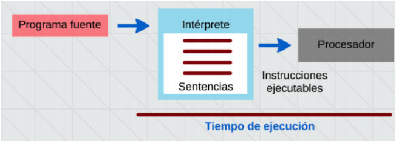
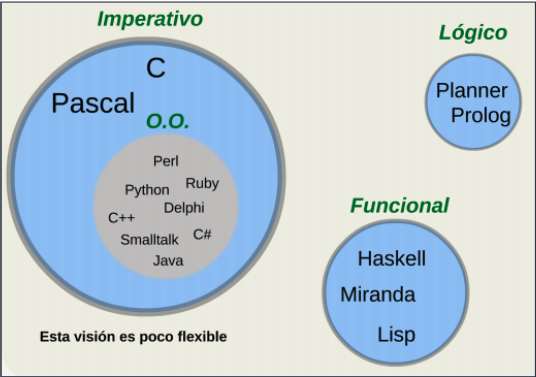
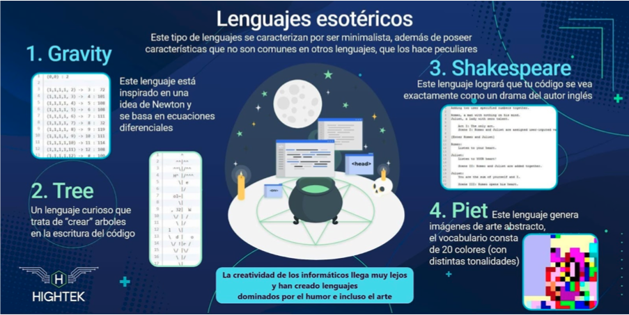

# Introducción

## Razones para estudiar los LP

* Comparar y contraponer:
  + Principios teóricos - Detalles técnicos.
  + Sintaxis - Semántica.
  + Evolución – Historia.
* Saber qué LP es el más adecuado para cada tipo de escenario y cada problema a resolver.
* Saber qué abstracciones de datos y control incluir.

## LP

* Comunicación entre seres humanos y computadoras.
* Es una notación para escribir programas (especificación de una tarea de computación)





## Historia de los LP

* Antes de la década de los 40 (del siglo XX), se programaba cableando.
* En esa década, cuando Von Neumann plantea el uso de códigos para determinar las acciones de las computadoras (grandes y costosas), evitando el cableado.
* A continuación se asignaron símbolos (notación con abreviaturas nemotécnicas) a los códigos de las instrucciones y a las localizaciones de memoria, naciendo el lenguaje ensamblador.
* Pero el lenguaje ensamblador, de bajo nivel de abstracción, dependía de cada computadora y era difícil de entender.
* Se fueron agregando al lenguaje construcciones de mayor nivel de abstracción como la asignación, los bucles y sentencias condicionales
* Pero al principio los lenguajes seguían reflejando la arquitectura Von Neumann: un área de memoria donde se almacenaban tanto a los programas como a los datos de los mismos, y por separado había una unidad de procesamiento que ejecutaba secuencialmente las instrucciones del programa en memoria. Los lenguajes estaban muy lejos de lo que ahora se entiende por un LP de alto nivel.
* Los lenguajes modernos se hacen independientes de la máquina y los programas sólo describen el procesamiento en general, en lugar de detallar todas las instrucciones que debe ejecutar la unidad de procesamiento.

## Genealogía



[Evolución de los LP desde 1965-2019 (video Youtube)](https://www.youtube.com/watch?v=2vQFKcqJF1w)

## Padres de los LP



## Abstracción en los LP

* Se refiere a … 
  + La **abstracción de los datos**, que resume sus propiedades y 
  + La **abstracción de control** que resume las propiedades de la transferencia de control (modificación de la estrategia de ejecución de un programa en una situación determinada).

* Indicar que si un LP sólo necesita describir computaciones, entonces sólo necesita mecanismos suficientes para describir todos los cálculos que puede llevar a cabo una máquina de Turing, puesto que cualquier **máquina de Turing** puede ejecutar cualquier cálculo conocido en una computadora.
* Un lenguaje de este tipo se conoce como **lenguaje completo en Turing**, debe incluir variables enteras y aritméticas, así como la ejecución de sentencias de forma secuencial, incluyendo sentencias de asignación, condicionales (if) y bucles (while).

## Clasificación de los LP

### Nivel de abstracción

* **bajo**: la programación se realiza teniendo muy en cuenta las características del procesador. Ejemplo: Ensamblador, usado principalmente para la manipulación directa de hardware. Lenguaje de máquina (código binario)
* **medio**: permiten un mayor grado de abstracción, pero al mismo tiempo mantienen algunas cualidades de los lenguajes de bajo nivel. Ejemplo: C puede realizar operaciones lógicas y de desplazamiento con bits, tratar todos los tipos de datos como lo que son en realidad a bajo nivel (números), C++, etc.
* **alto**: más parecidos al lenguaje humano. Manejan conceptos, tipos de datos, etc., de una manera cercana al pensamiento humano ignorando (abstrayéndose) del funcionamiento de la máquina. Ejemplos: Java, Ruby, Python, C#

### Dominio de aplicación

* **general**: aptos para todo tipo de tareas: Ejemplo: C. 
* **específico**: hechos para un objetivo muy concreto. Ejemplo: Csound (para crear ficheros de audio).
* **sistemas**: diseñados para realizar sistemas operativos o drivers. Ejemplo: C.
* **scripts**: para realizar tareas varias de control y auxiliares. Antiguamente eran los llamados lenguajes de procesamiento por lotes (batch) o JCL (“Job Control Languages”). Se subdividen en varias clases (de shell, de GUI, de programación web, etc.). Ejemplos: bash (shell), mIRC script, JavaScript (programación web).

### Tipo de traductor

* **compilados**: un programa traductor traduce el código del programa (código fuente) en código máquina (código objeto). Otro programa, el enlazador, unirá los ficheros de código objeto del programa principal con los de las librerías para producir el programa ejecutable. Lenguajes: Fortran, COBOL, Algol, PL/1, Modula, CLU, ADA, C, C++, Objetive-C, Pascal, Eiffel, Scala, Basic, Delphi, ML, C#, Java, Go, Rust, Swift 



* **interpretados**: un programa (intérprete), ejecuta las instrucciones del programa de manera directa. Lenguajes: APL, Forth, Lisp, Smalltalk, Matlab, PHP, Javascript, J, Perl, Python, Ruby, Basic, R, Dart



### Según almacenamiento de una variable

* **estáticos**: almacenamiento estático. Son compilados.  Ejemplos: Fortran, COBOL y derivados.
* **tipo Algol**: almacenamiento dinámico, tipos estáticos y alcance estático. Son compilados. Ejemplos: Algol, C, C++, ADA, Java, Pascal, Delphi, Go, Rust, Swift, etc.
* **dinámicos**: almacenamiento dinámico, tipos dinámicos y alcance dinámico. Son interpretados. Ejemplos: Smalltalk, BASIC, PHP, Perl, Ruby, etc.

### Generaciones 

* **primera**:
  + Se incluyen los lenguajes máquina, en los que los datos y las operaciones sobre ellos se describen mediante ceros y unos.
  + Son códigos con notaciones muy difíciles de entender por los programadores y cada procesador tiene el suyo propio. 
  + Por ejemplo, el byte 01111000 le dice al procesador Z80 de Zilog que copie en el registro A el contenido del registro B.

* **segunda**:
  + Es la que incluye a los lenguajes ensambladores, cuya traducción a lenguaje máquina es muy sencilla, y aún hoy se utilizan para tareas muy específicas, como puede ser para programar drivers para dispositivos. 
  + Siguiendo con el ejemplo anterior, el byte 01111000 se representa mediante el mnemónico “LD A, B”, que es más fácil de recordar.

* **tercera**:
   + Es la que incluye a los lenguajes de alto nivel como Pascal, Fortran, C o Java. Se denominan de alto nivel porque están muy alejados de la máquina pero muy cercanos a los programadores.
  + Para su traducción a lenguaje máquina se necesitan compiladores o intérpretes.
  + Surgen alrededor de los años 60 (del siglo XX), siendo los primeros Fortran, Lisp, Algol y Cobol.

* **cuarta**:
  + Agrupa a los lenguajes de propósito específico (para abordar un tipo concreto de problemas), como Natural, Mathematica o el del paquete estadístico SPSS que permite manipular grandes cantidades de datos con fines estadísticos.

* **quinta**:
  + Se incluyen lenguajes que se utilizan, en primer lugar, en el área de la Inteligencia Artificial, con los que se especifica más qué problema hay que resolver qué cómo se resuelve dicho problema con una secuencia de acciones.
  + De los primeros que se incluyen en este grupo es el lenguaje Prolog, aunque otros lenguajes funcionales como Haskell, también se clasifican como de quinta generación.

### Manera de abordar la tarea a realizar

* **operativos**: indican cómo hay que hacer la tarea, es decir, expresan los pasos a realizar. Ejemplo: C.
* **declarativos**: indican qué hay que hacer. Ejemplos: Lisp, Prolog. Otros ejemplos de lenguajes declarativos, pero que no son LP, son HTML (para describir páginas web) o SQL (para consultar bases de datos).

### Paradigma 



* **imperativo**:
  + LP basados en el modelo de computación Von Neumann, que propuso que el programa se almacenará en la máquina antes de ejecutarse y a su vez en 1) La ejecución secuencial de instrucciones (órdenes). 2) El uso de variables para la representación de las posiciones de memoria. 3) El uso de la asignación para cambiar el valor de las variables.
  + La mayoría de los LP son imperativos.

* **orientado a objetos**:
  + Se basa en la idea de que un objeto se puede describir como una colección de posiciones de memoria junto con todas las operaciones que pueden cambiar los valores de dichas posiciones.
  + Los objetos se agrupan en clases que representan a todos los que tienen las mismas propiedades.
  + Tras la declaración de una clase, se pueden crear objetos concretos a partir de la misma, mediante la instanciación de la clase.

* **funcionales**:
  + Se fundamenta en la evaluación de funciones o en la aplicación de funciones a valores conocidos. El mecanismo básico es la evaluación de funciones, con las siguientes características:
    + La transferencia de valores como parámetros de las funciones que se evalúan.
    + La generación de resultados en forma de valores devueltos por las funciones.
  + No involucra la asignación de una variable a una posición de memoria. Tampoco las operaciones repetitivas se representan por ciclos, sino mediante las funciones recursivas.

* **lógicos**:
  + En un LP lógica, un programa está formado por un conjunto de sentencias que describen lo que es verdad o conocido con respecto a un problema, en vez de indicar la secuencia de pasos que llevan al resultado.
  + No necesita de abstracciones de control condicionales ni de ciclos ya que el control lo aporta el modelo de inferencia lógica que subyace.
  + Puede programarse en Prolog, donde un programa es un conjunto de cláusulas, de la forma a :- b, c, d. que es una afirmación que se entiende como “a es cierto, o resoluble, si b, continuación c y finalmente d son ciertos o resolubles en este orden”

### Lugar de ejecución 

* **servidor**: se ejecutan en el servidor. Ejemplo: PHP es el más utilizado en servidores web.
* **cliente**: se ejecutan en el cliente. Ejemplo: JavaScript en navegadores web.

### Concurrencia

* **concurrente**: admiten concurrencia de procesos, esto es, la ejecución simultánea de varios procesos lanzados por el programa. Ejemplo: Ada.
* **no concurrente**: no admiten concurrencia de procesos. Ejemplo: C

### Interactividad del programa con el usuario u otros programas

* **orientados a eventos**: el flujo del programa es controlado por la interacción con el usuario o por mensajes de otros programas/sistema operativo, como editores de texto, interfaces gráficos de usuario (GUI) o kernels. Ejemplo: Visual Basic, LP declarativos.
* **no orientados a eventos**: el flujo del programa no depende de sucesos exteriores, sino que se conoce de antemano, siendo los procesos batch el ejemplo más claro (actualizaciones de bases de datos, colas de impresión de documentos, etc.). Ejemplos: LP imperativos.

### Realización visual o no del programa

* **visual**: el programa se realiza moviendo bloques de construcción de programas (objetos visuales) en un interfaz adecuado para ello. No confundir con entornos de programación visual, como Microsoft Visual Studio y sus lenguajes de programación textuales (como Visual C#). Ejemplo: Mindscript.
* **textual**: el código del programa se realiza escribiéndolo. Ejemplos: C, Java, Lisp.

### Predicción o no del siguiente estado del programa a partir del estado actual

* **deterministas**: ejemplos: todos los anteriores. 
* **no deterministas**: sirven para explorar grandes espacios de búsqueda, (como gramáticas), y en la investigación teórica de hipercomputación. Ejemplo: mutt (generador de texto aleatorio).

### Características de virtudes útiles o productivas, u oscuras y entreveradas

* **útiles**: sus virtudes en cuanto a eficiencia, sencillez, claridad, productividad, etc., motiva que sean utilizados en empresas, administraciones públicas y/o en la enseñanza. Ejemplos: Cualquier lenguaje de uso habitual (C, Java, C++, Lisp, Python, Ruby, …).
* **esotéricos**: inventados con la intención de ser los más raros, oscuros, difíciles, simples y/o retorcidos de los lenguajes, para diversión y entretenimiento de extravagantes programadores. A veces exploran nuevas ideas en programación. Ejemplo: Brainfuck.



## Descripción de los LP

* Los LP deben describirse de manera formal, completa y precisa.
* Esta descripción ha de ser, además, independiente de la máquina y de la implementación.

### Aspectos Léxicos

* El léxico o conjunto de las “palabras” o unidades léxicas que son las cadenas de caracteres significativas del lenguaje, también denominados tokens.
* También son unidades léxicas, los identificadores, los símbolos especiales de operadores y los símbolos de puntuación.

### Aspectos Sintácticos

* La sintaxis o estructura conlleva la descripción de los diferentes componentes del lenguaje y de sus combinaciones posibles.
* Para ello se utilizan las gramáticas libres de contexto. 
* Por ejemplo, la sentencia if en el lenguaje C se define por:

  ```
  <sentencia if> ::= if ( <expresión> ) <sentencia> [else <sentencia>]
  ```

### Aspectos Semánticos

* La semántica expresa los efectos de la ejecución en un contexto determinado.
* A veces esta definición interactúa con los significados de otros elementos del lenguaje, y por ello, la semántica es la parte más difícil en la definición de un lenguaje.
* Ejemplo: "Una sentencia if es ejecutada, primero, evaluando su expresión, que debe ser de tipo aritmético o apuntador, y si el resultado de la comparación es cierta, entonces se ejecuta la sentencia que sigue a la expresión. Si existe una parte else y el resultado de la expresión no es cierto, entonces se ejecuta la sentencia que sigue al else."

### Aspectos Pragmáticos

* La pragmática de los LP se ocupa de aspectos como la especificación de mecanismos para activación o deshabilitación de opciones de optimización, depuración y otras facilidades pragmáticas, que suelen incluirse en los traductores.

## Diseño de los LP

* Hay una gran variedad de LP y continúan apareciendo nuevos ¿por qué?
  + Evolución.
  + Propósito especial.
  + Preferencia personal.
* Hasta nuestros días, ningún lenguaje es adecuado para cualquier escenario o tarea, por lo que es necesario conocer de cada lenguaje qué características (o principios) lo diferencian y cuáles los hacen más adecuados para determinados escenarios o tareas.

## ¿Qué convierte a un lenguaje en exitoso?

* Poder expresivo.
* Facilidad de uso para novatos (baja curva de aprendizaje).
* Facilidad de implementación.
* Estandarización.
* Código abierto.
* Excelentes compiladores.
* Inercia, economía, quien lo promueve.

## Características de Diseño de los LP

* **Eficiencia**: el diseño debe permitir al traductor la generación de código ejecutable eficiente (optimizabilidad).

* **Regularidad**: se refiere al comportamiento de las características del lenguaje.
  + **generalidad**: se consigue cuando el uso y la disponibilidad de los constructores no están sujetas a casos especiales y cuando el lenguaje incluye solo a los constructores necesarios y el resto se obtienen por combinaciones de constructores relacionados. Ejemplo: Pascal no tiene arrays de longitud variable con lo que carecen de generalidad.
  + **ortogonalidad**: ocurre cuando los constructores del lenguaje pueden admitir combinaciones significativas y en ellas, la interacción entre los constructores o con el contexto, no provocan restricciones ni comportamientos inesperados. Ejemplo: En Pascal las funciones solo pueden devolver valores de tipo escalar o array, y en C o C++ las funciones pueden devolver cualquier tipo de datos, excepto arrays o matrices.
  + **uniformidad**: se refiere a que lo similar se ve similar y lo diferente, diferente. Lo que implica la consistencia entre la apariencia y el comportamiento de los constructores. Ejemplo: En C los operadores & y && parecen similares pero su comportamiento es muy diferente.

* Principios adicionales (simplicidad, expresividad, extensibilidad, capacidad de restricción, consistencia entre las notación y las convenciones, precisión, portabilidad, seguridad, interoperabilidad)

## ¿Qué lenguaje usar?

* No existe un "mejor lenguaje" de programación en términos absolutos. Pero, en ciertas situaciones, algunos lenguajes son una mejor opción que otros.
* Algunos criterios para adoptar un lenguaje/framework:
  + rendimiento, eficiencia.
  + capacidad técnica para satisfacer los requerimientos del proyecto.
  + popularidad (documentación, soporte, comunidad, bibliotecas, ...)
  + plataformas soportadas (web, standalone, mobile, ...)

## LP con mayor demanda

1. Go
1. Scala
1. Ruby
1. Typescript
1. Kotlin
1. Objetive-C
1. Javascript
1. Swift
1. PHP
1. Java
1. Python

## Actividades

1. ¿En qué se diferencia la programación declarativa de la programación orientada a objetos? 
2. ¿Cree que afecta la capacidad de expresión de un lenguaje en la eficiencia de programación en el mismo? 
3. Defina y aporte un ejemplo de cada uno de los tres principios en que se divide la eficiencia de un LP.
4. Defina las tres propiedades en que se subdivide el principio de regularidad de un LP.
5. Describa brevemente e incluya un ejemplo de las siguientes características que afectan al diseño de un lenguaje respecto a la eficiencia.
