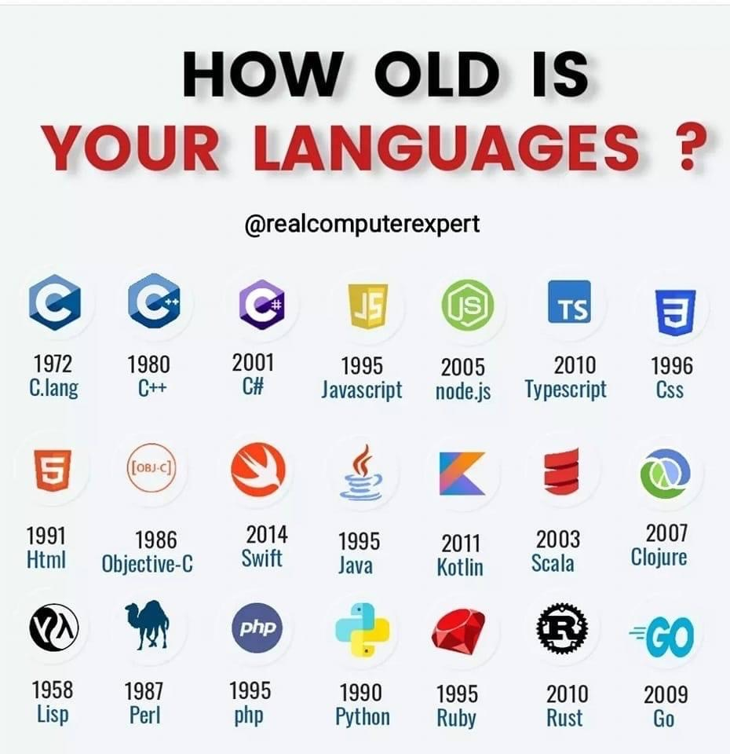
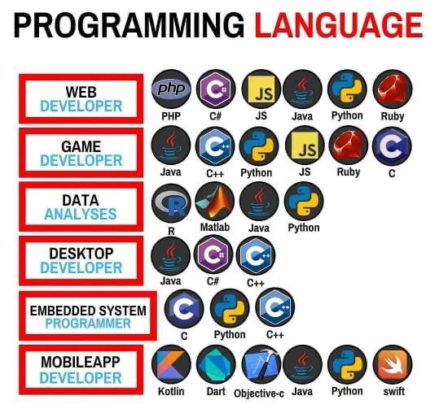

# Introducción

## LP

* Comunicación entre seres humanos y computadoras.
* Es una notación para escribir programas (especificación de una tarea de computación)


## Historia de los LP

* Antes de 1940 se programaba cableando
* En 1940, Von Neumann plantea el uso de códigos para determinar las acciones de las computadoras (grandes y costosas), evitando el cableado
* A continuación se asignaron símbolos (notación con abreviaturas nemotécnicas) a los códigos de las instrucciones y a las localizaciones de memoria, naciendo el lenguaje ensamblador
* Pero el lenguaje ensamblador, de bajo nivel de abstracción, dependía de cada computadora y era difícil de entender
* Se fueron agregando al lenguaje construcciones de mayor nivel de abstracción como la asignación, los bucles y sentencias condicionales
* Pero al principio los lenguajes seguían reflejando la arquitectura Von Neumann:
  * un área de memoria donde se almacenaban tanto a los programas como a los datos de los mismos, y por separado
  * una unidad de procesamiento que ejecutaba secuencialmente las instrucciones del programa en memoria
* Los lenguajes estaban muy lejos de lo que ahora se entiende por un LP de alto nivel
* Los lenguajes modernos se hacen independientes de la máquina y los programas sólo describen el procesamiento en general, en lugar de detallar todas las instrucciones que debe ejecutar la unidad de procesamiento


* **Vamos a estudiar los lenguajes de programación de alto nivel**
* **¿Por qué hoy siguen existiendo lenguajes de bajo nivel (assembler, web assembly, bytecodes, etc)?**

## ¿Cómo vamos a estudiar los LP?

* Existe un gran conjunto de LP
* History of Programming Languages: [https://hopl.info/](https://hopl.info/) (8945 lenguajes)
* ES IMPOSIBLE ESTUDIARLOS POR EXTENSIÓN
* **¿Cómo los vamos a estudiar?**
* VAMOS A ESTUDIARLOS POR COMPRENSIÓN
* **¿Cómo vamos a definir las categorías?**

### Estudio cronológico





[Línea de tiempo en tamañp completo](https://drive.google.com/file/d/1A-S6K8RudWwZYsgqHMSfDaprZaeF3F2P/view)

### Padres de los LP


### Popularidad

* [LP mas populares 1965 -2022 (video Youtube)](https://www.youtube.com/watch?v=qQXXI5QFUfw)
* [https://tjpalmer.github.io/languish/](https://tjpalmer.github.io/languish/)
* [https://www.youtube.com/c/CodingTech](https://www.youtube.com/c/CodingTech)
* [https://www.youtube.com/@contextfree](https://www.youtube.com/@contextfree)
* [https://pypl.github.io/PYPL.html](https://pypl.github.io/PYPL.html)
* [https://www.tiobe.com/tiobe-index/](https://www.tiobe.com/tiobe-index/)

### Por paradigmas

* **Paradigma**: es una colección de modelos conceptuales que juntos modelan el proceso de diseño, orientan la forma de pensar y solucionar los problemas y, por lo tanto, determinan la estructura final de un programa


| Paradigmas | Características |
| -- | -- |
| **Imperativo** | bloques o módulos, variables, secuencia de instrucciones, selección, iteración |
| **Objetos**    | clases, objetos (entidades), invocación de métodos, encapsulamiento, polimorfismo, herencia |
| **Funcional**  | componer funciones, cálculo lambda, transparencia referencial, evaluación diferida, funciones como parámetros |
| **Lógico**     | cláusulas de Horn, aserciones lógicas: hechos y reglas, deducir consecuencias a partir de premisas: unificación y backtracking |


#### Ejemplo imperativo (Pascal)

```pascal
PROGRAM Hanoi(input, output); 
VAR N:integer; 
PROCEDURE dohanoi(N, Tfrom, Tto, Tusing : integer); 
BEGIN 
    IF N > 0 THEN 
    BEGIN 
          dohanoi(N-1, Tfrom, Tusing, Tto); 
          writeln('move ', Tfrom:1, ' --> ', Tto:1); 
          dohanoi(N-1, Tusing, Tto, Tfrom); 
    END 
END; 
BEGIN 
    dohanoi(5, 1, 3, 2)
END.
```

#### Ejemplo objetos (Python)

```py
def hanoi(n, inc='1', temp='2', fin='3'):
  if n > 0:
      hanoi(n-1, inc, fin, temp)
      print('se mueve de torre', inc, 'a torre', fin)
      hanoi(n-1, temp, inc, fin)

hanoi(5)
```

#### Ejemplo funcional (Lisp)

```lisp
(defun torres-de-hanoi (discos)
  (interactive "nDime tus discos y te digo cuantos pasos tienes que dar: " discos)
  (message (number-to-string (torres-de-hanoi-aux discos))))
(defun torres-de-hanoi-aux (discos)
  (if (= discos 1)
      1
    (+ 1 (* 2 (torres-de-hanoi-aux (- discos 1))))))
```

#### Ejemplo lógico (Prolog)

```prolog
hanoi(1,A,B,C) :- write("Mueve del ",A," al ",C), nl.
hanoi(N,A,B,C) :- N>1, M is N-1, hanoi(M,A,C,B), hanoi(1,A,B,C), hanoi(M,B,A,C). 
```

### Por categoría / paradigma


| Nivel de abstracción ||
| -- | -- |
| **Bajo** | la programación se realiza teniendo muy en cuenta las características del procesador. Ejemplo: Ensamblador, usado principalmente para la manipulación directa de hardware. Lenguaje de máquina (código binario) |
| **Medio** | permiten un mayor grado de abstracción, pero al mismo tiempo mantienen algunas cualidades de los lenguajes de bajo nivel. Ejemplo: C puede realizar operaciones lógicas y de desplazamiento con bits, tratar todos los tipos de datos como lo que son en realidad a bajo nivel (números), C++, etc. |
| **Alto** | más parecidos al lenguaje humano. Manejan conceptos, tipos de datos, etc., de una manera cercana al pensamiento humano ignorando (abstrayéndose) del funcionamiento de la máquina. Ejemplos: Java, Ruby, Python, C# |

| Dominio ||
| -- | -- |
| **General** | aptos para todo tipo de tareas. Ejemplo: C |
| **Específico** | hechos para un objetivo muy concreto. Ejemplo: Csound (para crear ficheros de audio) |
| **Sistemas** | diseñados para realizar sistemas operativos o drivers. Ejemplo: C |
| **Scripts** | para realizar tareas varias de control y auxiliares. Antiguamente eran los llamados lenguajes de procesamiento por lotes (batch) o JCL (“Job Control Languages”). Se subdividen en varias clases (de shell, de GUI, de programación web, etc.). Ejemplos: bash (shell), mIRC script, JavaScript (programación web) |

| Tipo de traductor ||
| -- | -- |
| **Compilados** | un programa traductor traduce el código del programa (código fuente) en código máquina (código objeto). Otro programa, el enlazador, unirá los ficheros de código objeto del programa principal con los de las librerías para producir el programa ejecutable. Lenguajes: Fortran, COBOL, Algol, PL/1, Modula, CLU, ADA, C, C++, Objetive-C, Pascal, Eiffel, Scala, Basic, Delphi, ML, C#, Java, Go, Rust, Swift |
| **Interpretados** | un programa (intérprete), ejecuta las instrucciones del programa de manera directa. Lenguajes: APL, Forth, Lisp, Smalltalk, Matlab, PHP, Javascript, J, Perl, Python, Ruby, Basic, R, Dart  |

| Según almacenamiento de una variable ||
| -- | -- |
| **Estáticos** | almacenamiento estático. Son compilados. Ejemplos: Fortran, COBOL y derivados |
| **Tipo Algol** | almacenamiento dinámico, tipos estáticos y alcance estático. Son compilados. Ejemplos: Algol, C, C++, ADA, Java, Pascal, Delphi, Go, Rust, Swift, etc. |
| **Dinámicos** | almacenamiento dinámico, tipos dinámicos y alcance dinámico. Son interpretados. Ejemplos: Smalltalk, BASIC, PHP, Perl, Ruby, etc. |

| Generaciones ||
| -- | -- |
| **Primera** | incluye los lenguajes de máquina, en los que los datos y las operaciones sobre ellos se describen mediante ceros y unos |
| **Segunda** | incluye los lenguajes ensambladores, cuya traducción a lenguaje máquina es muy sencilla, y aún hoy se utilizan para tareas muy específicas, como puede ser para programar drivers para dispositivos |
| **Tercera** | incluye los lenguajes de alto nivel como Pascal, Fortran, C o Java |
| **Cuarta** | incluye los lenguajes de propósito específico como Natural, Mathematica o el del paquete estadístico SPSS que permite manipular grandes cantidades de datos con fines estadísticos |
| **Quinta** | incluye los lenguajes que se utilizan en el área de la Inteligencia Artificial como Prolog o Haskell |

| Manera de abordar la tarea a realizar | |
| -- | -- |
| **Operativos** | indican **cómo** hay que hacer la tarea, es decir, expresan los pasos a realizar. Un lenguaje de este tipo se conoce como **lenguaje completo en Turing**, debe incluir variables enteras y aritméticas, así como la ejecución de sentencias de forma secuencial, incluyendo sentencias de asignación, condicionales (if) y bucles (while). Ejemplo: C |
| **Declarativos** | indican **qué** hay que hacer. Declaración de proposiciones, condiciones, restricciones, ecuaciones o transformaciones que caracterizan al problema y describen su solución. Ejemplos: Lisp, Prolog. Otros ejemplos de lenguajes declarativos, pero que no son LP, son HTML (para describir páginas web) o SQL (para consultar bases de datos) |

| Paradigmas ||
| -- | -- |
| **Imperativos** | Fortran, C, Pascal, Algol, COBOL, ADA, CLIPPER, FOX, PL/1 |
| **Orientados a Objetos** | Python, Java, Ruby, C++, C#, Delphi, Smalltalk, Eiffel, Perl, Go, Rust, Simula |
| **Funcionales** | Haskell, Miranda, Lisp, Scheme, Scala, Ocam, Clojure, Racket, ML, Gofer |
| **Lógicos** | Prolog, Planner |


[https://en.wikipedia.org/wiki/Comparison_of_multi-paradigm_programming_languages](https://en.wikipedia.org/wiki/Comparison_of_multi-paradigm_programming_languages)

| Lugar de ejecución ||
| -- | -- |
| **Servidor** | se ejecutan en el servidor. Ejemplo: PHP es el más utilizado en servidores web |
| **Cliente** | se ejecutan en el cliente. Ejemplo: JavaScript en navegadores web |

| Concurrencia ||
| -- | -- |
| **Concurrente** | admiten concurrencia de procesos, esto es, la ejecución simultánea de varios procesos lanzados por el programa. Ejemplo: Ada |
| **No concurrente** | no admiten concurrencia de procesos. Ejemplo: C |

| Interactividad del programa con el usuario u otros programas ||
| -- | -- |
| **Orientados a eventos** | el flujo del programa es controlado por la interacción con el usuario o por mensajes de otros programas/sistema operativo, como editores de texto, interfaces gráficos de usuario (GUI) o kernels. Ejemplo: Visual Basic, LP declarativos |
| **No orientados a eventos** | el flujo del programa no depende de sucesos exteriores, sino que se conoce de antemano, siendo los procesos batch el ejemplo más claro (actualizaciones de bases de datos, colas de impresión de documentos, etc.). Ejemplos: LP imperativos |

| Realización visual o no del programa ||
| -- | -- |
| **Visual** | el programa se realiza moviendo bloques de construcción de programas (objetos visuales) en un interfaz adecuado para ello. No confundir con entornos de programación visual, como Microsoft Visual Studio y sus lenguajes de programación textuales (como Visual C#). Ejemplo: Mindscript, Scratch, App Inventor, Gobstones, PilasBloques, etc. |
| **Textual** | el código del programa se realiza escribiéndolo. Ejemplos: C, Java, Lisp, etc. |

| Predicción o no del siguiente estado del programa a partir del estado actual | |
| -- | -- |
| **Deterministas** | ejemplos: todos los anteriores |
| **No deterministas** | sirven para explorar grandes espacios de búsqueda, (como gramáticas), y en la investigación teórica de hipercomputación. Ejemplo: mutt (generador de texto aleatorio) |

| Características de virtudes útiles o productivas, u oscuras y entreveradas ||
| -- | -- |
| **Útiles** | sus virtudes en cuanto a eficiencia, sencillez, claridad, productividad, etc., motiva que sean utilizados en empresas, administraciones públicas y/o en la enseñanza. Ejemplos: Cualquier lenguaje de uso habitual (C, Java, C++, Lisp, Python, Ruby, etc.)  |
| **Esotéricos** | inventados con la intención de ser los más raros, oscuros, difíciles, simples y/o retorcidos de los lenguajes, para diversión y entretenimiento de extravagantes programadores. A veces exploran nuevas ideas en programación. Ejemplo: Brainfuck.     |

### Identificación de aspectos sintácticos, semánticos y pragmáticos

* Los LP deben describirse de manera formal, completa y precisa
* Esta descripción ha de ser, además, independiente de la máquina y de la implementación

| Patrones que se repiten en varios lenguajes |
| -- |
| Tipos |
| Alcance / Ámbito |
| Almacenamiento |
| Concurrencia |
| Nombre |
| Tiempo de vida |
| Valor |
| Pasaje de parámetros |
| ... |


## Diseño de los LP

* Hay una gran variedad de LP y continúan apareciendo nuevos ¿por qué?
  * Evolución
  * Propósito especial
  * Preferencia personal
* Hasta nuestros días, ningún lenguaje es adecuado para cualquier escenario o tarea, por lo que es necesario conocer de cada lenguaje qué características (o principios) lo diferencian y cuáles los hacen más adecuados para determinados escenarios o tareas

## ¿Qué convierte a un lenguaje en exitoso?

* Poder expresivo
* Facilidad de uso para novatos (baja curva de aprendizaje)
* Facilidad de implementación
* Estandarización
* Código abierto
* Excelentes compiladores
* Inercia, economía, quien lo promueve

## Características de Diseño de los LP

* **Eficiencia**: el diseño debe permitir al traductor la generación de código ejecutable eficiente (optimizabilidad)

* **Regularidad**: se refiere al comportamiento de las características del lenguaje
  * **generalidad**: se consigue cuando el uso y la disponibilidad de los constructores no están sujetas a casos especiales y cuando el lenguaje incluye solo a los constructores necesarios y el resto se obtienen por combinaciones de constructores relacionados. Ejemplo: Pascal no tiene arrays de longitud variable con lo que carecen de generalidad
  * **ortogonalidad**: ocurre cuando los constructores del lenguaje pueden admitir combinaciones significativas y en ellas, la interacción entre los constructores o con el contexto, no provocan restricciones ni comportamientos inesperados. Ejemplo: En Pascal las funciones solo pueden devolver valores de tipo escalar o array, y en C o C++ las funciones pueden devolver cualquier tipo de datos, excepto arrays o matrices
  * **uniformidad**: se refiere a que lo similar se ve similar y lo diferente, diferente. Lo que implica la consistencia entre la apariencia y el comportamiento de los constructores. Ejemplo: En C los operadores & y && parecen similares pero su comportamiento es muy diferente

* Principios adicionales (simplicidad, expresividad, extensibilidad, capacidad de restricción, consistencia entre las notación y las convenciones, precisión, portabilidad, seguridad, interoperabilidad)

## ¿Qué LP debo aprender primero?


## ¿Qué LP usar?

* No existe un "mejor lenguaje" de programación en términos absolutos. Pero, en ciertas situaciones, algunos lenguajes son una mejor opción que otros
* Algunos criterios para adoptar un lenguaje/framework:
  * rendimiento, eficiencia
  * capacidad técnica para satisfacer los requerimientos del proyecto
  * popularidad (documentación, soporte, comunidad, bibliotecas, ...)
  * plataformas soportadas (web, standalone, mobile, ...)

## Actividades

1. ¿En qué se diferencia la programación declarativa de la programación imperativa?
1. Resolver el mismo problema en los cuatro paradigmas
1. ¿Cree que afecta la capacidad de expresión de un lenguaje en la eficiencia de programación en el mismo?
1. Defina y aporte un ejemplo de cada uno de los tres principios en que se divide la eficiencia de un LP
1. Defina las tres propiedades en que se subdivide el principio de regularidad de un LP
