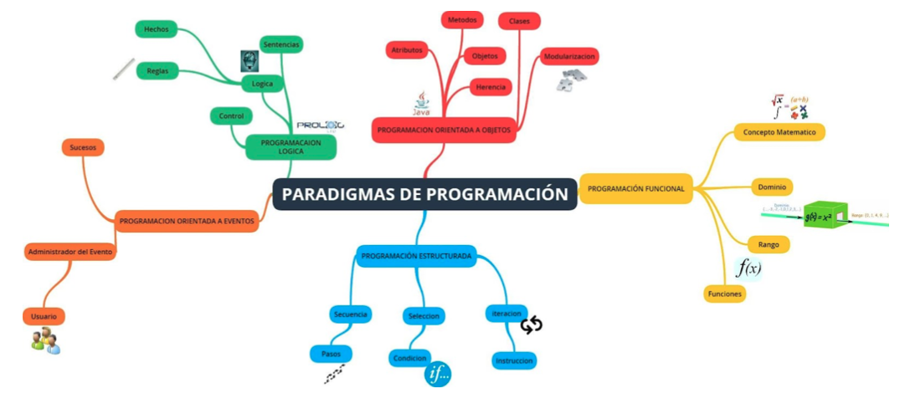
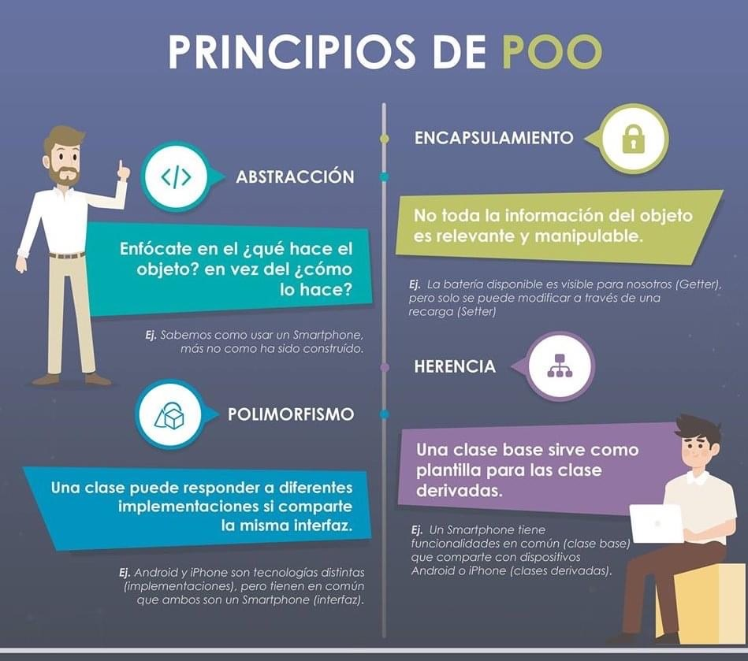
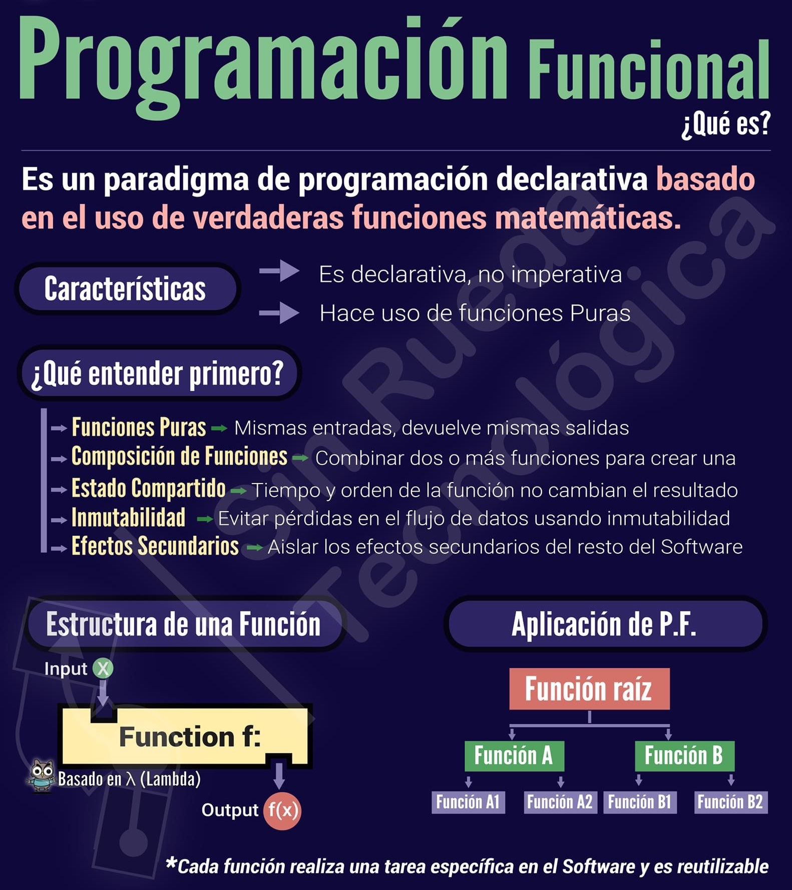
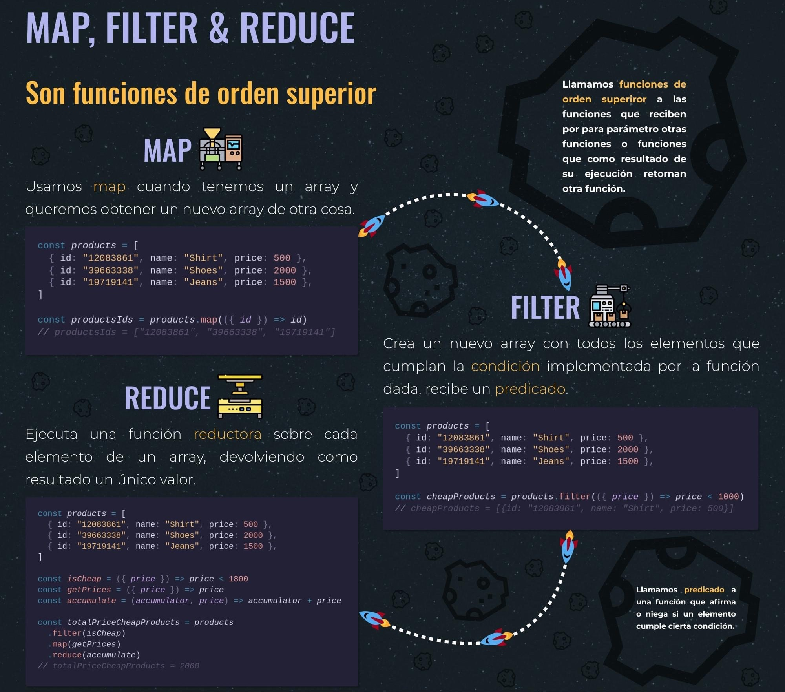

# Paradigmas

## Paradigma de programación

* Conjunto coherente de métodos para resolver un problema.
* Colección de patrones conceptuales integrados que orientan (guían) el proceso de desarrollo de software y determinan la estructura de un programa válido.
* Es un modelo básico de diseño e implementación de programas.
Un modelo que permite desarrollar programas conforme a ciertos principios o fundamentos específicos que se aceptan como válidos.
* En otras palabras, es una colección de modelos conceptuales que juntos modelan el proceso de diseño, orientan la forma de pensar y solucionar los problemas y, por lo tanto, determinan la estructura final de un programa.

## Lenguajes y Paradigmas: “soportar” o “admitir”

* Un LP “soporta” un paradigma si provee mecanismos que facilitan su implementación eficiente. Es decir, implementa mecanismos que permiten la sencilla aplicación del paradigma (impone restricciones para respetarlo).
* Un LP “admite” un paradigma si es posible escribir programas siguiendo los lineamientos del paradigma, pero hacerlo demanda un esfuerzo notable.
* El LP no exige la aplicación del paradigma, permite programar de acuerdo al paradigma pero sin proveer facilidades.
* Los LP, necesariamente, se encuadran en uno o varios paradigmas a la vez a partir del tipo de órdenes que permiten implementar, algo que tiene una relación directa con su sintaxis.

## Clasificación de los paradigmas de programación

* Procedimentales u operacionales:
  * Imperativo. Dividido en bloques + secuencia + selección + iteración
  * Orientado a objetos. Abstracción de datos en Objetos + Encapsulamiento de datos y comportamientos + Paso de mensajes entre objetos.

* Declarativos o no convencionales:
  * Lógico. Aserciones lógicas: hechos + reglas.
  * Funcional. Los programas se componen de funciones + Cálculo lambda



### Paradigmas procedimentales u operacionales

* Indican el modo de construir la solución, es decir detallan paso a paso el mecanismo para obtenerla.
* Se basan en “cómo” lograr la solución.
* Características: secuencia computacional e instrucciones de control (decisiones e iteraciones).

### Paradigmas declarativos

* Describen las características que debe tener la solución. Es decir especifican “qué” se desea obtener pero no requieren indicar “cómo” obtenerla.
* Se basan en desarrollar programas especificando o “declarando” un conjunto de proposiciones, condiciones, restricciones, afirmaciones, ecuaciones o transformaciones que caracterizan al problema y describen su solución

## Paradigma Imperativo

* Un programa es una secuencia de instrucciones que indican el flujo de la ejecución.
* Ejecución secuencial de instrucciones.
* Uso de variables representando valores de locaciones de memoria.
* Uso de sentencias de asignación para cambiar los valores de las variables, permitiendo así al programa operar sobre las locaciones de memoria.
* Su esencia es resolver un problema mediante la ejecución repetitiva y paso a paso de operaciones y cálculos con la asignación de los valores calculados a posiciones de memoria.
* La programación consiste en determinar qué datos son requeridos para el cálculo, asociar a esos datos una dirección de memoria, y efectuar, paso a paso, una secuencia de transformaciones en los datos almacenados, de forma que el estado final represente el resultado correcto.
* Se busca estructurar el control realizando una programación estructurada y modular con abstracción de datos para fomentar la reusabilidad y extensibilidad.
* Los programas se construyen siguiendo una aproximación Top-Down y Modular:
  * Sólo subprogramas.
  * Dividir para conquistar.
  * Existen abstracciones algorítmicas: abstracción a nivel instrucción (agrupar instrucciones en unidades – Procedure de Pascal) y abstracción de expresiones (Function de Pascal).
* Los programas se construyen siguiendo una aproximación Modular:
  * Programación estructurada: estructuras de control a nivel instrucción (secuencia, selección e iteración).
  * Programación modular: descomponer el problema priorizando recombinación y reutilización en otros problemas. Los módulos deben realizar conceptualmente una sola tarea.
  * Abstracción de datos: reconocer entidades abstractas (hallar representación para los datos) y operaciones lógicas (transformar en operaciones concretas).
* Lenguajes: PASCAL, C, Fortran, Algol, COBOL, ADA, CLIPPER, FOX, PL/1, etc.

### Torres de Hanoi en Pascal

  ```pascal
  PROGRAM Hanoi(input, output); 
  VAR N:integer; 
  PROCEDURE dohanoi(N, Tfrom, Tto, Tusing : integer); 
  BEGIN 
      IF N > 0 THEN 
      BEGIN 
            dohanoi(N-1, Tfrom, Tusing, Tto); 
            writeln('move ', Tfrom:1, ' --> ', Tto:1); 
            dohanoi(N-1, Tusing, Tto, Tfrom); 
      END 
  END; 
  BEGIN 
      dohanoi(5, 1, 3, 2)
  END.
  ```

### Torres de Hanoi en C

  ```C
  #include <stdio.h>
  #include <conio.h>
  void hanoi(int n,int com, int aux, int fin);
  void main(void) {
      hanoi(5, 'A', 'B', 'C');
  }
  void hanoi(int n,int com, int aux, int fin){
        if(n==1)
            printf("%c->%c",com,fin);
        else {
            hanoi(n-1,com,fin,aux);
            printf("\n%c->%c\n",com,fin);
            hanoi(n-1,aux,com,fin);
        }
  }
  ```

## Paradigma Orientado a Objetos

* Se caracteriza por reconocer las entidades del problema (similar a la abstracción de datos).
* Caracterizado por atributos y comportamiento (de acuerdo a su propósito y habilidades).
* Entidad = Objeto (abstracciones que representan las entidades del mundo real que forman parte del dominio del problema).
* Todo es pensado como un objeto.
* Comunicación por mensajes, diferente a la semántica de llamadas a procedimiento.
* Mensaje: invocación de un método de un objeto en particular.
* Concibe a un sistema como un conjunto de entidades que representan al mundo real, los “objetos”, que tienen distribuida la funcionalidad e información necesaria y cooperan entre sí para el logro de un objetivo común.
* Estructura de desarrollo modular basada en objetos, que son definidos a partir de clases, como implementación de tipos abstractos de datos.
* Encapsulamiento: separa las interfaces de las implementaciones de la funcionalidad del sistema (método) y oculta la información (variables).
* Mecanismo de envío de mensajes (permite delegación de responsabilidades).
* Polimorfismo: responden a un mismo mensaje: 3 + 5; “Ho” + “la”;
* Herencia: permite que una clase sea definida como una extensión o modificación de otra (Subclase es una SuperClase)
* Lenguajes: Smalltalk, Eiffel, Java, C++, C#, Python, Simula, Objective C, etc.



### Torres de Hanoi en Java

  ```java
  public class MainClass { 
      public static void main(String[] args) { 
            doTowers(5, 'A', 'B', 'C'); 
      } 
      public static void doTowers(int topN, char from, char inter, char to) { 
            if (topN == 1)  
                System.out.println("Disk 1 from " + from + " to " + to); 
          else { 
                doTowers(topN - 1, from, to, inter); 
                System.out.println("Disco " + topN + " desde " + from + " hacia " + to);
              doTowers(topN - 1, inter, from, to);
          }
      }
  }
  ```

### Torres de Hanoi en Smalltalk

  ```smalltalk
  moveTower: height from: fromPin to: toPin using: usingPin
  (height > 0) ifTrue: [
      self moveTower: (height-1) from: fromPin to: usingPin using: toPin.
      self moveDisk: fromPin to: toPin.
      self moveTower: (height-1) from: usingPin to: toPin using: fromPin]
  moveDisk: fromPin to: toPin
  Transcript cr.
  Transcript show: (fromPin printString,' - > ', toPin printString). 
  ```

### Torres de Hanoi en Python

  ```python
  def hanoi(n, inc='1', temp='2', fin='3'):
    if n > 0:
        hanoi(n-1, inc, fin, temp)
        print('se mueve de torre', inc, 'a torre', fin)
        hanoi(n-1, temp, inc, fin)

  hanoi(5)
  ```

## Paradigma Lógico

* Basado en lógica de predicados de primer orden y más en particular aún, las Claúsulas de Horn (reglas de la lógica, lenguaje preciso para expresar conocimiento). Dichas cláusulas son una forma de lógica de predicados con una sola conclusión en cada cláusula y un conjunto de premisas de cuyo valor de verdad se deduce el valor de verdad de la conclusión: una conclusión es cierta si lo son simultáneamente todas sus premisas.
* LP representativo: Prolog. Existen diferentes versiones y variantes (dialectos), pero todas basadas en la misma raíz del lenguaje PROLOG.
* Los fundamentos del paradigma son:
  * Deducir consecuencias a partir de premisas (inferir conclusiones a partir de datos).
  * Estudiar o decidir el valor de verdad de una sentencia a partir del valor de verdad de otras.
  * Establecer la consistencia entre hechos y verificar la validez de argumentos.
* Características de los lenguajes lógicos:
  * Eliminación del control. Internamente, existe un mecanismo interno llamado backtracking que actúa como control de secuencia.
  * El concepto de variable es más matemático, son nombres que retienen valores. Las variables son “unificadas” con valores particulares temporalmente y se van sustituyendo durante la ejecución del programa.
  * Establecen “que” es lo que se debe hacer sin dar ninguna especificación sobre el “cómo” hacerlo.
* Características de los programas lógicos:
  * No tiene un algoritmo que indique los pasos que detallen la manera de llegar a un resultado.
  * Conjuntos de axiomas que establecen relaciones.
  * Definen un conjunto de consecuencias que determinan el significado.
  * Son teoremas y la ejecución es una prueba automática.
  * Es decir, que los programas lógicos se consideran como una serie de aserciones lógicas.
  * Contiene una base de conocimiento sobre la que se hacen consultas.
  * La base de conocimiento está formada por hechos, que representan la información del sistema expresada como relaciones entre datos, y reglas lógicas que permiten deducir consecuencias a partir de combinaciones entre los hechos y, en general, otras reglas.
  * Se construye especificando la información del problema real en una base de conocimiento en un lenguaje formal y el problema se resuelve mediante un mecanismo de inferencia que actúa sobre ella. Así pues, una clave de la programación lógica es poder expresar apropiadamente todos los hechos y reglas necesarios que definen el dominio de un problema.

### Prolog

* Desarrollado en 1972 por Alain Colmerauer, Robert Kowalski y Philippe Roussel.
* Un programa escrito en un lenguaje lógico es una secuencia de “cláusulas”.
* Las cláusulas pueden ser:
  * Hecho: Ejemplo: tiene(coche,ruedas).
  * Regla: Ejemplo: virus(X):- programa(X),propaga(X).
* Ejemplo 1:

  ```prolog
  padre(juan, alberto).
  padre(luis, alberto).
  padre(alberto, leoncio).
  padre(gerónimo, leoncio).
  padre(luis, gerónimo).
  hermano(A,B) :- padre(A,P), padre(B,P), A \== B.
  nieto(A,B) :- padre(A,P), padre(P,B).
  ```

* Ejemplo 2:

  ```prolog
  persona(ana).
  persona(pepe).
  persona(juan).
  persona(josé).
  edad(ana, 23).
  edad(pepe, 19).
  edad(juan, 14).
  edad(josé, 5).
  persona_mayor_edad(P) :- persona(P), edad(P,E), E>18.
  persona_mayor_que(P1,P2) :- persona(P1), persona(P2), edad(P1,E1), edad(P2,E2), E1>E2.
  ```

* Ejemplo 3:

  ```prolog
  habla(ale,ruso).
  habla(juan,ingles).
  habla(maria,ruso).
  habla(maria,ingles).
  seComunicaCon(X,Y) :- habla(X,L), habla(Y,L), X\=Y
  ```

* Ejemplo 4:

```prolog
longitud([],0).
longitud([X|Y],N) :- longitud(Y,M), N=M+1.
```

### Torres de Hanoi en Prolog

  ```prolog
  hanoi(1,A,B,C) :- write("Mueve del ",A," al ",C), nl.
  hanoi(N,A,B,C) :- N>1, M is N-1, hanoi(M,A,C,B), hanoi(1,A,B,C), hanoi(M,B,A,C). 
  ```

## Paradigna Funcional

* Basado en el modelo matemático de composición funcional (uso de funciones), de ahí que habitualmente se hable de él como paradigma funcional.
* La esencia de esta metodología está en componer funciones para definir otras más complejas.
* En este modelo, el resultado de un cálculo es la entrada del siguiente, y así sucesivamente hasta que una composición produce el resultado deseado.
* Así, un programa es un conjunto de funciones que cooperan entre ellas para el logro de un objetivo común.
* Muy popular en la resolución de problemas de inteligencia artificial, matemática, lógica, procesamiento paralelo.
* Lenguajes: Lisp, Scheme, Common Lisp, ML, Gofer, Haskell, etc.
* Ventajas:
  * Vista uniforme de programa y función.
  * Tratamiento de funciones como datos.
  * Liberación de efectos colaterales.
  * Manejo automático de memoria.
* Desventaja:
  * Ineficiencia de ejecución.



### Función

* Es el mapeo de los miembros de un conjunto, llamado dominio, a otro conjunto, llamado rango.
* Los mapeos son realizados por expresiones.
* Requiere establecer una signatura y una regla de mapeo.
* En la definición se establecen los parámetros.
* En la aplicación se habla de argumentos.
* El retorno de la función provee el resultado.
* El orden de evaluación de las funciones es realizado por expresiones condiciones y recursivas.
* Las funciones no producen efectos laterales (sin asignación destructiva).
* El VALOR más importante en la programación funcional es el de una FUNCIÓN
* Matemáticamente una función es un correspondencia:  f: A -> B
* A cada elemento de A le corresponde un único elemento en B.
* f(x) denota el resultado de la aplicación de f a x.
* Las funciones son tratadas como valores pueden ser pasadas como parámetros, retornar resultados, etc.

### Expresiones y valores

* La expresión es la noción central de la programación funcional.
* Una expresión es su VALOR.
* El valor de una expresión depende ÚNICAMENTE de los valores de las sub expresiones que la componen.
* Las expresiones también pueden contener VARIABLES (valores desconocidos).
* La noción de Variable es la de “variable matemática”, no la de celda de memoria. “Diferentes ocurrencias del mismo nombre hacen referencia al mismo valor desconocido”.

### Características

* **Transparencia referencial**
  * Implementa la TRANSPARENCIA REFERENCIAL en sus expresiones (dos expresiones sintácticamente iguales darán el mismo valor, porque no existen EFECTOS LATERALES; es decir, no tiene asignación destructiva).
  * Las variables son utilizadas para hacer referencia a valores intermedios y parámetros de las funciones, como resultados de cálculos anteriores y entradas a subsiguientes cálculos.
  * Si bien internamente puedan utilizar alguna porción de memoria, no son “celdas” en las que se vayan realizando sucesivas “asignaciones”.
  * Tampoco existen algoritmos, sentencias, comandos ni estructuras de control imperativas.

* **Evaluación diferida**
  * Para la evaluación de los argumentos de las funciones utiliza el sistema de evaluación diferida, por lo que la evaluación de las expresiones invocadas se posterga hasta el momento en que realmente sean utilizadas.

* **Recursividad**
  * Otra característica, lejos de ser exclusiva del paradigma pero que tiene gran importancia en la formulación de soluciones, es la recursividad, que se ve expresada en el uso permanente de tipos de datos y funciones recursivas.
  * La recursividad, entendida como iteración con asignación no destructiva, está relacionada con el principio de inducción y surge de la definición axiomática de los números naturales.
  * En general, una función recursiva se define con al menos un término recursivo, en el que se vuelve a invocar la función que se está definiendo, y algún término no recursivo como caso base para detener la recursividad.

* **Listas**
  * Entre las estructuras de datos que utiliza se destacan las listas, como forma de organizar conjuntos de valores.
  * Están definidas en forma recursiva.
  * Como caso particular, y gracias a la utilización de la evaluación diferida, las listas pueden ser infinitas, es decir, contener tantos elementos como se requiera sin establecer un máximo.
  * Su construcción se suele realizar con funciones recursivas en las que no se definen casos bases que corten la recursividad y permitan así una invocación recursiva infinita

* **Funciones de orden superior**
  * La programación funcional incorpora el concepto de función como objeto de primera clase, lo que significa que las funciones son tratadas como datos y en consecuencia pueden ser pasadas como parámetros, calculadas, devueltas como resultados o mezcladas en cálculos más complejos con otros datos.
  * Las funciones que reciben a otras funciones como parámetros se llaman funciones de orden superior.
  * Un script es una lista de definiciones y …
    * Pueden someterse a evaluación. Ejemplos:

      ```plain
      ? cuadrado(3 + 4)
      49

      ? min 3 4
      3
      ```

    * Pueden combinarse. Ejemplo:

      ```plain
      ? min(cuadrado ( 1 + 1 ) 3)
      ```



* **Currificación**
  * Mecanismo que reemplaza argumentos estructurados por argumentos más simples.
  * Ejemplo: sean dos definiciones de la Función “Suma”
    1. Suma(x, y) = x + y
    2. Suma’ x y = x + y   ->  Suma’ x y = Suma’x (y) = x + y

### Cálculo lambda

* Es un modelo de computación para definir funciones.
* Se utiliza para entender los elementos de la programación funcional y la semántica subyacente, independientemente de los detalles sintácticos de un LP en particular.
* Las expresiones del Lambda cálculo pueden ser de 3 clases:
  * Un simple identificador o una constante. Ej: x, 3
  * Una definición de una función. Ej: λx.x+1
  * Una aplicación de una función. La forma es λ(e1 e2), dónde se lee e1 se aplica a e2.
* Ejemplo: en la función cube (x) = x \* x \* x
  * λx. x \* x \* x
  * λx. x \* x \* x (2)  // Evaluamos la función con 2 y resulta en 8.

### Torres de Hanoi en Lisp

  ```Lisp
  (defun torres-de-hanoi (discos)
    (interactive "nDime tus discos y te digo cuantos pasos tienes que dar: " discos)
    (message (number-to-string (torres-de-hanoi-aux discos))))
  (defun torres-de-hanoi-aux (discos)
    (if (= discos 1)
        1
      (+ 1 (* 2 (torres-de-hanoi-aux (- discos 1))))))
  ```

### Torres de Hanoi en Haskell

  ```haskell
  ProcesoHanoi(0, _, _, _) = []
  ProcesoHanoi(n, posteOrigen, posteDestino, posteAuxiliar) = ProcesoHanoi(n - 1, posteOrigen, posteAuxiliar, posteDestino) ++[(posteOrigen, posteDestino)] ++ProcesoHanoi(n - 1, posteAuxiliar, posteDestino, posteOrigen)hanoi(n) = ProcesoHanoi(n, 1, 3, 2) 
  ```

## Ejercicios

### Objetos

1. ¿Cómo definiría un programa escrito en POO?
1. Diga cuáles son los elementos más importantes y hable sobre ellos en la programación orientada a objetos.
1. ¿Qué tipos de herencias hay? ¿Cuál usa Smalltalk y C++?

### Funcional

1. ¿Qué es un programa escrito en un lenguaje funcional? y ¿Qué rol cumple la computadora?
1. ¿Cómo se define el lugar donde se definen las funciones en un lenguaje funcional?
1. ¿Cuál es el concepto de variables en los lenguajes funcionales?
1. ¿Qué es una expresión en un lenguaje funcional? ¿Su valor de qué depende?
1. ¿Cuál es la forma de evaluación que utilizan los lenguajes funcionales?

### Lógico

1. En el paradigma lógico. ¿Qué representa una variable? ¿y las constantes?
1. ¿Cómo se escribe un programa en un lenguaje lógico?
