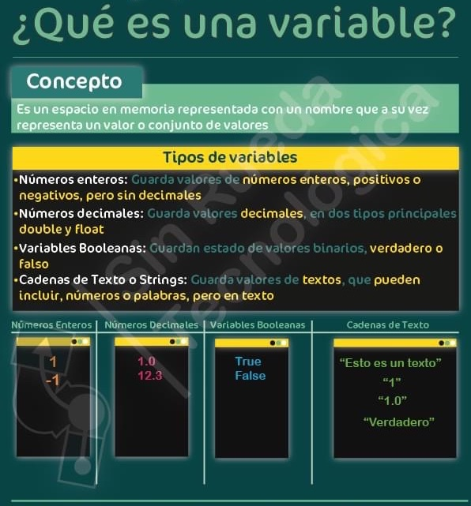
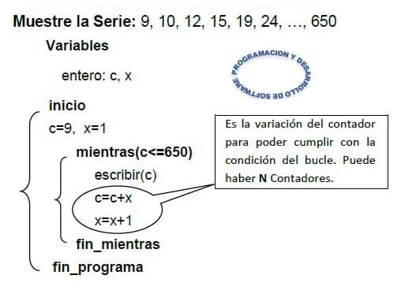

# Semántica

## Definición

* Describe el significado (interpretaciones) de los símbolos, palabras y frases de un lenguaje.
* Se les asigna un significado a las construcciones sintácticas que junto con la sintaxis ayuda a definir un sistema formal.
* Responder a la pregunta: ¿Qué significado tienen las sentencias? Ejemplos:
  * En este LP, cuando se asigna un float a una entero se trunca por la parte entera inferior.
  * En el LP Y, cuando se divide por cero, se debe mostrar tal mensaje de error.
* La especificación de la semántica de un LP no está estandarizada ni consensuada como en el caso de la sintaxis.
* A falta de una definición formal, hay varias formas posibles de especificar informalmente un LP:
  * Mediante un manual de referencia del LP, que puede ser impreciso, sufrir omisiones y contener ambigüedades.
    * Ejemplo de semántica descrita en MROC -> Operadores: especifica la realización de una operación que producirá un valor. Un operando es una entidad sobre la que actúa un operador. Ejemplos: +, ++, %
  * Mediante el uso de un traductor para definir la semántica.

* Lo mejor es una especificación formal.
* Entre las aproximaciones existentes, la semántica denotacional, que describe la semántica de un LP mediante funciones, es la más utilizada.
* Semántica denotacional o denotativa: define el significado de cada tipo de instrucción que se produce en la sintaxis como un función matemática de transformación de estado.
* Basada en la teoría de funciones recursivas. Cálculo lambda.

## Cálculo Lambda

* Creado en 1930 por los matemáticos estadounidenses Alonzo Church (1903-1995) y Stephen Kleene (1909-1994)
* La operatoria con los términos lambda se rige por el lambda-calculus o cálculo-λ.
* Es un sistema formal diseñado para investigar la definición de función, noción de aplicación de funciones y recursión.
* Una función es una expresión matemática y = f(x) que relaciona el valor de dos variables.
* Se lo puede considerar como el lenguaje universal de programación más pequeño, ya que cualquier función computable puede ser expresada y evaluada a través de él.
* Uno de los méritos de Church fue introducir una nueva sintaxis con la que representar a esta clase de expresiones matemáticas.
* Así, por ejemplo, si se evalúa la expresión (+(\* 2 3)(\* 5 6)) = 36. Por consiguiente, una función matemática sería una abstracción.
* Por si algo es célebre el cálculo λ es porque Church utilizó este formalismo para estudiar el llamado Problema de la Parada, obteniendo como resultado la noción de Problema Computable, que es precisamente la idea que subyace en la Máquina de Turing.
* A su vez, Turing demostró en 1937 que tanto el cálculo λ como su máquina eran equivalentes, es decir, permitían llegar por dos vías diferentes a los mismos resultados.
* Cuando una máquina de Turing procesa alguna de las expresiones indicadas, por ejemplo (+ 3 1), se detiene una vez obtenido un resultado, 4 en el ejemplo, siendo esta la expresión computable.
* Desde un punto de vista práctico, el cálculo λ inspiró el desarrollo de los llamados LP funcionales, uno cuyos ejemplos es Lisp, uno de los LP más importantes en IA.

### Sintaxis

```plain
expr -> var | λ var. expr | expr expr | (expr)
var -> x | y | z | f | n 
```

* Una expresión λ puede ser:
  * variable. Ejemplo:  x
  * abstracción sobre una variable (λ var. expr):
    * λ: abstracción
    * var: representa la entrada
    * .: separa la entrada de la salida
    * expr: representa la salida (indica qué es lo que hace la máquina con la entrada para obtener la salida). Es el cuerpo de la abstracción
    * Ejemplo 1: λx. x
    * Ejemplo 2: λa. λb. abc  (en este caso λb. abc es componente de λa. λb. abc)
  * aplicación de funciones (expr expr):
    * Ejemplo 1: λx.x λy.y
    * Ejemplo 2: λa.λb.ab λx.x (la expr λa.λb.ab está por procesar la expr λx.x)

### Codificación de Church

| Nombre | Expresión |
| -- | -- |
| + | λm.λn.λf.λx.mfnfx |
| * | λa.λb.λz.(a(bz)) |
| ^ | λa.λb.(ba) |
| 0 | λf.λx.x |
| 1 | λw.λy.wy |

* (+ 1 1)
  * (λm. λn. λf. λx. mfnfx) (λa. λb.ab) (λc. λd.cd)
  * (λn. λf. λx. (λa. λb.ab)fnfx) (λc. λd.cd)
  * λf. λx. (λa. λb.ab)f (λc. λd.cd)fx
  * λf. λx. (λb.fb)(λc. λd.cd)fx
  * λf. λx. f(λc. λd.cd)fx
  * λf. λx. f(λd.fd)x
  * λf. λx. f(fx) //(Es la M2)

* (* 0 1)
  * (λa. λb.λz (a(bz))) (λf. λx.x) (λw. λy.wy)
  * λb.λz (λf. λx.x(bz)) (λw. λy.wy)
  * λz (λf. λx.x((λw. λy.wy)z))
  * λz (λf. λx.x(λy.(zy)))
  * λf. λx.x   //(Es la M0)

## Atributos, vínculos y funciones semánticas

* En la descripción semántica de un LP, tienen que estar incluidas las reglas que determinan el significado de cada uno de los nombre o identificadores utilizados para las variables, los procedimientos y constantes.
* El significado de un identificador queda determinado por los atributos (propiedades) asociados al mismo.
* Unos atributos especialmente importantes son los valores, que representan cualquier cantidad almacenada y las localizaciones que son los lugares donde se almacenan los valores (direcciones de memoria)

* Elementos: variable, función/método, parámetro, bloque, sentencia, etc.
* Atributos: valor, almacenamiento, tipo, alcance, nombre, acción asociada, etc.

* Por ejemplo, la declaración o definición en el LP C:

    ```c
    const int n = 5;
    int x;
    double f(int n) { ... }
    ```

  * asocia al identificador n el atributo de tipo de dato constante entera y el atributo de valor 5.
  * asocia el atributo variable y el tipo de dato entero al identificador x
  * asocia el atributo función al identificador f y parámetros y tipo de dato devuelto y cuerpo del código que se ejecuta cuando se llama a la función.

* Diferencias entre los LP:
  * número de elementos.
  * número de atributos que se les pueden vincular.
  * momento en que se hacen los vínculos (binding time).

## Vínculo o ligadura o binding

* Proceso de asignación de un atributo a un identificador.
* Es el estudio del momento preciso en el que un atributo (propiedad) de un elemento (entidad) del lenguaje es conocida.
* Es la asociación entre el elemento y el atributo.
* Tiempo de vinculación:
  * Tiempo en que un atributo se está calculando o bien vinculando a un elemento.
  * Es el momento en cual se crea el binding.
  * Hay diferentes momentos:

    * **Estático**: en tiempo de definición (diseño e implementación) del lenguaje y en tiempo de escritura del programa (compilación, linkeo y carga). Por ejemplo, leyendo el programa se sabe que la variable i tiene el tipo entero:

        ```C
        i: integer; // en Pascal o Delphi
        int i;      // en C, C++ o Java 
        ```

    * **Dinámico**: en tiempo de ejecución. Por ejemplo, en Python hay que esperar que se ejecute la instrucción para conocer el tipo de las variables:

        ```python
        if a == 1:
            b = "hola"
        else:
            b = 3
        print b 
        ```

* Momento y estabilidad:
  * **Vínculo estático**: si se establece antes de la ejecución y no se puede cambiar. El término estático referencia al momento del binding y a su estabilidad. Ejemplo: En C, la sentencia int a; (se liga el tipo a la variable)
  * **Vínculo dinámico**: si se establece en el momento de la ejecución y puede cambiarse de acuerdo a alguna regla específica del LP. Excepción: constantes. Ejemplo: En C, la sentencia int a; (el valor de una variable entera se liga en ejecución y puede cambiarse muchas veces)
  
* En general, los lenguajes funcionales tienen más vínculos dinámicos que los imperativos.
* Los tiempos de vinculación también dependen del traductor:
  * Intérpretes: la mayoría de los vínculos serán dinámicos.
  * Compilador: genera mucho más vínculos estáticos.

## Variables

* Es un elemento  fundamental en los LP.
* Es una abstracción de una celda de memoria.
* Memoria principal: celdas elementales, identificadas por una dirección (referencia donde está almacenada la variable).
* El contenido de una celda es una representación codificada de un valor.
* Sintaxis de asignación \<identificador> \<símbolo de asignación> \<expresión>
* Ejemplos:

```plain
a = b          Java, C, C++, Perl, FORTRAN
a := b         Pascal, Delphi, Ada, ALGOL  
a <- b         APL, Smalltalk
(setq a b)     Lisp
MOVE B TO A    COBOL
set a b        Tcl
a =: b         J
LET a = b      Basic
```

* Valor de una variable:
  * Contenido de la ubicación de memoria a la que hace referencia la variable.
  * Binding dinámico: las variables son "variables", se espera que su valor cambie durante la ejecución del programa.
  * Binding estático: hay algunos LP en donde algunas variables no cambian su valor (constantes simbólicas y variables inmutables).



## Constantes

* Es una variable que se liga a un valor sólo cuando se realiza la ligadura a su correspondiente locación de memoria.
* Tipos:
  * Constantes literales:           a = 3;
  * Constantes simbólicas:          #define PI 3.141592  En C
  * Constantes propiamente dichas:  const x = 5;         En Pascal

## Mutabilidad e Inmutabilidad

* En algunos LP (CLU, Java, Python, Rust, etc.) existen variables inmutables, cuyo valor nunca puede ser modificado.
* Ejemplo:

```java

public class A {
    public int p = 1;
}

// a1 y a2 son objetos mutables
A a1 = new A();
A a2 = a1;
a1.p = 3;

// s1 y s2 son objetos inmutables
String s1 = "Hola";
String s2 = s1;
s1 = "Que tal";
```

## Inicialización de variables

* El binding de una variable a su valor en el momento que se liga al medio de almacenamiento se llama inicialización.
* Generalmente toma lugar a través de una asignación. Ejemplo Java:

```java
int contador = 0;
```



## Otros aspectos de una variable

* **Nombre**:
  * Identificador en lenguaje natural que utiliza el programador para hacer referencia a la celda de memoria.
  * Se define en una sentencia llamada declaración.
  * Consideraciones de diseño:
    * ¿tienen longitud máxima? Ejemplo en Fortran 6, en Java, C++ y Python sin límites.
    * ¿es sensible a mayúsculas y minúsculas? Ejemplo en C y Python sensibles a mayúsculas y minúsculas. En Pascal no sensible a mayúsculas y minúsculas.
    * ¿se permite el uso de conectores (caracteres aceptados)? Ejemplo: muchos LP no los permiten. En Python, C, Pascal: _
    * ¿hay palabras claves o reservadas?

* **Alcance**:
  * Rango de instrucciones en el que se conoce el nombre (visibilidad)
  * Es la región textual de un programa en el cual una ligadura está activa. Una variable tiene una ligadura activa para una sentencia si puede ser referenciada en ella.
  * Las instrucciones del programa pueden manipular una variable a través de su nombre dentro de su alcance.
  * Binding estático de alcance (alcance léxico):
    * Define el alcance en términos de la estructura léxica del programa.
    * Puede ligarse estáticamente a una declaración (explícita o implícita) examinando el texto del programa, sin necesidad de ejecutarlo.
    * La mayoría de los LP adoptan reglas de ligadura de alcance estático.
    * En un LP con reglas de alcance estático o léxico el binding se determina en tiempo de compilación a partir de la examinación del texto del programa.
    * Habitualmente el binding tiene lugar “matcheando” la declaración cuyo bloque está más cercano a ese punto del programa.
    * Formas conocidas en LP: Local – global / Bloques / Orden de declaración.

    ```java
    public class A {
        private int x;
        public A() {
            x = 0; // instrucciones que pueden usar x
        }
    }
    ```

  * **Binding dinámico de alcance**:
    * Define el alcance del nombre de la variable en términos de la ejecución del programa.
    * Cada declaración de variable extiende su efecto sobre todas las instrucciones ejecutadas posteriormente, hasta que una nueva declaración para una variable con el mismo nombre es encontrada durante la ejecución.
    * El binding se resuelve siguiendo la secuencia de llamados, no en la relación del texto del programa. De ahí que sólo pueda determinarse en ejecución.
    * APL, Lisp (original), SNOBOL4, Perl

    ```basic
    10 INPUT A
    20 B = 5
    30 IF (A>4) C = 3
    40 D = B + C
    ```

    * Sólo se puede ejecutar si el usuario ingresa un número mayor a 4. Si no, C no tiene valor y la ejecución da error. Mirando el programa, no se puede saber si una instrucción puede usar una variable.

* **Tipo**: valores y operaciones.

* **Tiempo de vida**: tiempo en el que la variable tiene lugar en memoria y puede ser accedida.

* **l-value**:
  * a := b  (a es l-value)
  * Lugar de memoria asociado con la variable.
  * Tiempo de vida: periodo de tiempo que existe la ligadura por l-valor. Se extiende durante toda la alocación.
  * Se accede a la celda de memoria que referencia la variable.

* **r-value**:
  * a := b  (b es r-value)
  * Valor codificado almacenado en la ubicación de la variable.
  * Se extrae el valor de esta variable a través del mecanismo de desreferencing. Si lo que está del lado derecho es una constante, simplemente se utiliza su valor.

## Ejercicios

1. Describa informalmente la semántica de algún constructor de un lenguaje de programación que conozca (por ejemplo, el while de java).
1. Investigue e informe qué otras entidades pueden ser denotadas por identificadores.
1. ¿Por qué c = b = a = 4 tiene el mismo efecto que la asignación a = b = c = 4?
1. ¿Por qué a = b + 2 = c = 4 es incorrecta?
1. Explique las diferencias que hay entre las sentencias de asignación en Pascal y las expresiones de asignación en ANSI C.
1. Describa la semántica:
    1. int a = 10;
    1. int mat [2][3] = {{1,2,3}, {4,5,6}};
    1. sentencias: if, while, for
1. Investigue e informe cuál es la diferencia semántica entre el prototipo de una función y la definición de esa misma función.
1. Defina un LP para un campo de aplicaciones particular, con la característica de que este LP esté formado por un grupo de comandos que son LRs. Describa su sintaxis en BNF, su semántica en lenguaje natural y presente varios ejemplos para su uso.
1. Dados los siguientes métodos en Java, Python y C, determine cuáles son las diferencias semánticas entre ellos en cuanto al uso de variables, tipos, inicialización de variables, etc. Verifique si retornan los mismos resultados.

    

1. Identificar abstracciones y aplicaciones: ((λx. ((λy. (xy)) x)) (λz.w))
1. Simplificar la siguientes expresiones:
    1. ((λx. (xy)) (λz.z))
    1. ((λx. ((λy. (xy)) x)) (λz.w))
1. Demostrar que la máquina suma, procesando a las máquinas tres y dos, obtiene la máquina cinco.
1. Demostrar que la máquina producto, procesando a las máquinas tres y dos, obtiene la máquina seis.
1. ¿En qué momento se definen los tipos de una variable en un lenguaje tipo-algol con inferencia de tipos?
1. ¿El tipo de binding de alcance de un lenguaje determina con seguridad el tipo de binding de tipo de ese lenguaje?
1. Considerar si la siguiente afirmación es verdadera o falsa: El hecho que la única invocación a una función se encuentre en el bloque de la cláusula “then” de una instrucción condicional de un programa hace que el lenguaje tenga binding dinámico de alcance.
1. Si se tuviese conocimiento de todos los valores que se definen en tiempo de ejecución en de programa (valor de las funciones de aleatorización, entradas del usuario, condiciones del sistema operativo, etc.) ¿se podría compilar un programa con alcance dinámico?
1. Defina el concepto de ligadura y su importancia respecto de la semántica de un programa. ¿Qué diferencias hay entre ligadura estática y dinámica? Cite ejemplos (proponer casos sencillos)
1. Tome una de las variables de la línea 3 del siguiente código e indique y defina cuales son sus atributos. Compare los atributos de la variable del punto a) con los atributos de la variable de la línea 4. Que dato contiene esta variable?, que otra variable hay en este código?

    ```plain
    01. Procedure Practica();
    02. var
    03. a,i:integer
    04. p:puntero
    05. Begin
    06. a:=0;
    07. new(p);
    08. p:= ^i
    09. for i:=1 to 9 do
    10. a:=a+i;
    11. end;
    12. ...
    13. p:= ^a;
    14. ...
    15. dispose(p);
    16. end;
    ```

1. Indique cuales son las diferentes formas de inicializar una variable en el momento de la declaración de la misma.
1. Analice en los lenguajes: Java, C, Phyton y Ruby las diferentes formas de inicialización de variables que poseen. Realice un cuadro comparativo de esta característica.
1. Explique los siguientes conceptos asociados al atributo l-valor de una. De al menos un ejemplo de cada uno. Investigue sobre qué tipos de variables respecto de su l-valor hay en los lenguajes C y Ada.
    1. Variable estática.
    1. Variable automática o semiestática.
    1. Variable dinámica.
    1. Variable semidinámica.
1. ¿A qué se denomina variable local y a que se denomina variable global?
1. ¿Una variable local puede ser estática respecto de su l-valor? En caso afirmativo dé un ejemplo.
1. Una variable global ¿siempre es estática? Justifique la respuesta.
1. Indique qué diferencia hay entre una variable estática respecto de su l-valor y una constante.
1. Sea el siguiente ejercicio escrito en Pascal:

    ```plain
    1- Program Uno;
    2- type tpuntero= ^integer;
    3- var mipuntero: tpuntero;
    4- var i:integer;
    5- var h:integer;
    6- Begin
    7-    i:=3;
    8-    mipuntero:=nil;
    9-    new(mipuntero);
    10-   mipuntero^:=i;
    11-   h:= mipuntero^+1;
    12-   dispose(mipuntero);
    13-   write(h);
    14-   i:= h - mipuntero;
    15- End.
    ```

    1. Indique el rango de instrucciones que representa el tiempo de vida de las variables i, h y mipuntero.
    1. Indique el rango de instrucciones que representa el alcance de las variables i, h y mipuntero.
    1. Indique si el programa anterior presenta un error al intentar escribir el valor de h. Justifique
    1. Indique si el programa anterior presenta un error al intentar asignar a i la resta de h con mipuntero. Justifique
    1. Determine si existe otra entidad que necesite ligar los atributos de alcance y tiempo de vida para justificar las respuestas anteriores. En ese caso indique cuál es la entidad y especifique su tiempo de vida y alcance.
    1. Especifique el tipo de variable de acuerdo a la ligadura con el l-valor de las variables que encontró en el ejercicio.
1. Elija un lenguaje y escriba un ejemplo:
    1. En el cual el tiempo de vida de un identificador sea mayor que su alcance.
    1. En el cual el tiempo de vida de un identificador sea menor que su alcance.
    1. En el cual el tiempo de vida de un identificador sea igual que su alcance.
1. Sea el siguiente programa en ADA, completar el cuadro siguiente indicando para cada variable de que tipo es en cuanto al momento de ligadura de su l-valor, su r-valor al momento de alocación en memoria y para todos los identificadores cuál es su alcance y cual es su el tiempo de vida. Indicar para cada variable su r-valor al momento de alocación en memoria:

    

    | Identificador | l-valor | r-valor | Alcance | Tiempo de Vida |
    | -- | -- | -- | -- | -- |
    | a (linea 4) | automática | basura | 4-14 | 1-14 |
    | | | | | |
    | | | | | |
    | | | | | |

1. El nombre de una variable puede condicionar (justifique la respuesta):
    1. Su tiempo de vida.
    1. Su alcance.
    1. Su r-valor.
    1. Su tipo.
1. Sean los siguientes archivos en C, los cuales se compilan juntos. Indicar para cada variable de que tipo es en cuanto al momento de ligadura de su l-valor. Indicar para cada identificador cuál es su alcance y cual es su el tiempo de vida. Indicar para cada variable su r-valor al momento de alocación en memoria.

    

    | Identificador | l-valor | r-valor | Alcance | Tiempo de Vida |
    | -- | -- | -- | -- | -- |
    | | | | | |
    | | | | | |
    | | | | | |
    | | | | | |
