# Sintaxis

* Especifica la forma en la que se deben escribir los programas
* Ejemplo:

  ```c
  v: array[1..10] of integer;   ---> Pascal
  int v[10];                    ---> C
  ```

  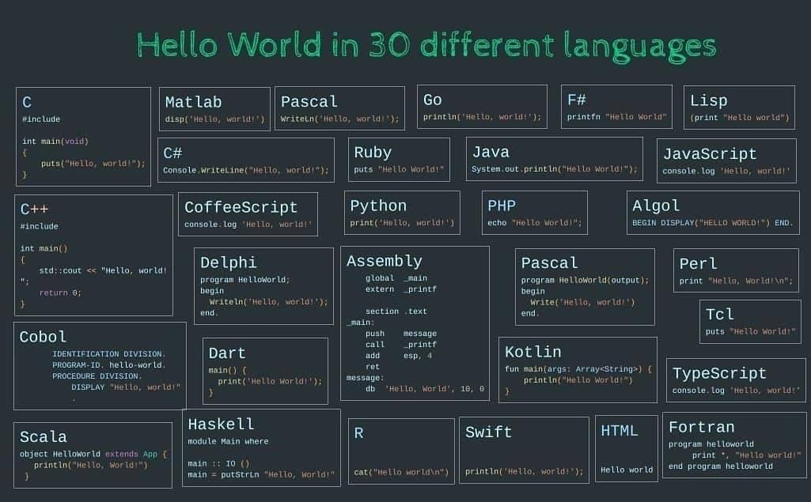

  

## Tipos de sintaxis

| Tipo | | Ejemplo |
| -- | -- | -- |
| **Abstracta**  | se refiere a la estructura   | while condición bloque |
| **Concreta**   | se refiere a la parte léxica | en C: while (x != y) { ... } en Pascal: while x <> y begin ... end |
| **Pragmática** | se refiere al uso práctico   | en C y Pascal {} o begin-end pueden omitirse si el bloque está compuesto por una sola sentencia |

## Elementos del lenguaje

* Cumplen las funciones de las palabras del lenguaje natural

  | Elemento |
  | -- |
  | Constantes |
  | Variables |
  | Palabras clave |
  | Parámetros |
  | Tipos |
  | Anotaciones |
  | etc. |

## Reglas

| Tipos | | Categorías | Ejemplo | Sistemas de formalización |
| -- | -- | -- | -- | -- |
| **Léxicas**     | Especifican cómo se escribe cada elemento | identificadores, palabras reservadas y símbolos especiales | Los identificadores comienzan con una letra, seguida de letras o números y tienen una longitud de 10 caracteres | ER: L (L+N)^9 |
| **Sintácticas** | Especifican cómo se combinan los elementos para formar programas | expresiones y sentencias | Una definición de función comienza con el tipo de valor de retorno, un identificador, a continuación una lista de parámetros formales y finalmente posee un cuerpo | GIC, BNF, EBNF, ABNF, ANTLR, Diagramas sintácticos |  

### Reglas Léxicas - ER

* Son patrones de caracteres
* Describen formalmente los tokens de un lenguaje
* Representan un Lenguaje Formal: LR
  * ER primitivas: ∅, λ, a ∈ Σ
  * ER derivadas: α+β, αβ, α*, (α)
* Precedencia de operadores: (), *, ., +
* Ejemplo: (0 + 1)* 01
* Dos ER son equivalentes si describen al mismo lenguaje. Ejemplos:
  * α + (β + θ) = (α + β) + θ
  * α + β = β + α
  * α\* α\* = α*
* Ejemplos:

  | ER | Describe... |
  | -- | -- |
  | ^\d{2}/\d{2}/\d{4} | una fecha DD/MM/YYYY |
  | Nov(\.\|iembre\|ember\|embro)? |  Nov, Noviembre, November, Novembro |
  | \(.*\) | cualquier cadena entre paréntesis |

  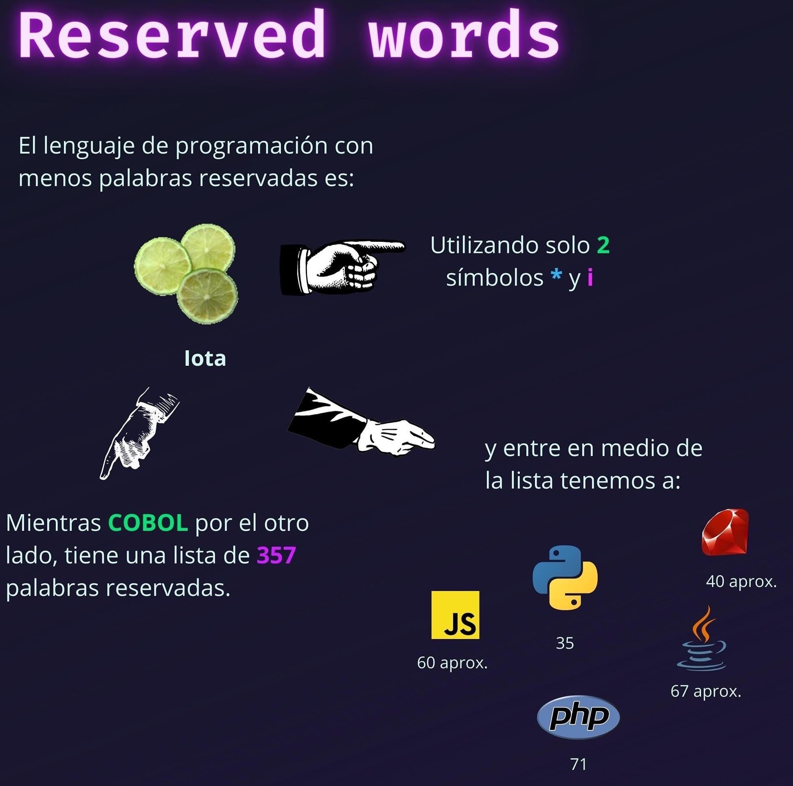

  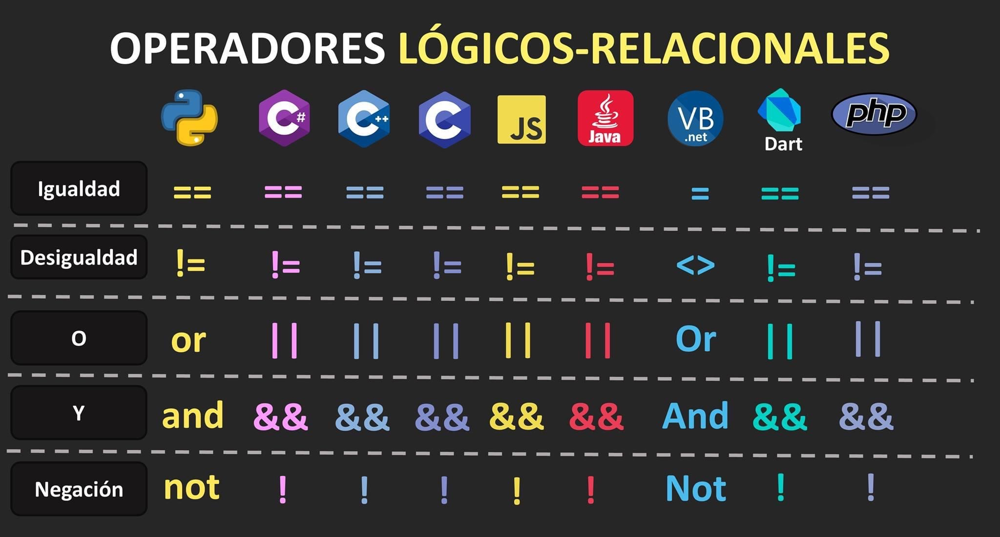

  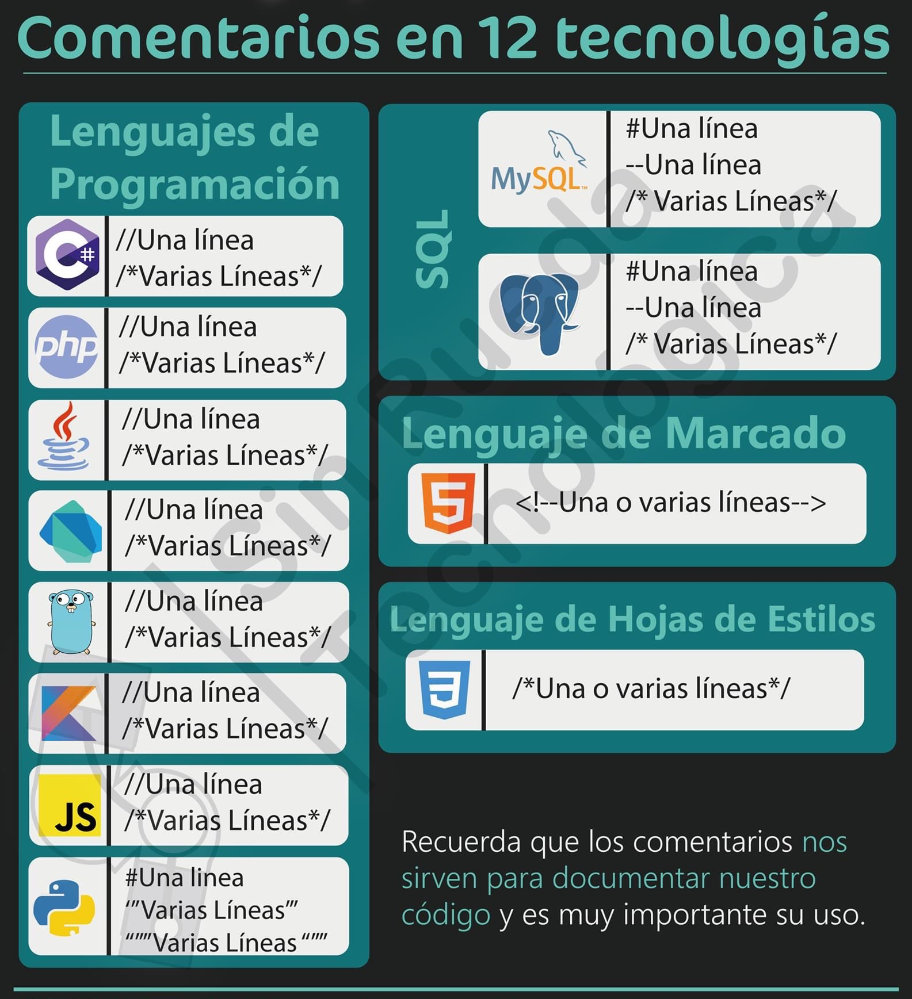

## Reglas Sintácticas - GIC

* Generan un Lenguaje Formal: LIC
* Conjunto de reglas finita que define un conjunto infinito de posibles sentencias válidas en el lenguaje
* Diseñada por Noam Chomsky (jerarquía de Chomsky)
* Una gramática está formada por una 4-tupla:

  |||
  | -- | -- |
  | ∑N | conjunto de símbolos no terminales |
  | ∑T | conjunto de símbolos terminales |
  | S  | axioma o símbolo distinguido |
  | P  | conjunto de producciones o reglas de reescritura. ∑N -> {∑N U ∑T}* |

* Ejemplo:

  ```grammar
  Los constructores del lenguaje son expresiones que denotan objetos geométricos llamados "retazos" con una altura, un ancho y un patrón dibujado en ellos. Reglas:
  1. Un retazo es una de las piezas primitivas, o
  2. se forma girando 90° un retazo hacia la derecha, o
  3. se forma cosiendo un retazo a la derecha de otro de igual altura
  4. Ninguna otra cosa es un retazo

  S -> retazo1
  S -> retazo2
  S -> girar(S)
  S -> coser(S, S)
  ```

## Derivación

* Es una secuencia que comienza con el axioma y en la que en cada paso se sustituye un símbolo no terminal de la cadena en curso por la parte derecha de una regla
* Se dice que se tiene una derivación de una cadena del lenguaje cuando todos los símbolos de la cadena en curso son terminales
* Ejemplo:

  ```plain
  S => coser(S, S) 
    => coser(girar(S), S) 
    => coser(girar(retazo1), S) 
    => coser(girar(retazo1), retazo2)
  ```

### GIC para describir identificadores

```grammar
Identificador -> Letra | Identificador Letra | Identificador Dígito
Letra -> A | ... | Z | a | ... | z
Dígito ->  0 | ... | 9
```

### GIC para describir expresiones aritméticas

```grammar
Expresión -> Término | Expresión + Término
Término -> Factor | Término * Factor 
Factor ->  Número | (Expresión)
Número ->  0 | ... | 9
```

## BNF

* Backus Naur Form
* Con el breve Manual de Referencia del lenguaje ALGOL, se publicó por primera vez en 1960, una descripción formal de la sintaxis de un LP
* Es una notación formal ("metalenguaje") para describir la sintaxis de otros lenguajes, ya que la GIC tiene muy pocos metasímbolos, dificultando la escritura y posterior comprensión de la sintaxis definida

  | Metasímbolo | |
  | -- | -- |
  | \<Simbolo no terminal> | distingue terminales de no terminales |
  | ::= | parte izquierda "reescribe" parte derecha |
  | \|  | unión de reglas |

### BNF para describir identificadores

```bnf
<Identificador> ::= <Letra> | <Identificador> <Letra> | <Identificador> <Digito>
<Letra> ::= A | ... | Z | a | ... | z 
<Digito> ::= 0 | ... | 9 
```

### BNF para describir números enteros

```bnf
<número entero> ::= <entero sin signo> | + <entero sin signo> | - <entero sin signo>
<entero sin signo> ::= <digito> | <digito> <entero sin signo>
<digito> ::= 0 | ... |9
```

### BNF para controlar parentización

```bnf
<INICIO> ::= <PAR_ABRE> <INICIO> <PAR_CIERRA> | λ | <INICIO> <INICIO> 
<PAR_ABRE> ::= (
<PAR_CIERRA> ::= )
```

### BNF para expresiones aritméticas

```bnf
<asig> ::= <id> "=" <expr> 
<expr> ::= <exp> "+" <term> 
<expr> ::= <exp> "-" <term> 
<expr> ::= <term>
<term> ::= <term> “*” <factor> | <term> “/” <factor>
<term> ::= <factor> 
<factor> ::= <var> | <cte>
```

### BNF para Lenguaje Colchita

```bnf
<exp> ::= a | b | turn (<exp>) | sew (<exp>, <exp>)
```

### BNF para Lenguaje Colchita Avanzada

```bnf
<exp> ::= a | b | <name> | <name> (<actuals>) | turn (<exp>) | sew(<exp>,<exp>) | let <decls> in <exp> end
<actuals> ::= <exp> | <exp> , <actuals>
<decls> ::= <decl> | <decl> <decls>
<decl> ::= fun <name> (<formals>) = <exp> | val <name> = <exp>
<formals> ::= <name> | <name> , <formals>
<name> ::= <c> | <c> <name>
<c> ::= a | ... | z
```

* BNF de Colchita que incorpora funciones definidas por el usuario y declaraciones locales. Ejemplo:
  * fun unturn (x) = turn(turn(turn(x)))
  * fun pile(x, y) = unturn (sew(turn(y), turn(x)))
* Las expresiones de asignación permiten que las declaraciones aparezcan dentro de las expresiones. Estas declaraciones tienen la siguiente forma: let \<declaraciones\> in \<expresión\> end
* Ejemplo:

     ```plain
     let fun unturn (x) = turn(turn(turn(x)))
          fun pile(x, y) = unturn (sew(turn(y), turn(x)))
     in pile(unturn(b), turn(b))
     end
     ```

* Declaraciones de valores, conveniente para escribir expresiones grandes en términos de otras más simples; es decir, asigna nombre a una expresión
let val \<nombre\> = \<expresión\> in \<expresión\> end
* Ejemplo:

     ```plain
     let val x = unturn(b)
          val y = turn(b)
     in sew(x, y)
     end
     ```

### BNF para un pequeño lenguaje

```bnf
<program> ::= begin <stmt_list> end
<stmt_list> ::= <stmt> | <stmt> ; <stmt_list>
<stmt> ::= <var> = <expression>
<var> ::= A | B | C
<expression> ::= <var> + <var> | <var> - <var> | <var>
```

### BNF para Lenguaje Esencial

* El único tipo de datos es entero no negativo
* Los identificadores son declarados implícitamente, deben comenzar con una letra y están compuestos de letras y dígitos
* El lenguaje contiene 2 enunciados de asignación:
  * **incr** nombre; //incrementa en 1 el valor asignado al identificador nombre
  * **decr** nombre; //decrementa en 1 (a menos que el valor por decrementar sea cero, en cuyo caso permanece con dicho valor)
* El único otro enunciado es el par de enunciados de control: **while** nombre **<> 0 do;** ... **end;**
el cual indica que es necesario repetir los enunciados que se encuentran entre los enunciados while y end mientras el valor asignado al identificador nombre no sea cero

```bnf
<programa> ::= <sentencias>
<sentencias> ::= <sentencia> | <sentencia> <sentencias>
<sentencia> ::= <incremento> | <decremento> | <iteración>
<incremento> ::= inc <identificador> ;
<decremento> ::= dec <identificador> ;
<iteración> ::= while <identificador> <> 0 do; <bloque> end;
<bloque> ::= <sentencias>
<identificador> ::= <letra> | <identificador> <letra> | <identificador> <dígito>
<letra> ::= a | ... | z | A | ... | Z
<dígito> ::= 0 | ... | 9
```

### BNF para Lenguaje Completo

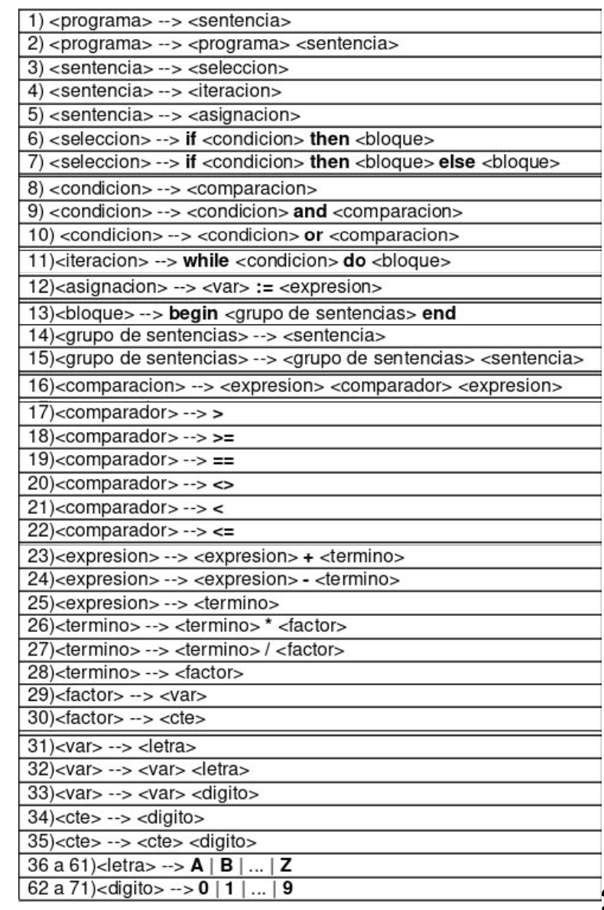

* 01-30: Reglas sintácticas
* 31-71: Reglas léxicas

### Limitaciones de BNF

* Limitaciones de longitud de identificadores. Ejemplo, lenguaje que pide que los identificadores tengan como máximo 8 caracteres
* Limitaciones de rangos en constantes
* Ubicaciones dentro del código fuente (una variable debe estar declarada antes de ser usada)
* Formateo de texto
* Aplicabilidad de operaciones a constantes y variables de diferentes tipos
* Esto obliga a ir a una definición por extensión, en lugar de por comprensión, se pierde el sentido de usar BNF

## EBNF

* Extended BNF
* La realizó Niklaus Wirth a la notación BNF utilizada para describir la sintaxis de ALGOL

  | Metasímbolos que incorpora ||
  | -- | -- |
  | [ ]    | elemento optativo |
  | ( \| ) | selección de una alternativa |
  | { }    | repetición |
  | *      | 0 o más veces |
  | +      | 1 o más veces |
  | ?      | 0 ó 1 vez     |

### EBNF para describir identificadores

```ebnf
<Identificador> ::= <Letra>  { <Letra o Dígito> }*
<Letra o Dígito> ::= <Letra> | <Dígito>
<Letra> ::= A | ... | Z | a | ... | z
<Dígito> ::= 0 | ... | 9
```

### EBNF para describir números enteros

```ebnf
<enterosig> ::= [(+ | -)] <digito> { <digito> }*
<dígito>  ::= 0 | 1 | 2 | 3 | 4 | 5 | 6 | 7 | 8 | 9
```

### EBNF para describir sentencias if y while

```ebnf
<sentencia if> ::= if <expresión> then <sentencia> | if <expresión> then <sentencia> else <sentencia>

<sentencia while> ::= while <expresión> do <sentencia>
```

## ABNF

* Augmented BNF
* C fue desarrollado entre 1969 y 1972 por Dennis Ritchie, con el objetivo principal de implementar el sistema operativo UNIX en un LP de alto nivel
* A mediados de la década de los 80, el ANSI comenzó a desarrollar una estandarización de este LP. En 1990 se publicó MROC (Manual de Referencia Oficial de ANSI C)
* A partir de ese momento, este LP es conocido como ANSI C

  | Metasímbolo | Representa |
  | -- | -- |
  | itálica | no terminales, ya no entre < > |
  | negrita | terminales |
  | :       | "reescribe", ya no ::= |
  | enter   | parte derecha, ya no \| |
  | uno de  | varios lados derechos que son símbolos para un no terminal |
  | _op     | símbolo opcional, ya {exp} o {} |

### ABNF para describir un token

```bnf
token: palabraReservada
       identificador
       constante 
       operador

token: uno de  palabraReservada identificador constante operador
```

### ABNF para describir palabras reservadas

```bnf
palabraReservada: uno de  char do double else float for if int long return sizeof struct typedef void while

```

### ABNF para describir identificadores

```bnf
identificador: noDígito
               identificador noDígito
               identificador dígito

noDígito: uno de  _ a b c d  e f g h i j k l m n o p q r s t u v w x y z A B C D E F G H I J K L M N O P Q R S T U V W X Y Z
dígito: uno de  0 1 2 3 4 5 6 7 8 9 
```

### ABNF para describir sentencias

```bnf
sentencia: una de  sentCompuesta sentExpr sentSelección sentIteración sentSalto
sentCompuesta: { listaDeclaraciones _op listaSentencias _op  }
listaDeclaraciones: declaración
                    listaDeclaraciones declaración
listaSentencias: sentencia
                 listaSentencias sentencia
sentExpr: expresión _op ;
sentSelección: if ( expresión ) sentencia
               if ( expresión ) sentencia else sentencia
               switch ( expresión ) sentencia 
sentIteración: while ( expresión ) sentencia
               do sentencia while ( expresión );
               for (expresión _op ; expresión _op ; expresión _op  ) sentencia 
sentSalto :  return expresión _op ;
```

### ABNF para describir Lenguaje Micro

* El único tipo de datos es entero.
* Todos los identificadores son declarados implícitamente y con una longitud máxima de 32 caracteres.
* Los identificadores deben comenzar con una letra y están compuestos de letras y dígitos.
* Hay dos tipos de sentencias:
  * Asignación
    * ID := Expresión;
    * La expresión es infija y se construye con identificadores, constantes y los operadores + y -; los paréntesis están permitidos.
  * Entrada/Salida
    * leer(lista de IDs);
    * escribir(lista de Expresiones);
* Cada sentencia termina con un “punto y coma” (;). El cuerpo de un programa está delimitado por inicio y fin.
* inicio, fin, leer y escribir son palabras reservadas y deben escribirse en minúscula.

```bnf
programa: inicio sentencias fin
sentencias: sentencia { sentencia }
sentencia:  uno de identificador := expresión ; leer(identificadores) ; escribir(expresiones) ;
identificadores:  identificador {,  identificador }
expresiones:  expresión {,  expresión }
expresión:  primaria { operadorAditivo primaria}
primaria: uno de identificador  { expresión }
identificador: letra { letraODigito }
letraODigito:  uno de letra digito
letra: una de a-z A-Z
digito: uno de 0-9
operadorAditivo: uno de + -
```

## Sintaxis para Java, Python, Kotlin, C++, Go

* Cada LP elige un sistema particular

  | LP | URL |
  | -- | -- |
  | Java |[https://docs.oracle.com/javase/specs/jls/se7/html/jls-18.html](https://docs.oracle.com/javase/specs/jls/se7/html/jls-18.html) |
  | Python | [https://docs.python.org/3/reference/grammar.html](https://docs.python.org/3/reference/grammar.html) |
  | Kotlin | [https://kotlinlang.org/docs/reference/grammar.html](https://kotlinlang.org/docs/reference/grammar.html) |
  | C++ | [https://alx71hub.github.io/hcb/](https://alx71hub.github.io/hcb/) |
  | Go  | [https://go.dev/ref/spec](https://go.dev/ref/spec) |
  | C   | [https://cs.wmich.edu/~gupta/teaching/cs4850/sumII06/The%20syntax%20of%20C%20in%20Backus-Naur%20form.htm](https://cs.wmich.edu/~gupta/teaching/cs4850/sumII06/The%20syntax%20of%20C%20in%20Backus-Naur%20form.htm) |

## Algunas herramientas que utilizan mecanismos de definición de sintaxis

| Herramienta | URL |
| -- | -- |
| CUP (Construction of Useful Parsers) | [http://www2.cs.tum.edu/projects/cup/](http://www2.cs.tum.edu/projects/cup/) |
| YACC (Yet Another Compiler-Compiler) |  |
| ANTLR (ANother Tool for Language Recognition) | [https://www.antlr.org/](https://www.antlr.org/) |
| GNU Bison | [https://www.gnu.org/software/bison/](https://www.gnu.org/software/bison/) |
| LLVM | [https://llvm.org/](https://llvm.org/) |

## Árboles sintácticos

* No todas las oraciones que se pueden armar con los terminales son válidas
* Se necesita de un método de análisis (reconocimiento) que permita determinar si un string dado es válido o no en el lenguaje: **Parsing**
* El parser, para cada sentencia construye un **árbol sintáctico (parsing) o árbol de derivación**
* Representa gráficamente el proceso de reemplazo o sustitución dentro de una derivación
* Verificar que un programa o fragmento está correctamente escrito según una gramática
* La raíz debe coincidir con el axioma de la gramática
* Los no terminales están en los nodos interiores.
* Las terminales están en las hojas

  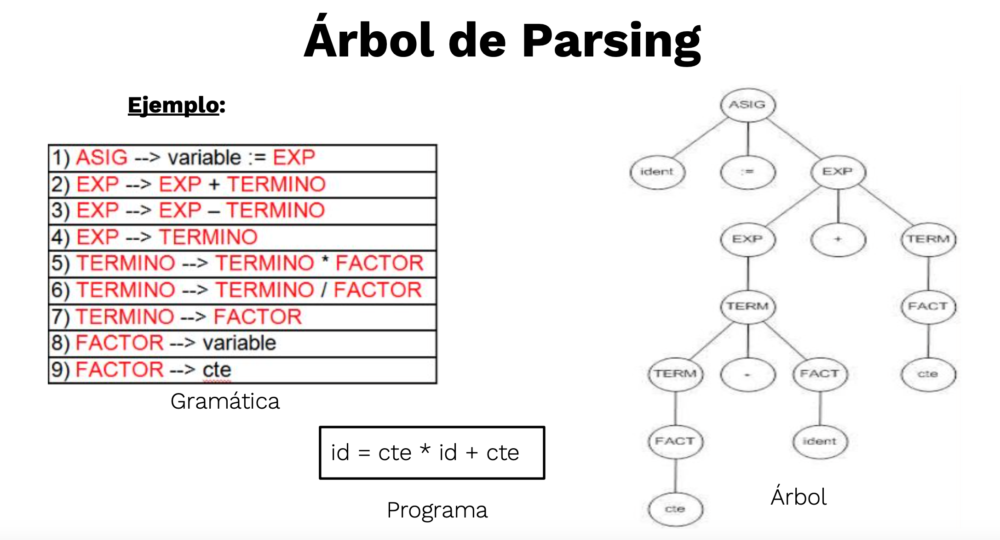

### Construcción del árbol sintáctico

* El proceso de compilación consiste en construir el árbol sintáctico
* Si se puede construir el árbol, el programa está bien escrito
* Si no se puede hacer el árbol sintáctico, el programa contiene errores sintácticos
* Si hay más de un árbol sintáctico para la misma expresión, la gramática es ambigua

  | Tipos de parsing | | Ejemplo |
  | -- | -- | -- |
  | **Descendente** | desde el axioma hacia los terminales (de la raíz hacia las hojas) | 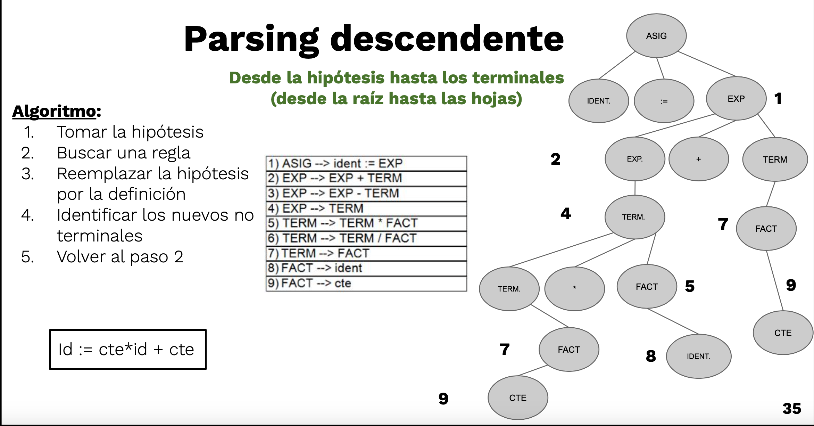 |
  | **Ascendente**  | desde los terminales hacia el axioma (de las hojas hacia la raíz) | 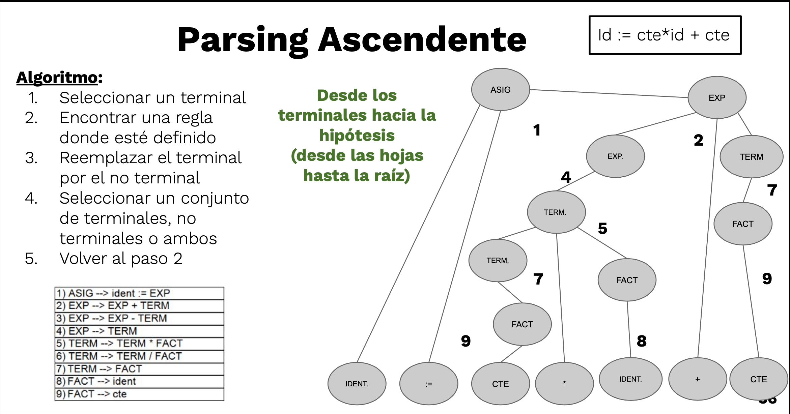 |

## Diagramas sintácticos (CONWAY)

* Es un grafo sintáctico o carta sintáctica.
* Cada diagrama tiene una entrada y una salida, y el camino determina el análisis.
* Cada diagrama representa una regla o producción.
* Para que una sentencia sea válida, debe haber un camino desde la entrada hasta la salida que la describa.
* Se visualiza y entiende mejor que BNF o EBNF.
* Se ha venido utilizando desde la década de los 70 (del siglo XX).
* Uno de los primeros lenguajes en ser así representados es Pascal.

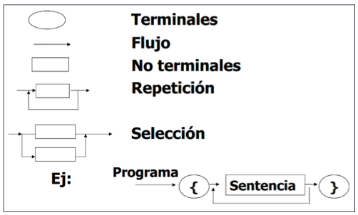

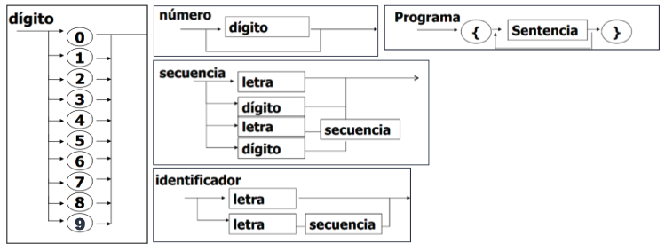

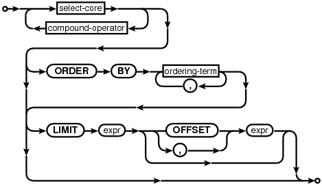

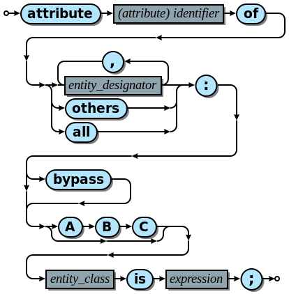

## Ejercicios

1. ¿Por qué conviene utilizar mecanismos formales como BNF para estudiar la sintaxis de los lenguajes de Programación?
1. ¿Pueden dos instrucciones de asignación en diferentes lenguajes poseer igual sintaxis, igual semántica y diferente pragmática?
1. ¿Pueden dos instrucciones de asignación en diferentes lenguajes poseer igual sintaxis y diferente semántica?
1. ¿Pueden dos instrucciones de asignación en el mismo lenguaje con diferente sintaxis poseer diferente semántica?
1. ¿Puede limitarse desde la gramática el valor máximo que puede adoptar una variable?
1. Responder si es verdadera o falsa la siguiente afirmación: Si un lenguaje tiene dos formas sintácticas diferentes para escribir una instrucción condicional, entonces existe una ambigüedad en la gramática.
1. Considere la siguiente expresión: 8 / 2 \* 4 – 12 \* 2 / 6 + 2 \* 2. Escribir una gramática de expresiones para cada uno de los siguientes casos:
    * Absolutamente recursiva a izquierda.
    * Absolutamente recursiva a derecha.
    * Suma y resta recursiva a izquierda y producto y división recursiva a derecha.
    * Suma y resta recursiva a derecha y producto y división recursiva a izquierda.
    * En cada caso construir el árbol de parsing de la expresión y calcular el resultado.
1. Dadas las siguientes reglas extraídas del conjunto de reglas del lenguaje Python

    ```bnf
    <asignacion> ::= <destino> "=" <expresión>
    <destino> ::= <identificador> | <elemento_arreglo>
    <elemento_arreglo> ::= <identificador> "[" <subindices> "]"
    <subindices> ::= <identificador> | <identificador> , <subindices>
    ```

    * Proponer las reglas que faltan para poder representar sintácticamente una asignación
    * Agregar reglas para permitir expresiones como subíndices de arreglos
    * Proponer reglas para permitir asignaciones múltiples por ejemplo: a,b,c = d, e+f, g+3
    * Construir el árbol de parsing para las siguientes sentencias con las reglas que haya agregado  B:= A - B \* (C + D / A)  y   B[2]:= A[(E + 1), 9] \* D
1. Dada la siguiente gramática en BNF:

    ```bnf
    <comienzo> ::= <declaración> | <invocación>
    <declaración> ::= PROCEDURE <id> ( < lis_param> ) <cuerpo> ;
    <lis_param> ::= <param> ; <lis_param> | <param>
    <param> ::= <list_id> : <tipo>
    <tipo> ::= INT | STRING
    <list_id> ::= <id> | <id> , <list_id>
    <invocación> ::= <id> ( <list_id> ) ;
    <cuerpo> ::= // { … }
    <id> ::= // [a-z][a-z]* cualquier conjunto de letras en minúscula
    ```

    * Enuncie en forma general qué forma deben tener las sentencias para que sean aceptadas por esta gramática.
    * Analice si la gramática planteada es ambigua. Si su respuesta es afirmativa indique por qué lo es y muestre la existencia de ambigüedad mediante un ejemplo. Si su respuesta en negativa, escriba dos expresiones que sean aceptadas por la gramática para cada una de las alternativas de la regla \<comienzo\>.
    * ¿Qué puede deducir de la semántica y de la sintaxis de los elementos del lenguaje que se reconocerían a través de esta gramática?

1. Se tiene el lenguaje Pascal definido en parte por las siguientes reglas BNF:

    ```bnf
    <Bloque> ::= <Declaracion Etiqueta><Definición Constantes><Definicion de tipos><Declaracion Variables><Declaracion de procedimientos><Instruccion compuesta>
    <Instruccion> ::== <Instruccion sin etiqueta> | <etiqueta> : <Instruccion sin etiqueta>
    <Instruccion sin etiqueta> ::= <Instruccion simple> | <Instruccion estructurada>
    <Instruccion simple> ::= <Instruccion de asignación> | <Instruccion de procedimiento> | <Instruccion goto> |
    <Instruccion vacía>
    <Instruccion compuesta> ::= begin <Instruccion> {; <Instruccion> } end;
    <Instruccion de procedimiento> ::= <Identificador de procedimiento> | <Identificador de procedimiento>(<Parámetro real> {, <Parámetro real> })
    <Instruccion estructurada> ::= <Instruccion compuesta> | <Instruccion condicional> | <Instruccion de repetición>
    <Declaración de procedimiento> ::= <Encabezado de Procedimiento> <Bloque>
    ```

    * Responder si cada una de las siguientes afirmaciones son verdaderas o falsas, justificando con las reglas anteriores que implican que el lenguaje posee esa característica.
      * El lenguaje posee anidamiento de bloques de instrucciones dentro de bloques de instrucciones
      * El lenguaje siempre permite la declaración de variables en las instrucciones que se encuentran enmarcadas dentro de las palabras begin y end
      * Es posible declarar un procedimiento dentro de las instrucciones enmarcadas por begin y end
      * El lenguaje admite más de un parámetro real en una instrucción de pasaje de parámetros

1. Teniendo las siguientes reglas en BNF que nos definen la sintaxis de las sentencias de la asignación de un determinado lenguaje:

    ```bnf
    <asig> ::= <variable> := <exp>
    <exp> ::= <término> | <exp> + <término> | <exp> - término>
    <término> ::= <factor> | <. término> * <factor> |<término> / <factor>
    <factor> ::= <primario> | <factor> ^ <primario>
    <primario> ::= <variable> | <número> | (<exp>)
    <variable> ::= <identif> | <identif> [<lista_índices>]
    <lista_índices> ::= <exp> | <lista_índices>, <exp>
    ```

    * Construya el árbol de parsing para las siguientes sentencias de asignación:
      * A : = B * (C + D) c) X[4] : = Y + 3
      * E : = C - D ^A + E / B d) X[I,J] : = X[J,I]

1. Se tiene un lenguaje que permite emplear los tipos de pasaje de parámetros por nombre, por referencia, por copia valor resultado y por copia valor, según lo descrito por la siguiente gramática:

    ```bnf
    <comienzo> ::= <declaración> | <invocación>
    <declaración> ::= FUNCTION <identificador> ( <lista_parametros> )
    <lista_parametros> ::= <parametro> | <parametro>; <lista_parametros>
    <parámetro> ::= <tipo de pasaje> : <identificador> : <tipo de datos> = <valor por defecto>
    <tipo_de_pasaje>::= name | reference | inout | in
    <tipo_de_datos> ::= integer | float | string | array | ...
    <invocación> ::= <identificador> ( <list_id> ) ;
    <list_id> ::= <identificador> | <identificador> , <list_id>
    <valor_por_defecto> ::= <constante> | <expresion> | <invocacion_funcion> | ... 
    <asignación> ::= <identificador> = <resultado>;
    <resultado> ::= <identificador> | <expresión> | <invocacion_funcion> | ...
    <identificador> ::= // [a-z][a-z]* 
    ```

    * Indicar si las siguientes declaraciones e invocaciones de funciones son aceptadas por esta gramática. Justifique sus respuestas especificando las reglas por las cuales son aceptadas.
      * ``` function imprimir(mensaje){...} ```
      * ``` PQ(); ```
      * ``` PP(x,t,y,z,PQ); ```
      * ``` function PP(name:a:integer; name:e:integer; reference:b:integer; inout:c:integer; in:d:integer=3) ```
      * ``` PQ(x,t,y,z,w); ```
      * ``` function PQ(name:a:integer=5; name:e:integer=8; reference:b:integer=0; inout:c:integer =1; in:d:integer=3) ```
      * ``` PP(3, ,x); ```
      * Para aquellas expresiones que no sean aceptadas ¿qué reglas agregaría, quitaría o modificaría de la gramática? Responda por cada inciso.

1. Dado el siguiente subconjunto de reglas BNF del lenguaje Pascal basadas en la definición de función y procedimiento:

    ```bnf
    <P> ::= <Identificador> | <Identificador> (<R> {, <R>})
    <PFD> ::= <PD>|<FD>
    <PD> ::= <PH><Bloque>
    <PH> ::= procedure<Identificador> : <T> | procedure<Identificador>(<F>{;<F>});
    <F> ::= <PG>|var <PG>| function<PG>|procedure<Identificador>{,<Identificador>}
    <PG> ::= <Identificador>{,<Identificador>}:<Tipo>
    <FD> ::= <FH><Bloque>
    <FH> ::= function<Identificador>: <T>; | function<Identificador>(<F>{;<F>}) : <T>;
    <T> ::= <Integer>|<-Real>|<Boolean>|<String>|<Char>
    ```

    * Aclaración: las llaves indican que puede haber repeticiones de los elementos que contienen.
    * Escribir 2 ejemplos diferentes de definición y llamada, uno a función y otro a procedimiento, aceptadas por esta gramática.
    * Modificar/agregar reglas para: a) No permitir el pasaje de parámetros por referencia. b) Lograr que una función sólo pueda devolver los tipos: Integer y Char. c)Que la máxima cantidad de parámetros sea tres.

1. Considere el siguiente fragmento BNF de un lenguaje y responda los incisos:

    ```bnf
    <type> ::= <primitive type> | <reference type>
    <primitive type> ::= <numeric type> | boolean
    <numeric type> ::= <integral type> | <floating-point type>
    <integral type> ::= byte | short | int | long | char
    <floating-point type> ::= float | double
    <reference type> ::= <class or interface type> | <array type>
    <class type> ::= <type name>
    <interface type> ::= <type name>
    <array type> ::= <type> [ ]
    <field declaration> ::= <field modifiers>? <type> <variable declarator id>
    ```

    * ¿Puede declararse arreglo como atributo mezclando tipos numéricos diferentes? Fundamentar la respuesta.
    * Agregar y/o modificar las reglas necesarias para que los arreglos de punto flotante se declaren utilizando los símbolos “[“ y “]” y los arreglos de tipos integrales se declaren utilizando los símbolos “(“ y “)”
    * Agregar y/o modificar las reglas necesarias para que no se puedan declarar arreglos de tipos booleanos
    * Agregar y/o modificar las reglas necesarias para que los modificadores de declaración en variables no puedan aplicarse sobre tipos interfaces.
    * ¿Es posible agregar/modificar reglas que permitan habilitar / deshabilitar operaciones sobre variables cuyo tipo pertenece a alguna clase determinada? Fundamentar la respuesta.

1. Proporcione GIC para describir la sintaxis de cada uno de los siguientes casos:
    1. Cadenas de longitud uno o mayores definidas sobre el conjunto de símbolos terminales {blanco, tab, línea nueva}.
    1. Secuencias de letras o dígitos, comenzando con una letra.
    1. Números reales en los cuales tanto la parte entera como la fraccionaria pueden estar vacías, pero no ambas a la vez. Así, la gramática debe permitir 31., 3.1 y .13, pero no un punto decimal solo.

1. Realice el diagrama sintáctico (esquema de sintaxis) de la gramática  BNFE:

    ```bnf
    Expresión ::= Término {(‘+’ |’-’) Término}
    Término ::= Factor {(‘*’ | div) Factor}
    Factor ::= ‘(’ Expresión ‘)’ | Variable | Constante
    ```

1. La siguiente gramática EBNF se basa en la sintaxis de los enunciados del lenguaje de programación Módula-2:

   ```bnf
    S ::= []
    | id := expr
    | if expr then SL {elsif expr then SL} [else SL] end 
    | loop SL end
    | while expr do SL end
    SL ::= S {; S}
    ```

    * El componente léxico id representa una variable, mientras que expr representa una expresión. Observe que [] representa la cadena vacía.
    * Escriba una versión BNF de esta gramática.
    * Escriba un esquema de sintaxis para esta gramática.

1. Sea la siguiente gramática expresada en notación EBNF:

    ```bnf
    <expresion> : := <termino> { OR <termino> }
    <termino> ::= <factor> { AND <factor> }
    <factor> ::= ‘(‘ <expresion> ‘)’' | <valor>
    <valor> ::= verdadero | falso | a | b | c
    ```

    * Para cada una de las siguientes cadenas de la gramática, dibujar su árbol sintáctico.
      * verdadero AND ( falso OR verdadero)
      * verdadero AND falso OR verdadero
      * ((a AND b) OR (c AND a))
      * a AND (c OR verdadero) AND (verdadero AND b)

1. Dibujar las reglas de la gramática EBNF del ejercicio anterior como diagramas sintácticos.
