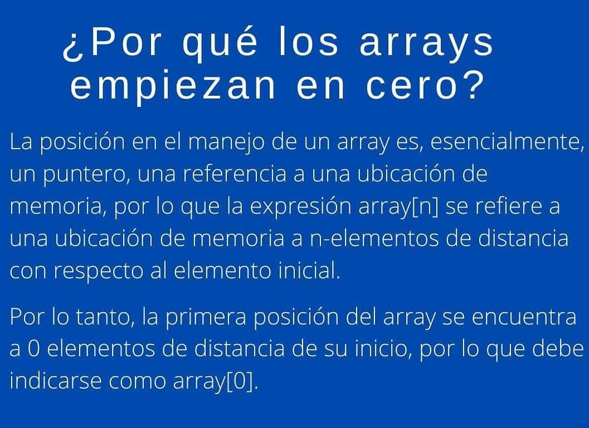
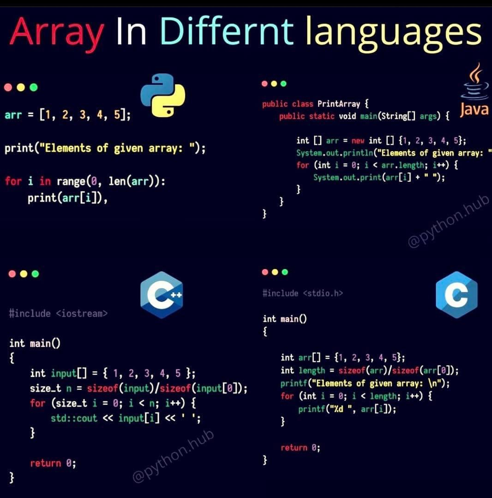
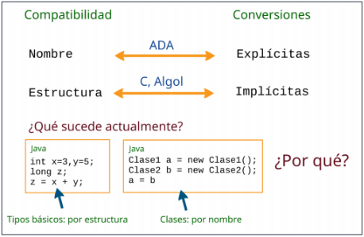
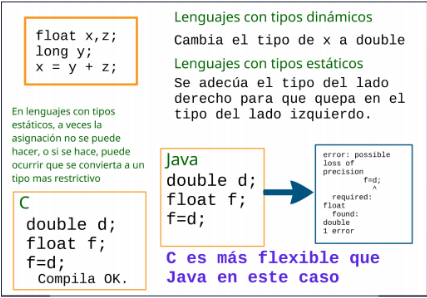

# Tipos

## Abstracción

* Es una representación de una entidad.
* Permite agrupar entidades en grupos.
* En LP es una herramienta para reducir la complejidad de la programación (simplificando el proceso de programación).
* Su aumento favorece: legibilidad, verificación, oscurecimiento, confiabilidad, reusabilidad y extensibilidad.
* Los LP contemporáneos proveen dos tipos de abstracción:
  * Abstracción de procesos a través de unidades.
  * Abstracción de datos desde 1980.

## Evolución del concepto de Tipo

* Tipos básicos.
* Tipos definidos por el usuario.
* Tipo de dato abstracto (TDA).

* Un tipo determina la interpretación de un valor almacenado y permite chequeos. (Fortran)
* Un tipo es el conjunto de valores que puede tomar un dato. (Pascal)
* Un tipo es un conjunto de valores y un conjunto de operaciones. (SIMULA)
* Un tipo de dato abstracto (TDA) es una entidad que encapsula valores y operaciones (solo acceso a través de las operaciones)

## Sistema de tipos

* Conjunto de reglas que estructuran y organizan una colección de tipos.
* Conjunto de reglas que determinan el tipo de un elemento (constantes, variables, retorno de funciones, parámetros, expresiones, etc.) del LP cuando este participa en una instrucción.
* El objetivo del sistema de tipos es lograr que los programas sean tan seguros como sea posible: Seguridad vs. Flexibilidad
* El **sistema de tipos es fuerte** cuando especifica restricciones sobre cómo las operaciones que involucran valores de diferentes tipos pueden operarse. Lo contrario establece un **sistema débil de tipos**.
* Ejemplo:

    ```javascript
    a = 2
    b = "2"
    concatenar(a, b) // retorna "22"
    sumar(a, b)      // retorna 4

    concatenar(a, b) // error de tipos
    sumar(a, b)      // error de tipos

    concatenar(str(a), b) // retorna "22"
    sumar(a, int(b))      // retorna 4
    ```

### Tipos de datos

* Los tipos de datos "capturan la naturaleza de los datos del problema que serán manipulados por los programas".
* Conjunto de valores posibles (dominio), con un conjunto de operaciones asociadas a esos valores (ejemplo: comparación, asignación, etc.)
* Operaciones: única forma de manipular los objetos instanciados.
* Tipo: comportamiento abstracto de un conjunto de objetos y un conjunto de operaciones.

#### Tipos básicos o predefinidos

* Reflejan el funcionamiento del hardware subyacente y son una abstracción de él.
* Ejemplos: enteros, reales, caracteres, booleanos, String

#### Tipos definidos por el usuario

* Separan la especificación de la implementación.
* Se definen los tipos que el problema necesita. Potencian la expresividad del LP.
* Ejemplos: enumerados, arreglos, producto cartesiano (struct en C, record en Pascal, etc.), listas, etc.

    ```pascal
    type MES is (ENERO, FEBRERO, ..., DICIEMBRE)
    X: MES
    ```

    ```c
    typedef struct {
        int nro_lados;
        float tamaño_lado;
    } reg_poligon;
    reg_poligon pol = {3, 3.45};
    ```





##### Tipo de dato recursivo

* Un tipo de dato recursivo T se define como una estructura que puede contener componentes del tipo T.
* Define datos agrupados cuyo tamaño puede crecer arbitrariamente y cuya estructura puede ser arbitrariamente compleja.
* Los LP convencionales soportan la implementación de los tipos de datos recursivos a través de los punteros.
* Los LP declarativos proveen mecanismos más abstractos que enmascaran a los punteros.
* Ejemplo: tope -> []->[]->null

    ```java
    public class Nodo {
        private int dato;
        private Nodo sig;
    }
    ```

    ```c
    struct Nodo {
        int dato;
        struct Nodo * sig;
    } nodo;
    ```

#### Tipo de dato abstracto (TDA)

* Es un tipo de dato definido por el usuario que satisface las siguientes condiciones:
  * La representación de los objetos del tipo son definidos como unidades sintácticas simples.
  * La representación del tipo son escondidos del programa que utilizan estos objetos, por lo tanto las únicas operaciones posibles son aquellas provistas por la definición del tipo.
* Beneficios:
  * Reduce la cantidad de detalles que el programador debe conocer y tener en mente a cada momento.
  * Previene el uso incorrecto de componentes del programa (contención de fallas)
  * Independencia significativa entre las componentes del programa.
  * La definición completa debería estar encapsulada de manera que el usuario del tipo solo necesite conocer el nombre del tipo, la semántica y las operaciones disponibles.
* Diseño:
  * Unidad sintáctica para definir el TDA.
  * Operaciones built-in: asignaciones y comparación.
  * Operaciones comunes: iteradores, constructores y destructores.
  * TDA parametrizados o clases genéricas: TDA que puede almacenar elementos de cualquier tipo.
  * Extensiones de tipos o herencia: sucede cuando una componente del programa, recibe propiedades o características de otra componente.
* Ejemplo:

    ```java
    public class Pila <T> {

        private Nodo<T> tope;

        class Nodo <T> {
            T info;
            Nodo<T> sig;
        }

        public Pila(){}
        public void poner(T dato){}
        public void sacar(){}
        public boolean esVacia(){}
        public T ver(){}
    }
    ```

### Tiempo de chequeo (ligadura)

* **Tipado estático**: si cada variable queda ligada a su tipo durante la compilación, sin necesidad de ejecutar el programa.
* **Tipado dinámico**: ligaduras en ejecución, provoca más comprobaciones en tiempo de ejecución. Python es débilmente tipado y tiene tipado dinámico.
* **Tipado seguro**: no es estático, ni inseguro.

* Los LP estáticamente tipados requieren declarar las variables con su tipo de datos. Ejemplo: Java

    ```java
    int a = 1;
    String b = "hola";
    boolean c = true; 
    ```

  * Más verbosos, pero menos propenso a errores de sintaxis (el compilador los detecta).
  * Se puede saber qué tipo de dato retorna una función.
  * No se puede cambiar el tipo de dato después de declarada la variable.
  * LP: Java, Go, C#, etc.

* Los LP dinámicamente tipados declaran variables sin necesidad de definir el tipo de datos (el intérprete infiere el tipo). Ejemplo: JavaScript

    ```javascript
    let a = 1
    let b = "hola"
    let c = true  
    ```

  * Código más legible y curva de aprendizaje más sencilla.
  * No se sabe qué tipo de dato retorna una función.
  * Se puede cambiar el tipo de dato después de declarada la variable.
  * LP: JS, Python, PHP, etc.

### Nivel de polimorfismo del lenguaje

* En el contexto de la POO implica que en una misma jerarquía de herencia, se puede responder al mismo mensaje en forma diferente.
* Para los LP tipados estáticamente, el polimorfismo no agrega complejidad.
* En cambio para los que permiten polimorfismo dinámico aparecen dificultades, ya que la cantidad de argumentos de una función polimórfica debe determinarse durante la ejecución.
* La ejecución de funciones polimórficas será claramente más lenta que para lenguajes con tipado estático, debido a que el programa debe interrogar los argumentos antes de obtener sus valores.
* Sin embargo, para muchas aplicaciones en poder de crear funciones polimórficas le quita peso a la ineficiencia en ejecución.

### Compatibilidad y Conversión

* **Compatibilidad**: ¿Qué pasa si se quiere hacer una operación con dos o más variables de distinto tipo?
* **Conversión**: ¿Cómo se hace para convertir un tipo en otro para hacer la operación?
* Ejemplo:

    ```java
    c = a + b;
    ```

  * ¿Son del mismo tipo? es necesario mirar el contexto del programa o la tabla de símbolos del compilador.
  * Si son de tipos diferentes. ¿Son compatibles?
    * No compatibles -> ERROR
    * Parcialmente o totalmente compatibles -> CONVERSIONES

* Tipos de compatibilidades:
  * Por nombre: dos variables que tengan el mismo nombre de tipo son compatibles. Ejemplo ADA

    ```ada
    type Enteros is new Integer;
    a : Integer;
    b : Enteros;
    a := a + b;
    ```

  * Por estructura: dos variables que tengan la misma representación en memoria son compatibles. Ejemplo Algol, C

    ```c
    typedef int entero;
    int a;
    entero b;
    a = a + b;
    ```

* Tipos de conversiones:
  * Explícitas:
    * Las escribe el programador.
    * Ejemplo a := a + Integer(b);
    * Ventajas: mayor seguridad en las operaciones y mejor legibilidad de los programas.
  * Implícitas:
    * No da ningún tipo de error.
    * Ejemplo a := a + b;
    * Ventajas: mayor flexibilidad para operar entre tipos diferentes y mayor facilidad de escritura de los programas.





## Ejercicios

1. ¿Qué características encierra el concepto de “tipo de datos”?
1. En todos los lenguajes ¿Una variable se liga estáticamente con su tipo? En caso de respuesta negativa, de al menos un ejemplo.
1. Enumere y explique las diferencias que existen entre el manejo de los tipos enumerativos entre Pascal y Ada. ¿Qué diferencias hay entre subtipo y subrango para cada lenguaje?
1. ¿Cómo es el manejo de punteros en C y en Java?
1. ¿Qué problemas de seguridad existen en el manejo de punteros? Ejemplifique.
1. En Python se habla de tipos de datos mutables e inmutables. ¿Para que se utiliza este tipo de datos? De al menos un ejemplo donde se puede utilizar. ¿Cómo? ¿Sucede lo mismo para Ruby? Explique la forma en que un objeto mutable puede convertirse en inmutable.
1. De un ejemplo de un lenguaje que sea fuertemente tipado y un lenguaje que no. Explicando en cada caso porque lo es y porque no lo es.
1. Ante las siguientes declaraciones de variables siguiendo la sintaxis de C:

    ```c
    typedef struct {
        int i;
        char c;
    } IntChar;

    IntChar  x;

    typedef IntChar2 IntChar;
    IntChar2 xx;

    struct {
        int i;
        char c;
    } y;

    typedef struct {
        int ii;
        char c;
    } IntChar3;

    IntChar3 z;
    ```

    * ¿Qué mecanismo de compatibilidades de tipos debería tener un lenguaje para que se cumplan las siguientes afirmaciones? ¿Por qué?
      * Las variables x e y tienen tipos compatibles.
      * Las variables x y xx tienen tipos compatibles.
      * Las variables x y z tienen tipos compatibles.
