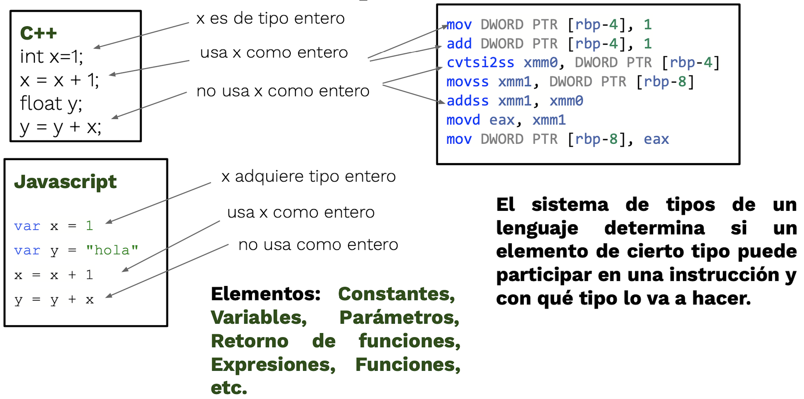
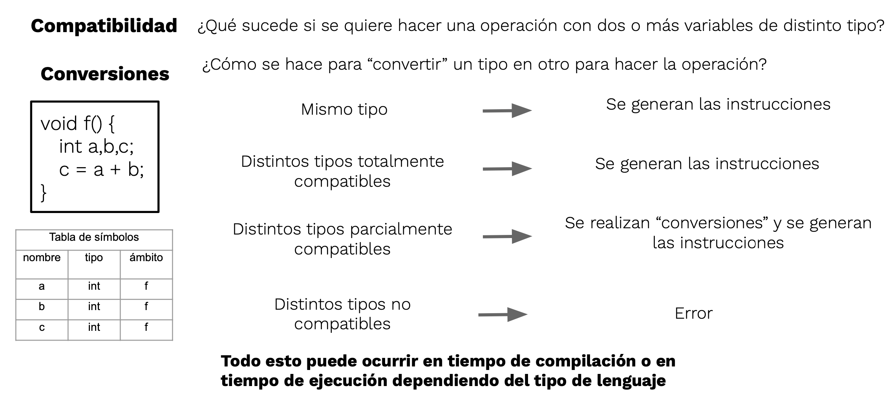
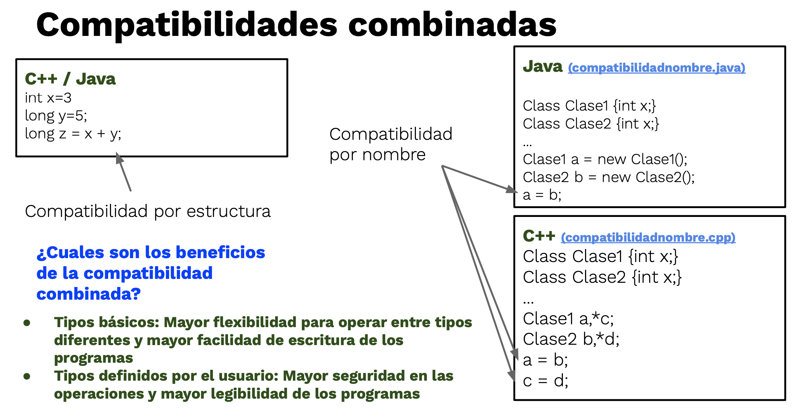
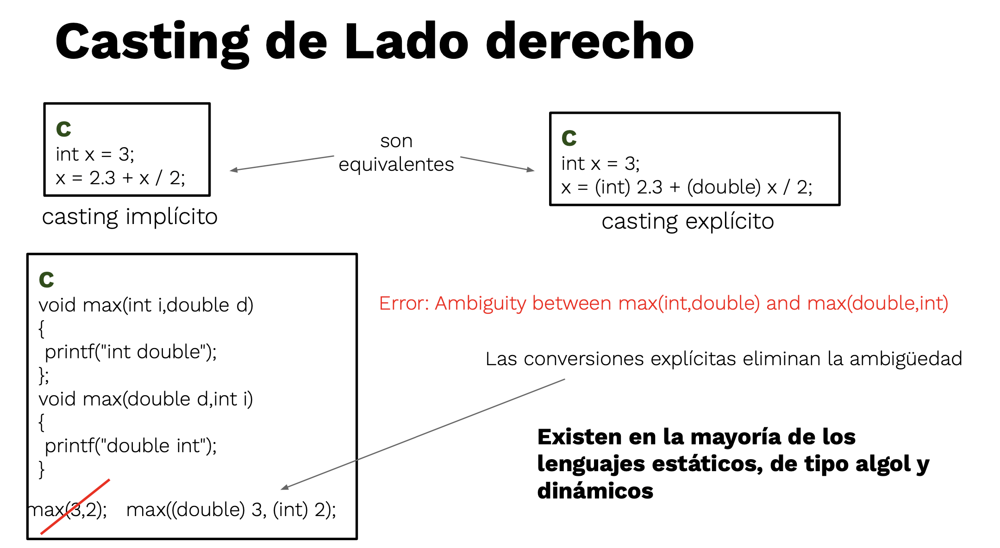
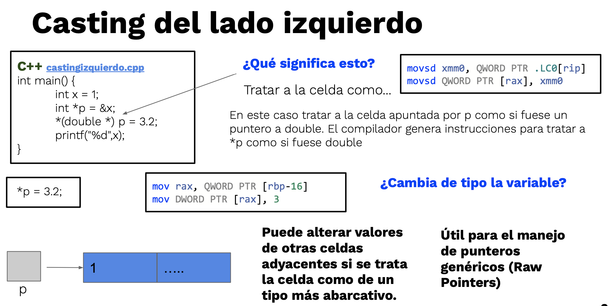
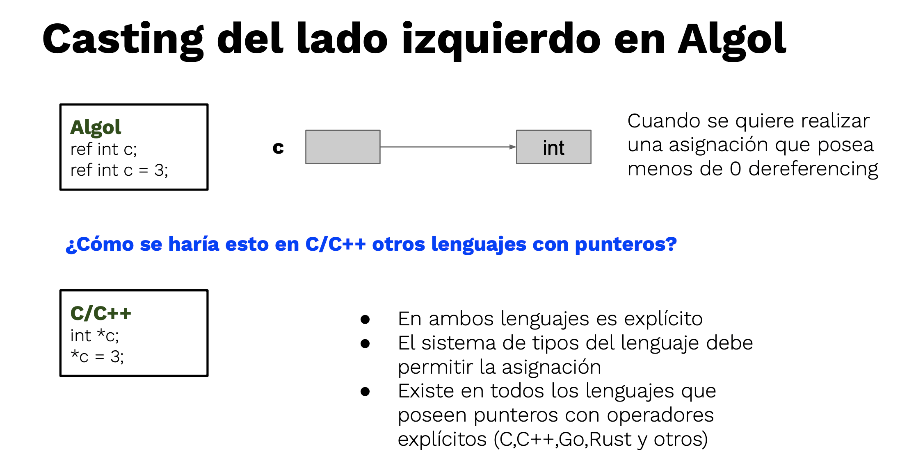
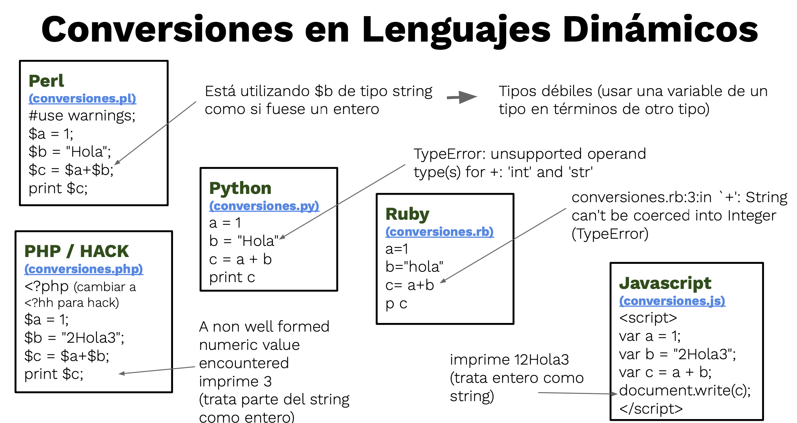

# Tipos

## Tipos de datos

* Conjunto de valores posibles (dominio), con un conjunto de operaciones asociadas a esos valores (ejemplo: comparación, asignación, etc.)

| Tipos | | |
| -- | -- | -- |
| **Básicos o escalares**    | Para el Lenguaje contienen un único valor (pueden estar compuestos internamente por varios valores) | Booleanos, Caracter, Enteros, Punto fijo, Punto flotante (real, float, double, etc.), Nulos, Enumeraciones, Intervalos, Tipos ordenados, etc. |
| **Agregados o compuestos** | Para el Lenguaje contienen más de un valor | Arreglos, Listas, Vectores, Conjuntos, Estructuras/Registros, Tipos recursivos (ejemplo: nodo), Tipos abstractos de datos (ejemplo: pila), Módulos, Clases |


## Sistema de tipos

* Conjunto de reglas que estructuran y organizan una colección de tipos.
* Conjunto de reglas que determinan el tipo de un elemento (constantes, variables, retorno de funciones, parámetros, expresiones, etc.) del LP cuando este participa en una instrucción.
* El objetivo del sistema de tipos es lograr que los programas sean tan seguros como sea posible: Seguridad vs. Flexibilidad
* El **sistema de tipos es fuerte** cuando especifica restricciones sobre cómo las operaciones que involucran valores de diferentes tipos pueden operarse. Lo contrario establece un **sistema débil de tipos**.
* Ejemplo:

    ```javascript
    a = 2
    b = "2"
    concatenar(a, b) // retorna "22"
    sumar(a, b)      // retorna 4

    concatenar(a, b) // error de tipos
    sumar(a, b)      // error de tipos

    concatenar(str(a), b) // retorna "22"
    sumar(a, int(b))      // retorna 4
    ```



### Clasificación de los sistemas de tipos

||||
| -- | -- | -- |
| Momento en que se conoce el tipo | **static typing** | **dynamic typing** |
| Las operaciones aplicables respetan siempre los términos del tipo | SI: **strong typing** | NO: **soft typing** |
| Los elementos siempre tienen un valor admisible para el tipo que poseen | SI: **type safety** | NO: **type unsafety** |

### Compatibilidad y Conversiones



| Tipos de Compatibilidades | | Ventajas | Tipo de conversión | Ejemplo |
| -- | -- | -- | -- | -- |
| **Compatibilidad de tipos por nombre**     | Los elementos son compatibles si los nombres de los tipos son iguales | Mayor seguridad en las operaciones y mayor legibilidad de los programas | **Explícitas** | type Enteros is new Integer; <br> a : Integer; <br> b : Enteros; <br> a := a + b; |
| **Compatibilidad de tipos por estructura** | Los elementos son compatibles si sus representaciones en memoria (estructuras) son compatibles | Mayor flexibilidad para operar entre tipos diferentes y mayor facilidad de escritura de los programas | **Implícitas o explícitas** | typedef int entero; <br> int a; <br> entero b; <br> a = a + b; |



| Tipos de conversiones | | Ejemplo |
| -- | -- | -- |
| **Explícitas** | Las escribe el programador | a := a + Integer(b); |
| **Implícitas** | No da ningún tipo de error, se intenta convertir hacia un tipo más abarcativo (agrandar la representación) | int i; long l; float f; double d; d = i\*l+i\*f+f\*l+i\*d+f\*d; |


## Casting









### Nivel de polimorfismo del lenguaje

* En el contexto de la POO implica que en una misma jerarquía de herencia, se puede responder al mismo mensaje en forma diferente.
* Para los LP tipados estáticamente, el polimorfismo no agrega complejidad.
* En cambio para los que permiten polimorfismo dinámico aparecen dificultades, ya que la cantidad de argumentos de una función polimórfica debe determinarse durante la ejecución.
* La ejecución de funciones polimórficas será claramente más lenta que para lenguajes con tipado estático, debido a que el programa debe interrogar los argumentos antes de obtener sus valores.
* Sin embargo, para muchas aplicaciones en poder de crear funciones polimórficas le quita peso a la ineficiencia en ejecución.

## Ejercicios

1. ¿Qué características encierra el concepto de “tipo de datos”?
1. En todos los lenguajes ¿Una variable se liga estáticamente con su tipo? En caso de respuesta negativa, de al menos un ejemplo.
1. Enumere y explique las diferencias que existen entre el manejo de los tipos enumerativos entre Pascal y Ada. ¿Qué diferencias hay entre subtipo y subrango para cada lenguaje?
1. ¿Cómo es el manejo de punteros en C y en Java?
1. ¿Qué problemas de seguridad existen en el manejo de punteros? Ejemplifique.
1. En Python se habla de tipos de datos mutables e inmutables. ¿Para que se utiliza este tipo de datos? De al menos un ejemplo donde se puede utilizar. ¿Cómo? ¿Sucede lo mismo para Ruby? Explique la forma en que un objeto mutable puede convertirse en inmutable.
1. De un ejemplo de un lenguaje que sea fuertemente tipado y un lenguaje que no. Explicando en cada caso porque lo es y porque no lo es.
1. Ante las siguientes declaraciones de variables siguiendo la sintaxis de C:

    ```c
    typedef struct {
        int i;
        char c;
    } IntChar;

    IntChar  x;

    typedef IntChar2 IntChar;
    IntChar2 xx;

    struct {
        int i;
        char c;
    } y;

    typedef struct {
        int ii;
        char c;
    } IntChar3;

    IntChar3 z;
    ```

    * ¿Qué mecanismo de compatibilidades de tipos debería tener un lenguaje para que se cumplan las siguientes afirmaciones? ¿Por qué?
      * Las variables x e y tienen tipos compatibles.
      * Las variables x y xx tienen tipos compatibles.
      * Las variables x y z tienen tipos compatibles.
