

# Características de Lenguajes de Programación

## Paradigma Imperativo


* Profesor:
  * Pablo Pandolfo

* Alumnxs:
  * Mariana Sánchez
  * Nicolás de la Fuente

### ÍNDICE

[**Introducción**](#_100)

[**GoTo**](#_200)

* [Goto en C](#_210)

* [Goto en Python](#_220)

* [Goto en Java](#_230)

[**Teorema del programa estructurado**](#_300)

* [Secuencia](#_310)

* [Selección](#_320)

* [Iteración](#_330)

[**Programación estructurada**](#_400)

[**GoTo vs Programación estructurada**](#_500)

[**Características**](#_600)

* [Variables](#_610)

* [Variables locales](#_620)

* [Variables globales](#_630)

[**Estructuras de control**](#_700)

* [Estructura secuencial](#_710)

[**Estructuras condicionales, selectivas o alternativas**](#_800)

* [Condicional simple](#_810)

* [Condicional doble](#_820)

* [Condicional múltiple](#_830)

[**Estructuras iterativas o repetitivas**](#_900)

* [Estructura while](#_910)

* [Estructura for](#_920)

* [Estructura do-while](#_930)

[**Componentes o módulos**](#_1000)

[Características de los módulos](#_1010)

[**Funciones, procedimientos y subrutinas**](#_1100)

[**Clasificación de las subrutinas**](#_1200)

[Subrutinas procedurales](#_1210)

[Funciones](#_1220)

[**Pasando a lenguajes de programación**](#_1300)

[Secuencia](#_1310)

[Selección](#_1320)

[Repetición](#_1330)

[Ciclos, bucles](#_1340)

[Subrutinas](#_1350)

### <a name="_100"></a></a>Introducción

El paradigma de la programación imperativa se fundamenta en la solución de problemas mediante la ejecución de programas que detallan un conjunto preciso de acciones para la computadora.

En este paradigma, se procesa cada instrucción en el orden en que se han escrito. En otras palabras, el programa indica a la computadora “cómo” realizar el proceso.

### <a name="_200"></a>GoTo

En un principio, los programas usaban una sola instrucción para modificar la secuencia de ejecución de las instrucciones mediante una transferencia incondicional del control con la instrucción "goto". A este tipo de programación se le llama programación lineal o no estructurada. Una instrucción "goto" permite el control a cualquier otra parte del programa. Cuando se ejecuta una instrucción "goto", la secuencia de ejecución del programa continúa a partir de la instrucción indicada por "goto". Por lo tanto, para entender cómo funciona un programa es necesario simular su ejecución. En la mayoría de los casos, es muy difícil comprender la lógica de un programa de este tipo. Los lenguajes como Fortran se basan en el uso de la instrucción "goto".

"goto" es una instrucción de programación que permite a un programa saltar a una sección de código específica dentro de su flujo de ejecución. Esta instrucción fue ampliamente utilizada en lenguajes de programación antiguos como BASIC y Fortran, pero su uso se ha desaconsejado en la programación moderna debido a sus efectos secundarios y a la posibilidad de generar código difícil de mantener y depurar.

La sintaxis básica del comando "goto" es la siguiente:

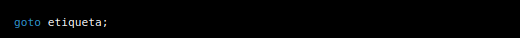

Donde "etiqueta" es una identificación única dentro del código del programa que se utilizará para identificar la sección de código a la que se desea saltar.

#### <a name="_210"></a>Goto en C

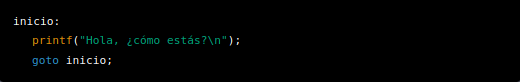

Este código imprimirá repetidamente el mensaje "Hola, ¿cómo estás?" en la pantalla, ya que el programa saltará de vuelta a la etiqueta "inicio" cada vez que se ejecute la línea "goto inicio;".

Es importante tener en cuenta que el uso excesivo de la instrucción "goto" puede dificultar la comprensión del flujo de ejecución del programa y hacer que sea más difícil de leer y mantener. En general, se recomienda utilizar estructuras de control de flujo como "if", "while" y "for" en su lugar para dirigir el flujo de ejecución del programa de manera más clara y predecible.

#### <a name="_220"></a>Goto en Python

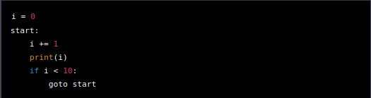

Este ejemplo utiliza un bucle infinito controlado por la instrucción "goto" para imprimir los números del 1 al 10 en la pantalla. La etiqueta "start" se utiliza para indicar el punto de inicio del bucle y el "if" se utiliza para salir del bucle cuando se llega a 10.

Es importante tener en cuenta que Python no tiene la instrucción "goto" incorporada, por lo que es necesario utilizar una biblioteca adicional como goto-labels para simular esta funcionalidad.

#### <a name="_230"></a>Goto en Java

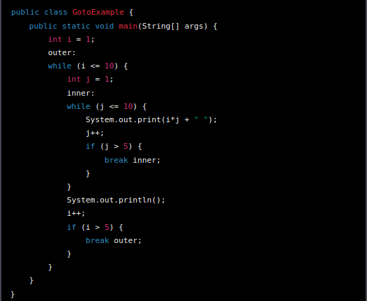

Este ejemplo utiliza dos etiquetas, "outer" y "inner", para controlar dos bucles anidados. El primer bucle "while" itera sobre la variable "i", mientras que el segundo bucle "while" itera sobre la variable "j". Cuando la variable "j" alcanza el valor 5, se rompe el bucle interior utilizando la instrucción "break inner". De manera similar, cuando la variable "i" alcanza el valor 5, se rompe el bucle exterior utilizando la instrucción "break outer".

No obstante, estas transferencias arbitrarias del control de ejecución hacían que los programas fueran muy poco legibles y difíciles de entender. A finales de los años sesenta, surgió una nueva forma de programar que reducía al mínimo el uso de la instrucción "goto" y la sustituía por otras más comprensibles.

### <a name="_300"></a>Teorema del programa estructurado

Así surgió la programación estructurada, que se desarrolló como solución a los problemas que presentaba la programación no estructurada.

Esta forma de programar se basa en el **teorema** del programa estructurado, que establece que toda función computable puede ser implementada en un lenguaje de programación que combine sólo tres estructuras lógicas. Esas tres formas (también llamadas estructuras de control) son:

#### <a name="_310"></a>Secuencia

La secuencia se refiere a la ejecución ordenada de instrucciones en un programa. Las instrucciones se ejecutan una detrás de otra, en el orden en que aparecen en el programa.

#### <a name="_320"></a>Selección

La selección se utiliza para hacer que el programa tome decisiones basadas en ciertas condiciones. Se utiliza una instrucción de selección (como "if" o "switch") para evaluar una condición y ejecutar un conjunto de instrucciones en consecuencia.

#### <a name="_330"></a>Iteración

La iteración se utiliza para repetir un conjunto de instrucciones varias veces. Se utiliza una instrucción de iteración (como "while" o "for") para repetir el conjunto de instrucciones mientras se cumple una determinada condición.

En conjunto, estas estructuras de control  son fundamentales en la programación estructurada y permiten la creación de programas complejos y eficientes.

Este teorema demuestra que la instrucción GOTO no es estrictamente necesaria y que para todo programa que la utilice existe otro equivalente que no hace uso de dicha instrucción.

### <a name="_400"></a>Programación estructurada

La programación estructurada tiene como característica principal su enfoque en la acción. Los programadores se centran en crear procesos, que son conjuntos de acciones que realizan una tarea común, y que se agrupan para formar programas. En esta metodología, la unidad fundamental es la acción, a diferencia de la Programación orientada a objetos, donde las entidades son las principales. Aunque los datos son importantes, se consideran como la materia prima para las acciones que realizan los procesos.

La metodología de desarrollo de programas de la programación estructurada se basa en los refinamientos sucesivos. Consiste en dividir una operación compleja en segmentos más simples y fáciles de manejar. Después de terminar todos los segmentos, se unifican las aplicaciones creadas por el equipo de programadores. Si se ha utilizado adecuadamente la programación estructurada, la integración debe ser sencilla y sin problemas. En caso contrario, cualquier problema puede ser fácilmente detectable y corregido.

La representación gráfica de los programas se realiza mediante diagramas de flujo o flow chart, los cuales representan el programa con sus entradas, procesos y salidas.

La programación estructurada propone la segregación de los procesos en estructuras simples, conocidas como secuencia, selección e iteración. Estas estructuras están disponibles en todos los lenguajes modernos de programación imperativa en forma de sentencias. Al combinar estas estructuras simples, se pueden construir sistemas amplios y complejos pero fáciles de entender.

La técnica de programación estructurada consiste en la clara organización de un programa a través del uso de tres estructuras lógicas de control: **secuencia, selección e iteración**.

La estructura de secuencia se refiere a la sucesión simple de dos o más operaciones en el programa.

La estructura de selección se utiliza para bifurcar condicionalmente una o más operaciones, según una condición establecida.

La estructura de iteración implica la repetición de una operación mientras se cumple una determinada condición.

Estas tres estructuras lógicas de control pueden combinarse para producir programas que manejen cualquier tarea de procesamiento de información.

### <a name="_500"></a>GoTo vs Programación estructurada

El comando "goto" es una instrucción de control de flujo en programación que permite saltar a otra sección del código. Fue introducido por primera vez en el lenguaje de programación FORTRAN en la década de 1950.

Aunque en un principio el comando "goto" era una herramienta útil para la programación, con el tiempo se hizo evidente que su uso podría conducir a código confuso y difícil de mantener. En particular, el uso excesivo de "goto" puede crear "spaghetti code", es decir, código que es difícil de seguir y entender.

En los años 60 y 70, surgió un movimiento en la programación llamado "programación estructurada", que buscaba eliminar el uso de "goto" y otras instrucciones de salto en el código. Este movimiento fue liderado por programadores como Edsger W. Dijkstra, que argumentaron que el uso de estructuras de control de flujo más claras y estructuradas, como las instrucciones "if-then-else" y "while", podían hacer que el código fuera más fácil de leer, entender y mantener.

La programación estructurada se convirtió en un enfoque dominante en la programación durante las décadas de 1970 y 1980, y se utilizó en una amplia gama de lenguajes de programación, incluyendo C, Pascal y Ada. Como resultado, el uso de "goto" disminuyó significativamente en la programación moderna. Sin embargo, todavía se puede encontrar en algunos lenguajes de programación y en situaciones específicas donde es necesario un control de flujo más complejo.

### <a name="_600"></a>Características

#### <a name="_610"></a>Variables

Las variables son espacios de almacenamiento en memoria que utilizan los programas imperativos para guardar valores necesarios en los procesos que realizan. Se pueden clasificar en dos grupos principales según su ámbito.

#### <a name="_620"></a>Variables locales

Una variable local es aquella que se define dentro de un bloque de código específico, como una función o un procedimiento, y solo puede ser accedida y modificada dentro de ese mismo bloque. Es decir, su ámbito de alcance se limita a la función o bloque en el que se declaró. Una vez que la función o bloque finaliza su ejecución, la variable local se elimina de la memoria.

#### <a name="_630"></a>Variables globales

Una variable global es aquella que se define fuera de cualquier función o bloque de código específico, y puede ser accedida y modificada desde cualquier parte del programa. Su ámbito de alcance es global, es decir, está disponible en todo el programa. A diferencia de las variables locales, las variables globales no se eliminan de la memoria hasta que finaliza la ejecución del programa. El uso excesivo de variables globales puede llevar a problemas de mantenimiento y depuración del código.

### <a name="_700"></a>Estructuras de control

Una estructura de control es un conjunto de instrucciones que permiten modificar el flujo de ejecución de un programa. Estas estructuras son utilizadas para tomar decisiones, realizar repeticiones o iteraciones y realizar operaciones en paralelo.

#### <a name="_710"></a>Estructura secuencial

Una estructura secuencial es una secuencia de instrucciones que se ejecutan en el orden en que se han escrito. Estas estructuras no permiten modificar el flujo de ejecución, ya que todas las instrucciones son ejecutadas de manera secuencial. Ejemplos de estructuras secuenciales son: la asignación de valores a variables, la llamada a funciones, la declaración de variables, entre otras.

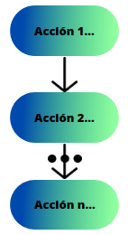

###### Ejemplo en pseudocódigo:
```
INICIO

  Leer base

  Leer altura

  Calcular area = (base \* altura) / 2

  Imprimir area

FIN
```

### <a name="_800"></a>Estructuras condicionales, selectivas o alternativas

Son estructuras de control que permiten evaluar condiciones y ejecutar acciones en función del resultado que arrojen estas condiciones.

#### <a name="_810"></a>Condicional simple

El condicional simple se utiliza para ejecutar un bloque de código si una condición se cumple, y no hacer nada si no se cumple.

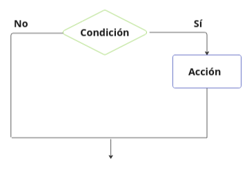

###### Ejemplo en Pseudocódigo:
```
INICIO

  Leer numero

  SI numero >= 0 ENTONCES

  Imprimir "El número es positivo"

  DE OTRO MODO

  Imprimir "El número es negativo"

FIN SI

FIN
```

#### <a name="_820"></a>Condicional doble

El condicional doble se utiliza para ejecutar diferentes bloques de código en función de si una o varias condiciones se cumplen o no.

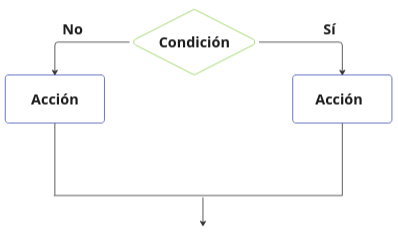

#### <a name="_830"></a>Condicional múltiple

Un condicional múltiple se refiere a una estructura de control de flujo que permite ejecutar diferentes bloques de código dependiendo del cumplimiento o no de varias condiciones.

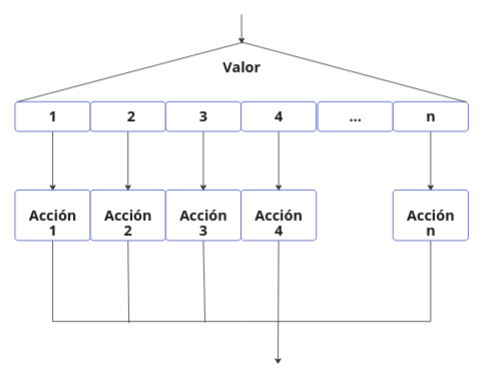

### <a name="_900"></a>Estructuras iterativas o repetitivas

Las estructuras iterativas o repetitivas son una forma de control de flujo que permiten ejecutar un bloque de código varias veces mientras se cumpla una condición determinada. Las estructuras de repetición son muy útiles cuando se necesita realizar una tarea varias veces, evitando tener que escribir el mismo código una y otra vez.

Un ciclo es un segmento de un algoritmo o programa, cuyas instrucciones se repiten un número determinado de veces mientras se cumple una determinada condición.

Un ciclo consta de tres partes:

* Decisión o condición.
* Cuerpo del ciclo.
* Salida del ciclo.

#### <a name="_910"></a>Estructura while

La estructura while ejecuta un bloque de código mientras se cumpla una condición determinada. El código dentro del bloque de while se ejecutará una y otra vez mientras la condición sea verdadera.

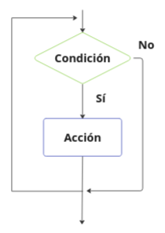

###### Ejemplo en Pseudocódigo:
```
INICIO

  suma = 0

  i = 1

  MIENTRAS i <= 10 HACER

  suma = suma + i

  i = i + 1

  FIN MIENTRAS

  Imprimir suma

FIN
```

#### <a name="_920"></a>Estructura for

La estructura for,  permite ejecutar un bloque de código un número determinado de veces. La sintaxis básica es la siguiente:

###### Ejemplo en Pseudocódigo:
```
INICIO

  Leer numero

  factorial = 1

  PARA i = 1 HASTA numero HACER

  factorial = factorial \* i

  FIN PARA

  Imprimir factorial

FIN
```

La variable inicializada en la parte de inicialización se utiliza para contar el número de veces que se ejecutará el bloque de código. La condición se verifica en cada iteración del ciclo, y si se cumple, se ejecuta el bloque de código. El incremento se utiliza para actualizar la variable de iteración en cada iteración del ciclo.

#### <a name="_930"></a>Estructura do-while

La estructura do-while es similar a la estructura while, con la diferencia de que el bloque de código se ejecuta al menos una vez, y después verifica si se cumple la condición para continuar o salir del ciclo. La sintaxis básica es la siguiente:

###### Ejemplo en Pseudocódigo:
```
INICIO

contador = 1

hacer { // Bloque de código a ejecutar al menos una vez escribir("El valor del contador es: " + contador)

contador = contador + 1

} mientras (contador <= 5) // La condición de salida

// Mensaje de finalización escribir("Se ha completado la ejecución del bucle")

FIN
```

El código dentro del bloque de do se ejecutará al menos una vez, y después se verificará la condición. Si la condición es verdadera, el bloque de código se ejecutará de nuevo, y así sucesivamente.

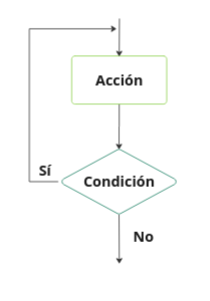

### <a name="_1000"></a>Componentes o módulos

Un componente es cada una de las secciones de un programa que resuelve uno de los subproblemas en que se divide el problema complejo original. Cada uno de estos componentes tiene una tarea claramente definida y algunos requieren de otros para poder funcionar correctamente. Si un componente necesita de otro, puede comunicarse con éste a través de una interfaz de comunicación que también debe estar definida de manera precisa. Aunque un componente puede entenderse como una parte de un programa en cualquiera de sus formas y contextos diversos, en la práctica se los suele considerar sinónimos de procedimientos y funciones. Sin embargo, no es necesariamente un componente una función o un procedimiento, ya que puede contener muchos de ellos. No se debe confundir el término "componente" (en el sentido de programación modular) con términos como "función" o "procedimiento", propios del lenguaje que lo soporte. En el caso de la programación, los componentes suelen estar (no necesariamente) organizados jerárquicamente en niveles, de forma que hay un componente principal que realiza las llamadas adecuadas a los componentes de nivel inferior. Cuando un componente es llamado, recibe como entrada los datos proporcionados por otro del mismo o superior nivel, el que ha realizado la llamada; luego realiza su tarea. A su vez, este componente puede llamar a otro u otros componentes de nivel inferior si fuera necesario. Cuando éstos finalizan su tarea, devuelven la salida pertinente al componente inmediato llamador, en secuencia reversa, y finalmente se continúa con la ejecución del componente principal.

#### <a name="_1010"></a>Características de los módulos

Un módulo es una unidad lógica de un programa que se compone de las siguientes características:

* Una tarea bien definida: Un módulo debe tener una tarea específica y claramente definida que resuelva uno de los subproblemas en que se divide el problema complejo original. Esto facilita la comprensión del código y su mantenimiento.
* Un conjunto de instrucciones: Un módulo está compuesto por un conjunto de instrucciones que ejecutan la tarea asignada al mismo. Estas instrucciones son las que se encargan de manipular los datos de entrada, realizar cálculos y generar la salida correspondiente.
* Entrada y salida: Un módulo recibe ciertos datos de entrada, que son necesarios para realizar su tarea, y produce una salida que es el resultado de esa tarea. La entrada y salida de datos se realizan mediante parámetros y variables.
* Modularidad: El paradigma imperativo utiliza el concepto de programación modular, lo que significa que los módulos pueden ser diseñados, escritos y probados de manera independiente. Además, se pueden reutilizar en diferentes partes del programa, lo que facilita la creación de programas complejos.
* Interacción con otros módulos: Los módulos pueden interactuar con otros módulos mediante la utilización de interfaces de comunicación. Esto permite que los módulos se comuniquen entre sí para realizar tareas más complejas.
* Jerarquía: Los módulos pueden organizarse jerárquicamente en diferentes niveles, lo que facilita la comprensión y la estructuración del programa. Un módulo principal puede llamar a módulos de nivel inferior para que realicen tareas específicas.
* Encapsulamiento: Un módulo puede encapsular su funcionalidad, lo que significa que oculta su implementación interna al resto del programa. Esto permite que el código sea más seguro y fácil de mantener, ya que los cambios en la implementación interna de un módulo no afectan a otros módulos que lo utilizan.

### <a name="_1100"></a>Funciones, procedimientos y subrutinas

Una función, procedimiento o subrutina, es un conjunto de instrucciones que realizan una tarea específica en un programa. Estas pueden ser definidas y llamadas varias veces en diferentes partes del programa, lo que hace que el código sea más modular y fácil de mantener. Una subrutina al ser llamada dentro de un programa hace que el código principal se detenga y se dirija a ejecutar el código de la subrutina, cuando esta termina el código principal continúa con su ejecución.

En general, una función, procedimiento o subrutina en el paradigma imperativo tiene las siguientes características:

* Nombre: se le asigna un nombre que identifica la función o procedimiento de manera única.
* Argumentos: puede recibir cero o varios argumentos que se utilizan como entrada para realizar la tarea.
* Cuerpo: contiene un conjunto de instrucciones que se ejecutan en secuencia para realizar la tarea deseada.
* Valor de retorno: puede devolver un valor de retorno después de realizar la tarea.

### <a name="_1200"></a>Clasificación de las subrutinas

Las subrutinas pueden clasificarse en dos tipos principales: subrutinas procedurales y funciones.

#### <a name="_1210"></a>Subrutinas procedurales

Las subrutinas procedurales son bloques de código que realizan una tarea específica. No devuelven ningún valor, pero pueden tener efectos secundarios en el estado del programa. Estas subrutinas se utilizan para agrupar código repetitivo o para dividir un programa en tareas más pequeñas y manejables.

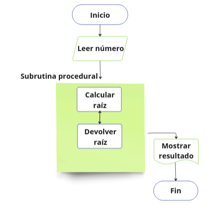

En este ejemplo, se presenta una subrutina procedural llamada CalculoRaiz que realiza el cálculo de la raíz cuadrada de un número. La subrutina toma como entrada el número que se desea calcular la raíz y devuelve como salida el resultado del cálculo.

La secuencia de pasos en el diagrama es la siguiente:

1. En el paso LeerNumero, se solicita al usuario ingresar el número al que se le calculará la raíz.
2. En el paso CalculoRaiz, se llama a la subrutina CalculoRaiz para realizar el cálculo de la raíz cuadrada del número ingresado.
3. En el paso MostrarResultado, se muestra en pantalla el resultado del cálculo realizado en la subrutina CalculoRaiz.
4. Finalmente, en el paso Fin, se termina la ejecución del programa.

#### <a name="_1220"></a>Funciones

Las funciones son similares a las subrutinas procedurales, pero en lugar de simplemente ejecutar un bloque de código, devuelven un valor. Las funciones se utilizan para realizar cálculos y procesamiento de datos, y el valor devuelto puede ser utilizado por el programa para realizar otras tareas.


En este ejemplo, se presenta una subrutina de función llamada CalculoPotencia que realiza el cálculo de la potencia de un número elevado a un exponente. La subrutina toma como entrada el número base y el exponente y devuelve como salida el resultado de la operación.

La secuencia de pasos en el diagrama es la siguiente:

1. En el paso LeerNumero, se solicita al usuario ingresar el número base.
1. En el paso LeerExponente, se solicita al usuario ingresar el exponente al que se elevará el número base.
1. En el paso CalculoPotencia, se llama a la subrutina de función CalculoPotencia para realizar el cálculo de la potencia del número base elevado al exponente ingresado.
1. En el paso MostrarResultado, se muestra en pantalla el resultado del cálculo realizado en la subrutina CalculoPotencia.
1. Finalmente, en el paso Fin, se termina la ejecución del programa.

### <a name="_1300"></a>Pasando a lenguajes de programación

#### <a name="_1310"></a>Secuencia

###### Código en Python:
```
base = float(input("Ingrese la base del triángulo: "))

altura = float(input("Ingrese la altura del triángulo: "))

area = (base \* altura) / 2

print("El área del triángulo es:", area)
```

###### Código en JavaScript:
```
let base = parseFloat(prompt("Ingrese la base del triángulo: "));

let altura = parseFloat(prompt("Ingrese la altura del triángulo: "));

let area = (base \* altura) / 2;

alert("El área del triángulo es: " + area);
```

#### <a name="_1320"></a>Selección

###### Código en Python:
```
numero = int(input("Ingrese un número: "))

if numero >= 0:

  print("El número es positivo")

else:

  print("El número es negativo")
```

###### Código en JavaScript:
```
let numero = parseInt(prompt("Ingrese un número: "));

if (numero >= 0) {

  alert("El número es positivo");

} else {

  alert("El número es negativo");

}
```

#### <a name="_1330"></a>Repetición

###### Código en Python:
```
suma = 0

i = 1

while i <= 10:

  suma += i

  i += 1

print("La suma de los números del 1 al 10 es:", suma)
```

###### Código en JavaScript:
```
let suma = 0;

let i = 1;

while (i <= 10) {

  suma += i;

  i++;

}

alert("La suma de los números del 1 al 10 es: " + suma);
```

#### <a name="_1340"></a>Ciclos, bucles

###### Código en Python:
```
numero = int(input("Ingrese un número: "))

factorial = 1

for i in range(1, numero + 1):

factorial \*= i

print("El factorial de", numero, "es:", factorial)

Código en JavaScript:

let numero = parseInt(prompt("Ingrese un número: "));

let factorial = 1;

for (let i = 1; i <= numero; i++) {

  factorial \*= i;

}

alert("El factorial de " + numero + " es: " + factorial);
```

#### <a name="_1350"></a>Subrutinas

###### Código en Python:

```
def calcular\_area(base, altura):

area = (base \* altura) / 2

return area

base = float(input("Ingrese la base del triángulo: "))

altura = float(input("Ingrese la altura del triángulo: "))

area = calcular\_area(base, altura)

print("El área del triángulo es:", area)
```

###### Código en JavaScript:
```
function calcularArea(base, altura) {

let area = (base \* altura) / 2;

  return area;

}

let base = parseFloat(prompt("Ingrese la base del triángulo: "));

let altura = parseFloat(prompt("Ingrese la altura del triángulo: "));

let area = calcularArea(base, altura);

alert("El área del triángulo es: " + area);
```
