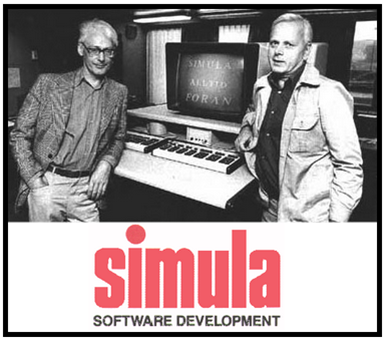
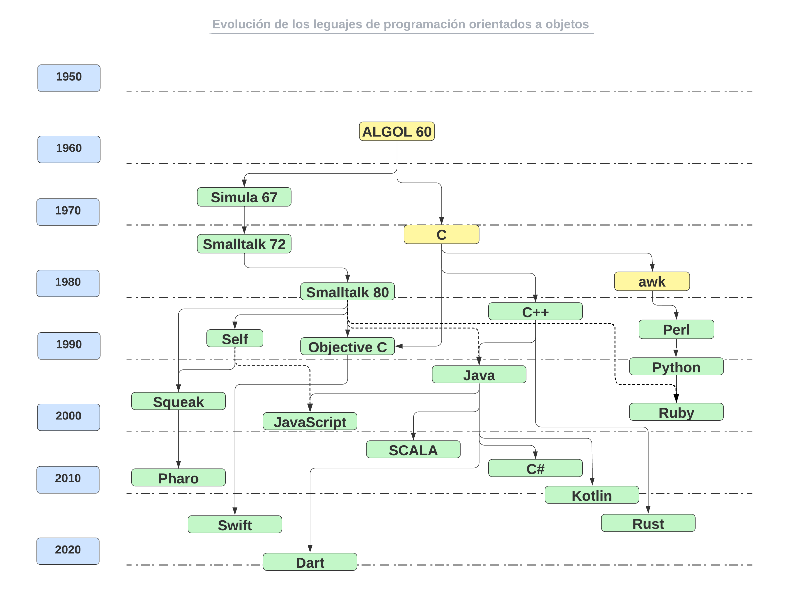
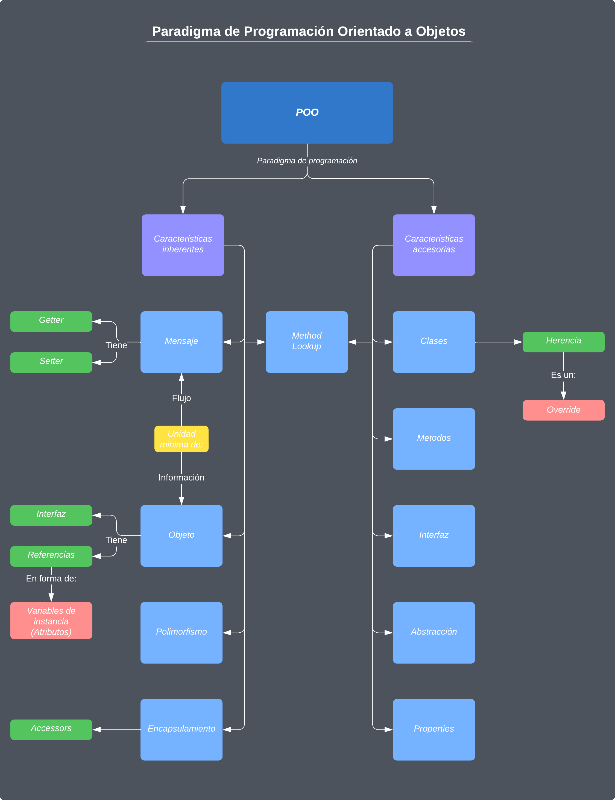

# El paradigma de programación orientada a objetos (POO)

* El paradigma de programación orientada a objetos (POO) se basa en la idea de que el mundo puede ser modelado como una colección de objetos que interactúan entre sí.
* Cada objeto tiene un estado y un comportamiento, y puede comunicarse con otros objetos a través de mensajes.
* En la POO, los objetos son las unidades fundamentales de programación y la programación se realiza a través de la manipulación de estos objetos.

## Historia

* La POO nace en los años 60's en el Norwegian Computing Center con la implementación de dos lenguajes de programación de simulación: Simula 1 y Simula 67, desarrollados por Kristen Nygaard y Ole Johan Dahl.
* Simula 67 introdujo por primera vez los conceptos de clases, objetos, herencia, subclases, corutinas y funciones virtuales.
* Es por esta razón que Simula es considerado el primer lenguaje de programación orientado a objetos.

* Dahl y Nygaard en los tiempos del desarrollo del Simula.

## Evolución de los lenguajes de POO a través de los años

| Año  | Lenguaje | Descripción |
|------|----------|-------------|
| 1960 | Simula   | El primer lenguaje de programación orientado a objetos. Fue desarrollado en Noruega para simular sistemas |
| 1972 | Smalltalk| Uno de los primeros lenguajes de programación orientado a objetos. Fue desarrollado en Xerox PARC. Es considerado un "mundo virtual de objetos" donde cualquier entidad es modelada como un objeto |
| 1983 | C++      | Fue diseñado a mediados de los años 80's por Bjarne Stroustrup con la intención de extender el lenguaje de programación C a mecanismos que permitieran la manipulación de objetos. |
| 1986 | Objective-C| Fue creado como un superconjunto de C para que implementara un modelo de objetos parecido al de Smalltalk. Originalmente fue creado por Brad Cox y la corporación StepStone en 1980. Actualmente se usa como un lenguaje principal de programación para Mac OS X, iOS y GNUstep, además de Swift |
| 1986 | Self | Es un lenguaje de programación orientado a objetos y un entorno de desarrollo integrado (IDE) basado en Smalltalk. Self se destaca por su sistema de objetos prototípicos y por su enfoque en la optimización automática del rendimiento. Self también fue uno de los primeros lenguajes en incorporar el concepto de "reflexión", lo que significa que los objetos pueden examinar y modificar su propia estructura y comportamiento en tiempo de ejecución |
| 1987 | Perl | Es un lenguaje de programación diseñado por Larry Wall en 1987. Toma características del lenguaje C, del lenguaje interpretado bourne shell (sh), AWK, sed, Lisp y, en un grado inferior, de muchos otros lenguajes de programación y adicionalmente, soporta herencia múltiple |
| 1989 | Python | Es un lenguaje de programación interpretado cuya filosofía hace hincapié en una sintaxis que favorezca un código legible, usa tipado dinámico, es multiparadigma y multiplataforma. Fue creado a finales de los 80's por Guido van Rossum en el Centro para las Matemáticas y la Informática (CWI, Centrum Wiskunde & Informatica), en los Países Bajos, como un sucesor del lenguaje de programación ABC |
| 1993 | Ruby     | Lenguaje de programación dinámico y de código abierto enfocado en la simplicidad y productividad. Su elegante sintaxis es cómoda al leerla y fácil al escribirla. Fue creado por el programador japonés Yukihiro Matsumoto, quien comenzó a trabajar en Ruby en 1993, y lo presentó públicamente en 1995. |
| 1995 | Java     | Es un lenguaje de programación de propósito general, concurrente y multiplataforma que fue diseñado específicamente para tener pocas dependencias de implementación. Fue originalmente desarrollado por James Gosling de Sun Microsystems y publicado en 1995 como un componente fundamental de la plataforma Java de Sun Microsystems. Mediante una maquina virtual (JVM) se encarga de interpretar y ejecutar el código. Este es compilado en un formato llamado bytecode, que es un conjunto de instrucciones que la máquina virtual puede entender y ejecutar. La máquina virtual se encarga de convertir el bytecode en código de máquina específico para la plataforma en la que se está ejecutando el programa.|
| 1995 | JavaScript |  Lenguaje de programación interpretado utilizado principalmente en el desarrollo web. Permite la creación de contenido dinámico en una página web, interactuando con HTML y CSS. También es utilizado en el desarrollo de aplicaciones backend.|
| 1997 | Squeak | Squeak es similar a Smalltalk-80, pero tiene una arquitectura modularizada y una máquina virtual más avanzada. |
| 2000 | C#       | Fue desarrollado y estandarizado por Microsoft como parte de su plataforma .NET. El nombre C Sharp fue inspirado por la notación musical '#' (sostenido). Diseñado por Anders Hejlsberg y un grupo de desarrolladores, surgió en enero de 1999 con el nombre de Cool, pasando un tiempo después al nombre de C# por problemas de marca. |
| 2003 | SCALA | Scala es un lenguaje de programación que combina elementos de programación orientada a objetos y programación funcional, por lo que se considera un lenguaje de programación multiparadigma. |
| 2008 | Pharo | Orientado a objetos y utiliza un IDE basado en Smalltalk. Pharo es la versión moderna de Smalltalk y se utiliza principalmente en el desarrollo de software empresarial, científico y educativo. Es altamente escalable y extensible, tiene una gran comunidad de desarrolladores y usuarios. |
| 2011 | Kotlin   | Fue desarrollado por JetBrains en 2011. Se ejecuta en la plataforma Java. Kotlin fue diseñado para abordar las limitaciones y problemas que se encontraron en el desarrollo de software con otros lenguajes de programación.. Es utilizado en aplicaciones móviles, de escritorio y web. |
| 2014 | Swift    | Este lenguaje de programación orientado a objetos fue desarrollado por Apple para reemplazar a Objective-C. Es utilizado en el desarrollo de aplicaciones para dispositivos de Apple. |
| 2016 | Rust     | Es lenguaje pone énfasis en la seguridad, la concurrencia y el rendimiento. Es utilizado en aplicaciones de baja latencia, sistemas embebidos y juegos. |
| 2019 | Dart     | Un lenguaje de programación orientado a objetos desarrollado por Google. Se utiliza principalmente para el desarrollo de aplicaciones móviles y web. Dart es compatible con la plataforma Flutter, que es un framework para el desarrollo de aplicaciones móviles y de escritorio. |

## Caracteristicas de lenguajes de POO

### ¿Qué es un objeto?

* En la POO, un objeto es una instancia de una clase que tiene un estado (atributos o propiedades) y un comportamiento (métodos o funciones). En otras palabras, un objeto es una entidad concreta que puede representar cualquier cosa del mundo real o abstracto.
* Entonces, podemos decir que la POO es un método de implementación en el que los programas se organizan como colecciones cooperativas de objetos, cada uno de los cuales representan una instancia de alguna clase, y cuyas clases son, todas ellas miembros de una jerarquía de clases unidas mediante relaciones de herencia.
* Un lenguaje es orientado a objetos si cumple con las siguientes premisas:

1. Debe soportar objetos que son abstracciones de datos con una interfaz de operaciones con nombre y un estado local oculto.
2. Los objetos deben tener un tipo asociado (clase).
3. Los tipos (clases) pueden heredar atributos de los supertipos (superclases).

* Para un lenguaje POO, el qué soporte la herencia significa: Usar la relación << ES UN >>.
* Ejemplo: Un Cocker  << ES UN >> tipo de perro y un perro << ES UN  >> animal doméstico.
* Con lo antes mencionado, podemos decir que la POO, realiza una abstracción de la realidad.

### Elementos del Modelo

### Caracteristicas inherentes

* **Objeto**:  Un objeto es una instancia o copia de una clase, que tiene sus propias propiedades (atributos) y puede realizar acciones (métodos)Un objeto es una entidad concreta que representa algo del mundo real, como una persona, un automóvil, un animal, etc. Cada objeto tiene su propia identidad, estado y comportamiento. La identidad se refiere al hecho de que cada objeto es único y tiene un identificador único que lo distingue de otros objetos. El estado se refiere a los valores actuales de los atributos del objeto, que pueden cambiar a lo largo del tiempo. El comportamiento se refiere a las acciones que un objeto puede realizar, que se definen mediante sus métodos.

* **Mensaje**: Un mensaje es una solicitud de un objeto para realizar una acción específica, que se transmite a través de un método. Un objeto que recibe un mensaje buscará el método correspondiente en su clase y lo ejecutará. Por ejemplo, si tenemos un objeto perro de la clase Mascota, podemos enviarle un mensaje para que realice una acción específica, como ladrar(). El objeto perro buscará el método ladrar() en su clase Mascota y lo ejecutará.

* **Polimorfismo**: El polimorfismo es la capacidad de un objeto para tomar diferentes formas. En la POO, esto significa que un objeto puede tener diferentes formas o comportamientos dependiendo del contexto en el que se utiliza. Por ejemplo, un objeto puede ser tratado como un objeto de una clase específica o como un objeto de una clase más general.

* **Encapsulamiento**: El encapsulamiento es la idea de que los datos y las funciones que operan sobre esos datos deben estar contenidos dentro de un objeto. Los objetos encapsulan sus propios datos y funciones, lo que significa que el código que utiliza el objeto no tiene que conocer los detalles internos del objeto. Esto hace que el código sea más modular y fácil de mantener.

* Existen tres niveles de acceso para el encapsulamiento, los cuales son:
  * **Público (Public)**: Todos pueden acceder a los datos o métodos de una clase que se definen con este nivel, este es el nivel más bajo.
  * **Protegido (Protected)**: Solamente son accesibles dentro de su clase y por subclases que heredan de esta.
  * **Privado (Private)**: En este nivel se puede declarar miembros accesibles sólo para la propia clase.

* **Method Lookup**: En POO el method lookup es común a las caracteristicas inherentes y accesorias. Para entender su funcionamiento podemos decir que: Los objetos se crean a partir de clases y heredan sus métodos y propiedades. Cuando se llama a un método en un objeto, el método debe buscarse en la clase del objeto y en las clases superiores en la cadena de herencia, en el orden en que se definen.

El proceso de búsqueda de método comienza en la clase del objeto y continúa ascendiendo en la cadena de herencia hasta que se encuentra el método adecuado. Si el método no se encuentra en la clase del objeto ni en ninguna de sus superclases, se producirá un error.

> Si llegara a faltar alguno de los elementos principales del modelo, no se concideraria un lenguaje de programación orientada a objetos.

### Caracteristicas accesorias

* **Clase**: una clase define un tipo de objeto que puede tener un conjunto específico de propiedades y comportamientos. Una clase es como un plano o esquema que describe cómo deben ser los objetos que se crean a partir de ella. Los objetos creados a partir de una clase se denominan instancias o objetos de esa clase. Cada instancia tiene su propio conjunto de valores para los atributos de la clase y puede llamar a los métodos definidos en esa clase.

Por ejemplo, si tenemos una clase Coche, podemos definir los atributos que describen un coche, como el modelo, la marca, el color, la matrícula, etc., y los métodos que definen lo que puede hacer un coche, como acelerar(), frenar(), girar(), etc.

Cuando creamos un objeto a partir de la clase Coche, establecemos los valores de los atributos específicos del objeto, como el modelo, la marca y la matrícula, y luego podemos llamar a los métodos definidos en la clase para realizar acciones específicas con ese objeto.

* **Herencia**: Es el mecanismo mediante el cual una clase puede heredar propiedades y comportamientos de otra clase existente, llamada clase padre o clase base. La clase que hereda estas propiedades y comportamientos se llama clase hija o clase derivada. La herencia permite crear nuevas clases a partir de clases existentes, evitando así la duplicación de código y facilitando la creación de jerarquías de clases.

* **Herencia múltiple**: Es la capacidad de una clase de heredar atributos y métodos de varias clases padre. Aunque puede ser útil, la herencia múltiple puede generar complicaciones y ambigüedades en el código, por lo que algunos lenguajes de programación orientados a objetos no la permiten o la limitan.

* **Método**: Un método es una forma de encapsular el comportamiento de una clase, lo que significa que las operaciones realizadas por un objeto se realizan a través de sus métodos. Cada objeto de una clase tiene acceso a los métodos definidos en esa clase, y puede llamarlos para realizar tareas específicas. Los métodos pueden tener argumentos y pueden devolver un valor, y pueden acceder a los atributos o propiedades del objeto al que pertenecen.

Por ejemplo, si tenemos una clase Coche, podríamos definir un método llamado arrancar() que se encargue de iniciar el motor del coche. El método arrancar() puede tomar argumentos para especificar la velocidad y la dirección del coche, y también puede acceder a los atributos de la clase, como el tipo de combustible, el número de marchas, etc.

* **Interface**: Son un conjunto de métodos que una clase debe implementar para cumplir con un contrato definido. Las interfaces se utilizan para definir comportamientos comunes que varias clases pueden compartir.

* **Abstracción**: Es la capacidad de modelar los objetos de un sistema a través de su comportamiento y características esenciales, sin entrar en detalles irrelevantes para el problema que se está resolviendo.

* **Properties**: Las properties son atributos o propiedades de una clase que pueden ser accesibles desde el exterior de la clase, pero que se acceden a través de métodos específicos llamados getters y setters.

Las properties son una forma de encapsular los atributos de una clase, lo que significa que la manipulación de los valores de esos atributos se realiza a través de métodos específicos en lugar de directamente a través de la asignación de valores. De esta manera, se puede tener un mayor control sobre la forma en que los atributos de una clase se manipulan y se acceden desde el exterior de la clase.

Por ejemplo, si tenemos una clase Coche, podemos definir una property llamada color que se puede leer y escribir desde el exterior de la clase, pero solo a través de los métodos getColor() y setColor(). De esta manera, podemos controlar el acceso y la manipulación del color del coche desde el exterior de la clase.

## Ventajas y desventajas del paradigma

### Ventajas

* Una de las principales ventajas de la POO es que permite la modularidad del código. Los objetos son unidades independientes y pueden ser reutilizados en diferentes partes del código. Esto hace que el código sea más fácil de mantener y actualizar, ya que los cambios realizados en un objeto no afectan a otros objetos. Además, la POO facilita la creación de aplicaciones complejas, ya que los objetos pueden interactuar entre sí para realizar tareas más grandes.

### Desventajas

* Una de las principales desventajas es que puede ser más difícil de entender para los programadores nuevos. La POO requiere un enfoque diferente al de la programación procedural tradicional, lo que puede ser un desafío para algunos programadores. Además, la POO puede ser menos eficiente que otros enfoques de programación en términos de uso de memoria y velocidad de ejecución.

## Conclusión

* La POO es un paradigma de programación que se basa en la idea de que el mundo puede ser modelado como una colección de objetos que interactúan entre sí.
* La POO utiliza conceptos como la encapsulación, la herencia y el polimorfismo para hacer que el código sea modular y fácil de mantener. Si bien la POO tiene algunas desventajas, sus ventajas la hacen una de las técnicas de programación más utilizadas en la actualidad.
* La POO se ha utilizado en una amplia variedad de aplicaciones, desde el desarrollo de videojuegos hasta la creación de sistemas de gestión de bases de datos.
* De la lista detallada en el punto "Evolución de los lenguajes de POO a través de los años" podemos destacar como los lenguajes mas populares: Java, C++, Python, JavaScript y Ruby.
* En resumen, la POO es un paradigma de programación poderoso y ampliamente utilizado que ha ayudado a los programadores a crear aplicaciones más complejas y fáciles de mantener.
